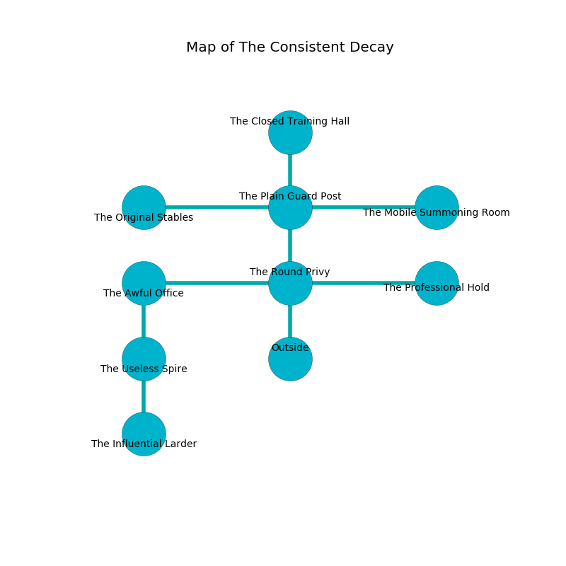

%Ruin Dogs

##The Consistent Decay
###Overview
The Consistent Decay is located on a cursed city. Regions of it are unbearably cold. The ruin is burning. It is occupied by Duergars. Sena Finley The Obsessive, an Assassin is here. The Duergars worship Sena Finley The Obsessive. She  is trying to exploit [Feaehiaewi](#Feaehiaewi). 

###Artifact
####Feaehiaewi

Feaehiaewi has the form of a smooth prism. Fire bends around it. When touched it levitates surrounding objects. 

###Locations

####the round privy
The floor is bloodstained. The glass walls are scratched. 

* To the west a narrow hallway opens to [the awful office](#the-awful-office).
* To the east a small artery opens to [the professional hold](#the-professional-hold).
* To the north a long cavern connects to [the plain guard post](#the-plain-guard-post).
* To the south is the entrance.

####the awful office
The obsidion walls are pristine. The floor is bloodstained. Red ferns are growing from the walls. The air tastes like dairy here. There are eight Duergars here. The Duergars are defending this room from intruders. 

* To the east a narrow hallway connects to [the round privy](#the-round-privy).
* To the south a torchlit cavern leads to [the useless spire](#the-useless-spire).

####the plain guard post
Yellow mushrooms are swaying in cracks in the floor. The metallic walls are pristine. The floor is flooded with nine inch deep cool water. 

* To the west a small cavern opens to [the original stables](#the-original-stables).
* To the east a hazy gap leads to [the mobile summoning room](#the-mobile-summoning-room).
* To the north a narrow cave connects to [the closed training hall](#the-closed-training-hall).
* To the south a long cavern opens to [the round privy](#the-round-privy).

####the original stables
The floor is cluttered with bones. Gray moss is sprouting in cracks in the floor. 

* There is a stamp here.
* To the east a small cavern leads to [the plain guard post](#the-plain-guard-post).

####the mobile summoning room
The floor is flooded with one inch deep cool water. The air smells like pear skin here. The metallic walls are caving in. 

* To the west a hazy gap leads to [the plain guard post](#the-plain-guard-post).

####the closed training hall
The air smells like weed here. There is a trap here. When activated, a magical proximity detector will open a trapdoor in the floor. The glass walls are covered in mold. 

There is an engraving on a stone written in Duergars Script. 

> I am lost in The Consistent Decay.
>
> Hide here.
>

* [Sena Finley The Obsessive](#Sena-Finley-The-Obsessive) is here.
* To the south a narrow cave opens to [the plain guard post](#the-plain-guard-post).

####the professional hold
The floor is sticky. The air tastes like marzipan here. There is a trap here. When activated, a magical proximity detector will ring a bell. 

* To the west a small artery connects to [the round privy](#the-round-privy).

####the useless spire
There are eight Duergars here. The air smells like cereal here. One of the Duergars is on watch, the rest are sleeping. 

* [Feaehiaewi](#Feaehiaewi) is here.
* To the north a torchlit cavern opens to [the awful office](#the-awful-office).
* To the south a twisted hall connects to [the influential larder](#the-influential-larder).

####the influential larder
There are a Duodrone, a Galeb Duhr, a Vampire Spawn, and a Draft Horse here. The air smells like jonquil here. Yellow mushrooms are sprouting from the walls. There is a trap here. When activated, a magical rune will fire a scything blade. 

* To the north a twisted hall leads to [the useless spire](#the-useless-spire).

