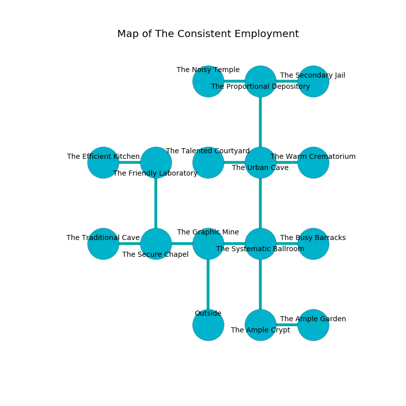

%Ruin Dogs

##The Consistent Employment
###Overview
The Consistent Employment is constructed on a poisoned plain. Some areas of it are flooded. The ruin is flooding. It is occupied by Drow. Billie Hyatt The Possessive, a Hobgoblin Warlord is here. The Drow are battling Billie Hyatt The Possessive. He  is trying to discover [Baemi](#Baemi). 

###Artifact
####Baemi

Baemi looks like a glassy rock. When smelled it becomes a shielding force. 

###Locations

####the graphic mine
The air tastes like grain here. Green ferns are swaying from the walls. The stone walls are scratched. 

* There is a skull here.
* [Billie Hyatt The Possessive](#Billie-Hyatt-The-Possessive) is here.
* To the west a windy hallway connects to [the secure chapel](#the-secure-chapel).
* To the east a narrow pathway leads to [the systematic ballroom](#the-systematic-ballroom).
* To the south is the entrance.

####the systematic ballroom
The floor is bloodstained. There is a trap here. When activated, a magical rune will make the walls close in. The obsidion walls are caving in. There are a Ghast, a Specter, a Drow Elite Warrior, and a Swarm of Rats here. The air smells like mango here. White mushrooms are swaying in broken urns. 

* To the west a narrow pathway opens to [the graphic mine](#the-graphic-mine).
* To the east a torchlit walkway leads to [the busy barracks](#the-busy-barracks).
* To the north a torchlit cave opens to [the urban cave](#the-urban-cave).
* To the south a windy cave opens to [the ample crypt](#the-ample-crypt).

####the secure chapel
There are a Quasit, an Ochre Jelly, a Ghost, and a Tridrone here. The crystal walls are unsettled. The floor is cluttered with shells. The air tastes like orange peel here. 

* There is a ring here.
* To the west a dark hall connects to [the traditional cave](#the-traditional-cave).
* To the east a windy hallway opens to [the graphic mine](#the-graphic-mine).
* To the north a twisted gap leads to [the friendly laboratory](#the-friendly-laboratory).

####the traditional cave
Blue moss is swaying from the ceiling. The brick walls are covered in mold. 

* To the east a dark hall connects to [the secure chapel](#the-secure-chapel).

####the urban cave
There is a trap here. When activated, a magical proximity detector will make the walls close in. Yellow moss is growing in a patch on the floor. There are two Drow Elite Warriors here. The air smells like patchouli here. The Drow are fighting amongst themselves. 

There is an engraving on a stone written in Drow Script. 

> Oh my! the world is poor
>
> always premature
>
> it is always civic
>
> death is secure
>

* To the west a narrow cave leads to [the talented courtyard](#the-talented-courtyard).
* To the east a dripping corridor opens to [the warm crematorium](#the-warm-crematorium).
* To the north a twisted hallway connects to [the proportional depository](#the-proportional-depository).
* To the south a torchlit cave opens to [the systematic ballroom](#the-systematic-ballroom).

####the ample crypt
There are two Drow Elite Warriors here. The floor is glossy. The Drow are willing to negotiate. 

* To the east a torchlit corridor leads to [the ample garden](#the-ample-garden).
* To the north a windy cave connects to [the systematic ballroom](#the-systematic-ballroom).

####the ample garden
There are two Drow Elite Warriors here. The floor is smooth. Gray lichens are decaying in cracks in the floor. The Drow are feasting. 

* To the west a torchlit corridor opens to [the ample crypt](#the-ample-crypt).

####the talented courtyard
The floor is flooded with three inch deep cold water. 

There is an engraving on a monolith written in Drow Script. 

> Go away.
>

* There is a chest here.
* There is a boot here.
* To the east a narrow cave opens to [the urban cave](#the-urban-cave).

####the busy barracks
White moss is swaying from the walls. There are a Hobgoblin Warlord and a Shadow Demon here. 

* There is a bell here.
* To the west a torchlit walkway leads to [the systematic ballroom](#the-systematic-ballroom).

####the proportional depository
There are two Drow Elite Warriors here. Red razorgrass is decaying from the ceiling. The air smells like lemon peel here. The mirrored walls are unsettled. The Drow are willing to negotiate. 

* [Baemi](#Baemi) is here.
* To the west a hazy cave leads to [the noisy temple](#the-noisy-temple).
* To the east a dark corridor connects to [the secondary jail](#the-secondary-jail).
* To the south a twisted hallway connects to [the urban cave](#the-urban-cave).

####the friendly laboratory
Blue mushrooms are decaying in broken urns. The air tastes like civet here. The floor is flooded with four inch deep cold water. The glass walls are caving in. 

* To the west a narrow cave opens to [the efficient kitchen](#the-efficient-kitchen).
* To the south a twisted gap connects to [the secure chapel](#the-secure-chapel).

####the secondary jail
The air tastes like cinnamon here. Yellow lichens are swaying in cracks in the floor. The stone walls are covered in mold. The floor is glossy. 

* There is a monkey here.
* To the west a dark corridor opens to [the proportional depository](#the-proportional-depository).

####the efficient kitchen
The air smells like acrylate here. There are two Drow Elite Warriors here. The floor is bloodstained. The metallic walls are unsettled. White razorgrass is decaying from the walls. The Drow are willing to negotiate. 

* To the east a narrow cave leads to [the friendly laboratory](#the-friendly-laboratory).

####the warm crematorium
Blue mushrooms are swaying from the walls. 

* There is an icon here.
* To the west a dripping corridor opens to [the urban cave](#the-urban-cave).

####the noisy temple
The concrete walls are unsettled. The floor is bloodstained. There are a Giant Octopus, a Vine Blight, a Crab, a Tridrone, a Red Slaad, a Sea Horse, and a Young Faerie Dragon here. 

* There is a ring here.
* To the east a hazy cave opens to [the proportional depository](#the-proportional-depository).

