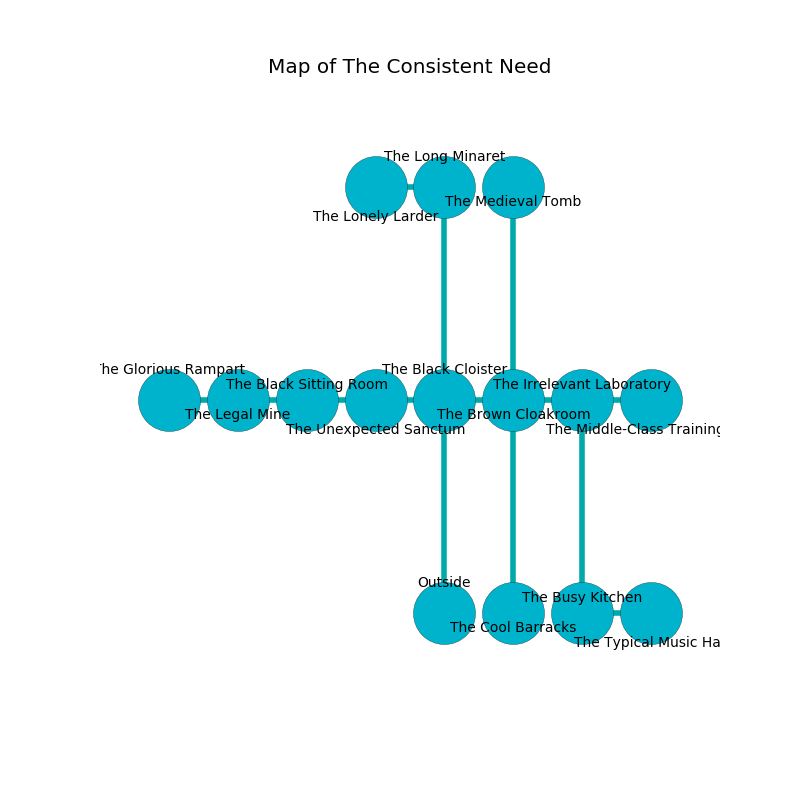

%Ruin Dogs

##The Consistent Need
###Overview
The Consistent Need is constructed on an obsidion mountain. Some rooms of The Consistent Need are flooded. A lunar eclipse is happening outside. It is occupied by Harpies. Cheree Liles The Stubborn, a Fire Giant is here. The Harpies are battling Cheree Liles The Stubborn. She  is founding a new religion. 

###Artifact
####The Huge Zone

The Huge Zone is a powerful artifact in the shape of a mushy figurine. Gravity glows around it. When carried it ignites its surrroundings. 

###Locations

####the black cloister
The air tastes like plastic here. There are a Rhinoceros, a Gelatinous Cube, a Flameskull, and a Green Hag here. The obsidion walls are caving in. 

* There is a goat here.
* To the west a long opening connects to [the unexpected sanctum](#the-unexpected-sanctum).
* To the east a narrow threshold connects to [the brown cloakroom](#the-brown-cloakroom).
* To the north a small threshold connects to [the long minaret](#the-long-minaret).
* To the south is the entrance.

####the brown cloakroom
There is a Yochlol here. The mirrored walls are caving in. 

* To the west a narrow threshold leads to [the black cloister](#the-black-cloister).
* To the east a hazy gap connects to [the irrelevant laboratory](#the-irrelevant-laboratory).
* To the north a hazy walkway opens to [the medieval tomb](#the-medieval-tomb).
* To the south a small walkway opens to [the cool barracks](#the-cool-barracks).

####the unexpected sanctum
Blue lichens are sprouting in broken urns. There are a Gnoll Fang of Yeenoghu, a Death Dog, a Warhorse Skeleton, a Gargoyle, and a Killer Whale here. 

* To the west a dripping corridor opens to [the black sitting Room](#the-black-sitting-Room).
* To the east a long opening leads to [the black cloister](#the-black-cloister).

####the cool barracks
There are ten Harpies here. Blue mushrooms are swaying in broken urns. The floor is glossy. One of the Harpies is pointing a ballista at the entrance. 

There is an engraving on the ceiling written in Harpies Script. 

> Oh my! pitiful you
>
> tough, complex, past
>
> but due
>
> fate is last
>

* There is a chest here.
* To the north a small walkway leads to [the brown cloakroom](#the-brown-cloakroom).

####the black sitting Room
The crystal walls are bloodstained. The air tastes like vegetables here. The floor is bloodstained. There is a trap here. When activated, a magical sound detector will fire a scything blade. 

* To the west a long cavern connects to [the legal mine](#the-legal-mine).
* To the east a dripping corridor opens to [the unexpected sanctum](#the-unexpected-sanctum).

####the medieval tomb
The air smells like banana here. The concrete walls are covered in mold. 

* To the south a hazy walkway opens to [the brown cloakroom](#the-brown-cloakroom).

####the long minaret
The air tastes like grass here. The floor is smooth. There are a Glabrezu and a Mage here. 

* To the west a windy hallway connects to [the lonely larder](#the-lonely-larder).
* To the south a small threshold opens to [the black cloister](#the-black-cloister).

####the irrelevant laboratory
Blue ferns are growing from the ceiling. The floor is sticky. There are ten Harpies here. The Harpies are berserk with rage. 

There is an engraving on the wall written in common. 

> Try fighting.
>

* There is a roof here.
* There is a leprechaun here.
* To the west a hazy gap leads to [the brown cloakroom](#the-brown-cloakroom).
* To the east a dripping passageway opens to [the middle-class training hall](#the-middle-class-training-hall).
* To the south a long passageway connects to [the busy kitchen](#the-busy-kitchen).

####the legal mine
There are a Triceratops, a Hobgoblin Captain, and a Pegasus here. The brick walls are covered in mold. The air tastes like brown sugar here. The floor is sticky. 

There is an engraving on the wall written in Harpies Script. 

> I am lost in The Consistent Need.
>

* [The Huge Zone](#The-Huge-Zone) is here.
* To the west a narrow pathway leads to [the glorious rampart](#the-glorious-rampart).
* To the east a long cavern leads to [the black sitting Room](#the-black-sitting-Room).

####the busy kitchen
The air smells like chestnut here. 

There is an engraving on a monolith written in Harpies Script. 

> O meak you
>
> it is always dramatic
>
> personal, full-time, true
>
> the world is automatic
>

* To the east a narrow walkway leads to [the typical music hall](#the-typical-music-hall).
* To the north a long passageway leads to [the irrelevant laboratory](#the-irrelevant-laboratory).

####the middle-class training hall
Yellow moss is growing in broken urns. There are a Blink Dog, a Hippogriff, a Young Brass Dragon, a Brass Dragon Wyrmling, and a Carrion Crawler here. The concrete walls are scratched. The floor is sticky. The air tastes like elderberry here. 

There is an engraving on the wall written in Harpies Script. 

> [The Huge Zone](#The-Huge-Zone)
>
> temporary, bald, hot
>
> You are dying
>
> current, consistent, low
>
> [The Huge Zone](#The-Huge-Zone)
>

* There is a net here.
* There is a brain here.
* To the west a dripping passageway opens to [the irrelevant laboratory](#the-irrelevant-laboratory).

####the typical music hall
The stone walls are covered in mold. The air tastes like agarwood here. There are ten Harpies here. The Harpies are meditating. 

* To the west a narrow walkway leads to [the busy kitchen](#the-busy-kitchen).

####the lonely larder
The stone walls are covered in mold. The floor is smooth. The air tastes like musk here. There are a Bone Naga, a Mimic, and a Xorn here. 

* [Cheree Liles The Stubborn](#Cheree-Liles-The-Stubborn) is here.
* To the east a windy hallway opens to [the long minaret](#the-long-minaret).

####the glorious rampart
The air smells like ham here. Red razorgrass is decaying from the walls. 

* To the east a narrow pathway leads to [the legal mine](#the-legal-mine).

