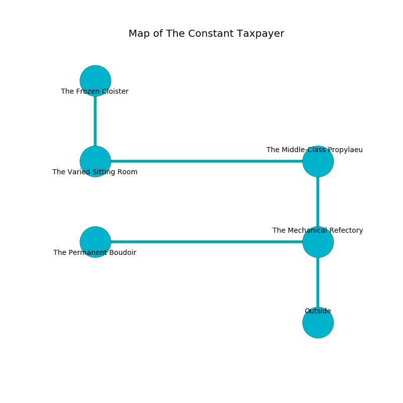

%Ruin Dogs

##The Constant Taxpayer
###Overview
The Constant Taxpayer is located on a ruined rift. Some rooms of it are incredibly hot. A massive storm is happening outside. It is occupied by Pixies. Erik Hudson The Vague, an Assassin is here. The Pixies are the slaves of Erik Hudson The Vague. He  is founding a new religion. 

###Artifact
####Gaehdaf Faghacdaeum

Gaehdaf Faghacdaeum is a powerful artifact in the shape of a glassy cube. Gravity slips near it. It is a sickly white color. When held it tunnels into the earth. 

###Locations

####the mechanical refectory
There are thirty six Pixies here. The metallic walls are bloodstained. Blue moss is swaying in broken urns. The air tastes like fermentation here. The floor is smooth. The Pixies are performing a ritual. If not interrupted, a powerful monster will be summoned. 

* To the west a narrow cave connects to [the permanent boudoir](#the-permanent-boudoir).
* To the north a twisted hall opens to [the middle-class propylaeum](#the-middle-class-propylaeum).
* To the south is the entrance.

####the middle-class propylaeum
There are a Frog, an Umber Hulk, a Commoner, a Rust Monster, a Cloud Giant, a Pteranodon, an Octopus, and a Polar Bear here. The air smells like logenberry here. 

* To the west a twisted path leads to [the varied sitting Room](#the-varied-sitting-Room).
* To the south a twisted hall leads to [the mechanical refectory](#the-mechanical-refectory).

####the varied sitting Room
White ferns are decaying from the walls. The air tastes like moss here. 

* [Gaehdaf Faghacdaeum](#Gaehdaf-Faghacdaeum) is here.
* To the east a twisted path leads to [the middle-class propylaeum](#the-middle-class-propylaeum).
* To the north a hazy cave opens to [the frozen cloister](#the-frozen-cloister).

####the permanent boudoir
The floor is sticky. There is a trap here. When activated, a magical sound detector will launch a ceiling pendulum. Yellow ferns are swaying from the ceiling. 

* [Erik Hudson The Vague](#Erik-Hudson-The-Vague) is here.
* To the east a narrow cave connects to [the mechanical refectory](#the-mechanical-refectory).

####the frozen cloister
There are a Lizardfolk Shaman, a Gladiator, a Giant Crab, and a Griffon here. The obsidion walls are pristine. The air smells like valerian root here. 

* To the south a hazy cave connects to [the varied sitting Room](#the-varied-sitting-Room).

