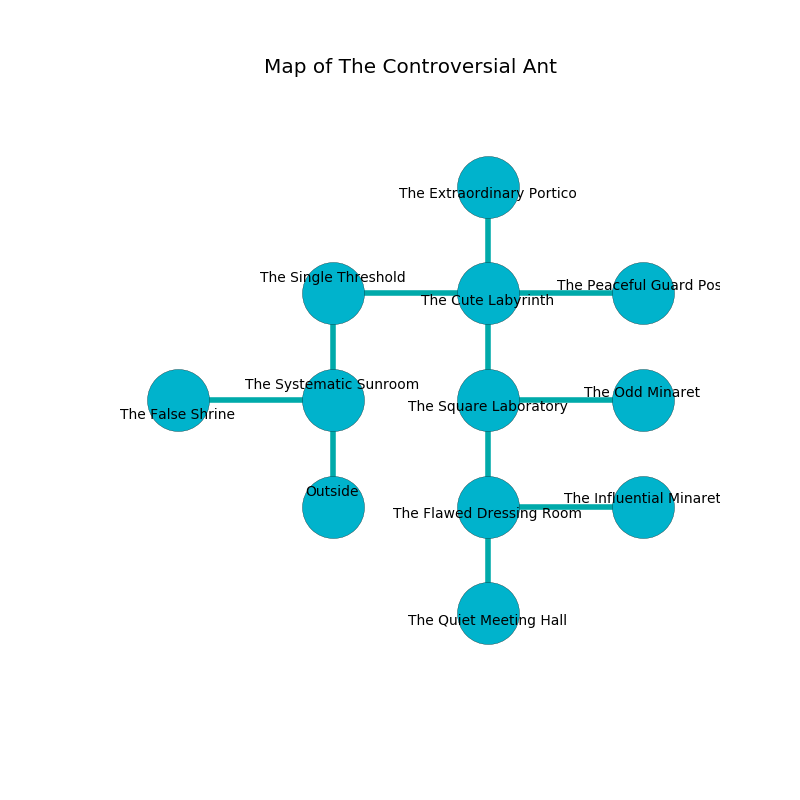

%Ruin Dogs

##The Controversial Ant
###Overview
The Controversial Ant is located on a crystal rift. Some rooms of The Controversial Ant are foggy. The ruin is coming to life. It is occupied by Yuan-Ti. Jung Baines The Cowardly, an Assassin is here. The Yuan-Ti are the slaves of Jung Baines The Cowardly. She  is founding a new religion. 

###Artifact
####The Different Matrix

The Different Matrix is a powerful artifact in the shape of a cold amulet. It smells like pumpkin. It is a medium blue color. When carried it tunnels into the earth. 

###Locations

####the systematic sunroom
The air tastes like white chocolate here. Gray razorgrass is sprouting in a patch on the floor. The floor is smooth. The brick walls are ruined. 

* To the west a long corridor leads to [the false shrine](#the-false-shrine).
* To the north a dripping hallway leads to [the single threshold](#the-single-threshold).
* To the south is the entrance.

####the single threshold
There are two Yuan-Ti Malisons and four Yuan-Ti Purebloods here. Yellow razorgrass is decaying in cracks in the floor. The Yuan-Ti are performing a ritual. If not interrupted, the Yuan-Ti will become more powerful. 

* To the east a narrow hall opens to [the cute labyrinth](#the-cute-labyrinth).
* To the south a dripping hallway leads to [the systematic sunroom](#the-systematic-sunroom).

####the cute labyrinth
Green mushrooms are swaying from the walls. The glass walls are unsettled. The air tastes like logenberry here. The floor is flooded with two inch deep cool water. 

There is an engraving on a tablet written in common. 

> They are sorrowful
>
> ever brown
>
> dramatic and compatible
>
> you shall be returned
>

* [The Different Matrix](#The-Different-Matrix) is here.
* To the west a narrow hall opens to [the single threshold](#the-single-threshold).
* To the east a narrow pathway opens to [the peaceful guard post](#the-peaceful-guard-post).
* To the north a twisted pathway opens to [the extraordinary portico](#the-extraordinary-portico).
* To the south a flooded opening leads to [the square laboratory](#the-square-laboratory).

####the square laboratory
The floor is cluttered with bones. White moss is decaying in cracks in the floor. The brick walls are covered in mold. 

There is an engraving on the floor written in Yuan-Ti Script. 

> A trap ahead.
>

* There is a dress here.
* To the east a flooded threshold leads to [the odd minaret](#the-odd-minaret).
* To the north a flooded opening opens to [the cute labyrinth](#the-cute-labyrinth).
* To the south a small threshold opens to [the flawed dressing room](#the-flawed-dressing-room).

####the flawed dressing room
The floor is glossy. The obsidion walls are bloodstained. The air smells like capers here. 

There is an engraving on a monolith written in common. 

> A pump is a job
>
> live and effective
>
> democratic, decisive, civilian
>

* To the east a twisted cave connects to [the influential minaret](#the-influential-minaret).
* To the north a small threshold opens to [the square laboratory](#the-square-laboratory).
* To the south a torchlit pathway leads to [the quiet meeting hall](#the-quiet-meeting-hall).

####the peaceful guard post
The obsidion walls are scratched. 

There is an engraving on a stone written in common. 

> Hide here.
>

* To the west a narrow pathway connects to [the cute labyrinth](#the-cute-labyrinth).

####the odd minaret
There are a Yuan-Ti Abomination and a Yuan-Ti Malison here. Yellow mushrooms are decaying from the ceiling. The Yuan-Ti are berserk with rage. 

There is an engraving on the wall written in Yuan-Ti Script. 

> [The Different Matrix](#The-Different-Matrix)
>
> yet never vertical
>

* To the west a flooded threshold leads to [the square laboratory](#the-square-laboratory).

####the false shrine
Green ferns are swaying in cracks in the floor. 

There is an engraving on a stone written in Yuan-Ti Script. 

> [The Different Matrix](#The-Different-Matrix)
>
> intellectual, vain, loose
>
> [The Different Matrix](#The-Different-Matrix)
>
> residential, supplementary, chronic
>
> yet helpless
>
> but never cool
>
> manual and useless
>
> but huge
>
> but classical
>
> A map is a price
>
> marine, stubborn, invisible
>
> homosexual and persistent
>
> difficult and broken
>
> forward, weekly, deep
>
> A blade is a dolphin
>
> distant, flawed, old
>
> ever indigenous
>
> round, prolonged, unlike
>
> All of us are damned
>
> comfortable and useful
>
> senior and technical
>
> A pump is a training
>
> cooperative, great, afraid
>

* [Jung Baines The Cowardly](#Jung-Baines-The-Cowardly) is here.
* To the east a long corridor leads to [the systematic sunroom](#the-systematic-sunroom).

####the influential minaret
The air smells like coconut here. The floor is flooded with five inch deep hot water. There are a Yuan-Ti Pureblood, a Yuan-Ti Abomination, and a Yuan-Ti Malison here. The mirrored walls are pristine. The Yuan-Ti are crazy with bloodlust. 

* To the west a twisted cave leads to [the flawed dressing room](#the-flawed-dressing-room).

####the quiet meeting hall
The floor is cluttered with bones. The air tastes like bell pepper here. Blue ferns are sprouting in broken urns. There are a Yuan-Ti Malison, a Yuan-Ti Abomination, and a Yuan-Ti Pureblood here. The Yuan-Ti are crazy with bloodlust. 

* There is a bucket here.
* To the north a torchlit pathway opens to [the flawed dressing room](#the-flawed-dressing-room).

####the extraordinary portico
The concrete walls are scratched. There are two Yuan-Ti Malisons and three Yuan-Ti Purebloods here. There is a trap here. When activated, a pressure plate will cast a curse. Yellow razorgrass is sprouting from the walls. The air tastes like cranberry here. One of the Yuan-Ti is working a mechanism that can open a trapodoor in the floor. 

* To the south a twisted pathway opens to [the cute labyrinth](#the-cute-labyrinth).

