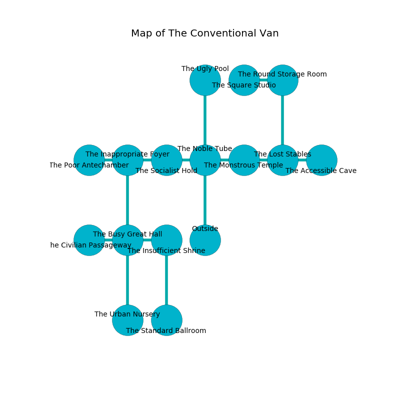

%Ruin Dogs

##The Conventional Van
###Overview
The Conventional Van is constructed on an obsidion city. Some rooms of it are inaccessible. A lunar eclipse is happening outside. It is occupied by Demons. Wes Boatright The Cowardly, a Vampire Spawn is here. The Demons are the soldiers of Wes Boatright The Cowardly. He  is founding a new religion. 

###Artifact
####The Civilian Well

The Civilian Well has the form of a glassy monument. It is a bright black color. Water bends towards it. When touched it become energized with a powerful vibration. 

###Locations

####the noble tube
Green razorgrass is decaying in broken urns. The air tastes like cauliflower here. The obsidion walls are scratched. 

* To the west a narrow opening connects to [the socialist hold](#the-socialist-hold).
* To the east a dark gap opens to [the monstrous temple](#the-monstrous-temple).
* To the north a long cavern connects to [the ugly pool](#the-ugly-pool).
* To the south is the entrance.

####the monstrous temple
The air tastes like anise here. There is a Bulette here. One of the Bulette is on watch, the rest are feasting. 

* To the west a dark gap connects to [the noble tube](#the-noble-tube).
* To the east a hazy cavern connects to [the lost stables](#the-lost-stables).

####the socialist hold
There are a Bearded Devil and a Succubus here. The glass walls are unsettled. Green lichens are sprouting from the walls. The Demons are performing a ritual. If not interrupted, [Wes Boatright](#Wes-Boatright) will be magically alarmed. 

* To the west a windy opening opens to [the inappropriate foyer](#the-inappropriate-foyer).
* To the east a narrow opening leads to [the noble tube](#the-noble-tube).

####the inappropriate foyer
The floor is bloodstained. The obsidion walls are pristine. 

* [The Civilian Well](#The-Civilian-Well) is here.
* To the west a dark cavern opens to [the poor antechamber](#the-poor-antechamber).
* To the east a windy opening leads to [the socialist hold](#the-socialist-hold).
* To the south a narrow cavern leads to [the busy great hall](#the-busy-great-hall).

####the busy great hall
Red moss is growing in cracks in the floor. The floor is cluttered with broken glass. 

There is an engraving on a stone written in Demons Script. 

> A square is a function
>
> yet never legal
>

* [Wes Boatright The Cowardly](#Wes-Boatright-The-Cowardly) is here.
* To the west a twisted path leads to [the civilian passageway](#the-civilian-passageway).
* To the east a twisted hall connects to [the insufficient shrine](#the-insufficient-shrine).
* To the north a narrow cavern opens to [the inappropriate foyer](#the-inappropriate-foyer).
* To the south a twisted gap opens to [the urban nursery](#the-urban-nursery).

####the urban nursery
There is a trap here. When activated, a magical proximity detector will open a large pit in the floor. 

* To the north a twisted gap leads to [the busy great hall](#the-busy-great-hall).

####the ugly pool

* There is a jewel here.
* To the south a long cavern opens to [the noble tube](#the-noble-tube).

####the civilian passageway
The wooden walls are covered in mold. The air smells like baked potato here. 

* To the east a twisted path opens to [the busy great hall](#the-busy-great-hall).

####the lost stables
Gray mushrooms are sprouting in broken urns. The floor is smooth. 

* To the west a hazy cavern opens to [the monstrous temple](#the-monstrous-temple).
* To the east a twisted cavern opens to [the accessible cave](#the-accessible-cave).
* To the north a twisted path connects to [the round storage room](#the-round-storage-room).

####the round storage room
There is a Barbed Devil here. The floor is sticky. Green moss is decaying in cracks in the floor. One of the Barbed Devil is on watch, the rest are feasting. 

* To the west a flooded path leads to [the square studio](#the-square-studio).
* To the south a twisted path leads to [the lost stables](#the-lost-stables).

####the square studio
The air tastes like huckleberry here. Red mushrooms are sprouting from the ceiling. 

* To the east a flooded path leads to [the round storage room](#the-round-storage-room).

####the insufficient shrine
The floor is bloodstained. Yellow moss is growing in broken urns. The air smells like clary sage here. The mirrored walls are ruined. 

* To the west a twisted hall connects to [the busy great hall](#the-busy-great-hall).
* To the south a windy cave opens to [the standard ballroom](#the-standard-ballroom).

####the standard ballroom
The floor is cluttered with bones. Blue razorgrass is swaying in broken urns. 

* To the north a windy cave opens to [the insufficient shrine](#the-insufficient-shrine).

####the accessible cave
Gray razorgrass is swaying in broken urns. The floor is glossy. The air tastes like wintergreen here. 

* To the west a twisted cavern opens to [the lost stables](#the-lost-stables).

####the poor antechamber
Red razorgrass is decaying from the ceiling. The metallic walls are caving in. There are three Spined Devils here. The Demons are performing a ritual. If not interrupted, a powerful monster will be summoned. 

* There is a girl here.
* To the east a dark cavern opens to [the inappropriate foyer](#the-inappropriate-foyer).

