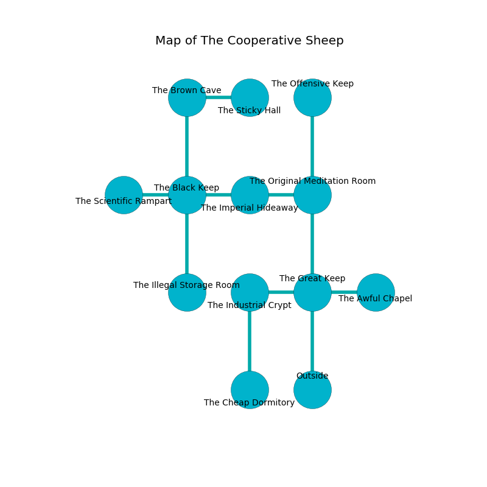

%Ruin Dogs

##The Cooperative Sheep
###Overview
The Cooperative Sheep is located in a spikey city. Regions of it are foggy. A massive flood is happening outside. It is occupied by Harpies. Bennie Francois The Irresponsible, a Bearded Devil is here. The Harpies are the soldiers of Bennie Francois The Irresponsible. He  is trying to understand [Haedafedofa](#Haedafedofa). 

###Artifact
####Haedafedofa

Haedafedofa is a powerful artifact in the shape of an opaque doll. It smells like raw	reseda. It is a sickly white color. When eaten it glows with an eerie light. 

###Locations

####the great keep
The air smells like lilac here. There are four Harpies here. There is a trap here. When activated, a magical proximity detector will launch a rolling boulder. The Harpies are willing to negotiate. 

* To the west a torchlit hallway opens to [the industrial crypt](#the-industrial-crypt).
* To the east a long hall leads to [the awful chapel](#the-awful-chapel).
* To the north a narrow threshold opens to [the original meditation room](#the-original-meditation-room).
* To the south is the entrance.

####the industrial crypt
There are a Kenku, a Commoner, a Reef Shark, a Deep Gnome, a Polar Bear, a Sea Horse, a Green Dragon Wyrmling, and a Hyena here. The air tastes like hawthorn here. The floor is glossy. White ferns are sprouting from the walls. The concrete walls are bloodstained. 

There is an engraving on a tablet written in common. 

> I am worshipping this place.
>
> Try cowering.
>

* To the east a torchlit hallway leads to [the great keep](#the-great-keep).
* To the south a small path connects to [the cheap dormitory](#the-cheap-dormitory).

####the cheap dormitory

* To the north a small path opens to [the industrial crypt](#the-industrial-crypt).

####the awful chapel
The stone walls are pristine. There are a Kuo-Toa Monitor and a Half-Ogre here. Gray ferns are swaying in cracks in the floor. 

* To the west a long hall connects to [the great keep](#the-great-keep).

####the original meditation room
There are a Black Pudding, a Merrow, a Brown Bear, and an Owl here. 

There is an engraving on the floor written in Harpies Script. 

> I am lost in The Cooperative Sheep.
>
> I tried dying.
>

* There is a root here.
* To the west a narrow corridor opens to [the imperial hideaway](#the-imperial-hideaway).
* To the north a torchlit path leads to [the offensive keep](#the-offensive-keep).
* To the south a narrow threshold leads to [the great keep](#the-great-keep).

####the imperial hideaway
There are four Harpies here. The air smells like immortelle here. Red mushrooms are decaying in a patch on the floor. The Harpies are willing to negotiate. 

* [Bennie Francois The Irresponsible](#Bennie-Francois-The-Irresponsible) is here.
* To the west a narrow hallway connects to [the black keep](#the-black-keep).
* To the east a narrow corridor opens to [the original meditation room](#the-original-meditation-room).

####the black keep
There is a Gnoll Fang of Yeenoghu here. Blue lichens are swaying from the ceiling. 

* To the west a flooded passageway connects to [the scientific rampart](#the-scientific-rampart).
* To the east a narrow hallway connects to [the imperial hideaway](#the-imperial-hideaway).
* To the north a hazy corridor opens to [the brown cave](#the-brown-cave).
* To the south a twisted walkway opens to [the illegal storage room](#the-illegal-storage-room).

####the scientific rampart
The mirrored walls are scratched. There are a Swarm of Rats and a Chuul here. The air tastes like balsam	petal here. 

* To the east a flooded passageway connects to [the black keep](#the-black-keep).

####the offensive keep
There are four Harpies here. Green ferns are sprouting in a patch on the floor. The Harpies are willing to negotiate. 

* To the south a torchlit path connects to [the original meditation room](#the-original-meditation-room).

####the brown cave
There are four Harpies here. Yellow ferns are decaying in broken urns. The floor is glossy. The air smells like tolu here. One of the Harpies is pointing a ballista at the entrance. 

* [Haedafedofa](#Haedafedofa) is here.
* To the east a torchlit walkway connects to [the sticky hall](#the-sticky-hall).
* To the south a hazy corridor opens to [the black keep](#the-black-keep).

####the illegal storage room
The air tastes like wax here. 

* There is a stamp here.
* To the north a twisted walkway leads to [the black keep](#the-black-keep).

####the sticky hall
The floor is cluttered with rocks. The glass walls are bloodstained. There is a trap here. When activated, a magical sound detector will launch a blade. 

* To the west a torchlit walkway connects to [the brown cave](#the-brown-cave).

