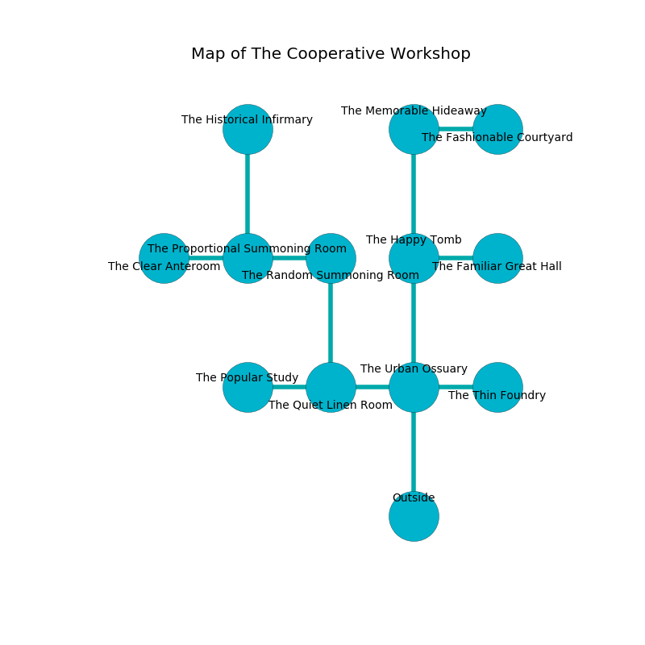

%Ruin Dogs

##The Cooperative Workshop
###Overview
The Cooperative Workshop is constructed on a haunted tree. Regions of it are somewhat hot. The ruin is collapsing slowly. It is occupied by Drows. Bryce Mclemore The Materialistic, a Myconid Sovereign is here. The Drows are ruled by Bryce Mclemore The Materialistic. He  is founding a new religion. 

###Artifact
####Meaef

Meaef looks like a sharp orb. Cacophony slides away from it. It is a bright green color. When carried it shows an image of the future. 

###Locations

####the urban ossuary
Red moss is sprouting in a patch on the floor. The glass walls are bloodstained. There is a trap here. When activated, a magical proximity detector will open a large pit in the floor. 

* To the west a long threshold connects to [the quiet linen room](#the-quiet-linen-room).
* To the east a hazy walkway opens to [the thin foundry](#the-thin-foundry).
* To the north a flooded gap leads to [the happy tomb](#the-happy-tomb).
* To the south is the entrance.

####the thin foundry
The floor is glossy. Green lichens are decaying in cracks in the floor. The concrete walls are scratched. 

* There is a parcel here.
* To the west a hazy walkway connects to [the urban ossuary](#the-urban-ossuary).

####the happy tomb
Blue razorgrass is swaying in cracks in the floor. The floor is glossy. The mirrored walls are unsettled. 

There is an engraving on the wall written in common. 

> Run away.
>

* To the east a long artery opens to [the familiar great hall](#the-familiar-great-hall).
* To the north a small walkway connects to [the memorable hideaway](#the-memorable-hideaway).
* To the south a flooded gap connects to [the urban ossuary](#the-urban-ossuary).

####the memorable hideaway
The air smells like moss here. Yellow ferns are growing in a patch on the floor. 

* There is a frame here.
* To the east a small corridor opens to [the fashionable courtyard](#the-fashionable-courtyard).
* To the south a small walkway leads to [the happy tomb](#the-happy-tomb).

####the quiet linen room
The crystal walls are caving in. Green lichens are growing from the walls. 

* To the west a torchlit corridor leads to [the popular study](#the-popular-study).
* To the east a long threshold connects to [the urban ossuary](#the-urban-ossuary).
* To the north a dripping artery connects to [the random summoning room](#the-random-summoning-room).

####the random summoning room
Green razorgrass is swaying in cracks in the floor. There is a trap here. When activated, a pressure plate will open a large pit in the floor. The concrete walls are bloodstained. 

There is an engraving on the ceiling written in common. 

> Treasure here.
>

* To the west a dripping hallway leads to [the proportional summoning room](#the-proportional-summoning-room).
* To the south a dripping artery connects to [the quiet linen room](#the-quiet-linen-room).

####the proportional summoning room
The metallic walls are unsettled. The floor is sticky. Yellow mushrooms are growing from the ceiling. 

* [Meaef](#Meaef) is here.
* To the west a flooded corridor opens to [the clear anteroom](#the-clear-anteroom).
* To the east a dripping hallway leads to [the random summoning room](#the-random-summoning-room).
* To the north a narrow threshold leads to [the historical infirmary](#the-historical-infirmary).

####the popular study
The floor is glossy. The air smells like mushroom here. There are a Giant Vulture and a Myconid Sovereign here. There is a trap here. When activated, a magical sound detector will launch a poison needle. 

* [Bryce Mclemore The Materialistic](#Bryce-Mclemore-The-Materialistic) is here.
* To the east a torchlit corridor opens to [the quiet linen room](#the-quiet-linen-room).

####the familiar great hall
The metallic walls are unsettled. The air tastes like pimenta here. Yellow razorgrass is growing from the ceiling. 

There is an engraving on a monolith written in common. 

> I am lost in The Cooperative Workshop.
>

* To the west a long artery leads to [the happy tomb](#the-happy-tomb).

####the fashionable courtyard
The concrete walls are bloodstained. Gray moss is growing from the ceiling. 

* There is a bell here.
* To the west a small corridor opens to [the memorable hideaway](#the-memorable-hideaway).

####the clear anteroom
Yellow razorgrass is sprouting in a patch on the floor. There is a trap here. When activated, a magical rune will launch a rolling boulder. The air tastes like bread crust here. The floor is sticky. 

There is an engraving on a monolith written in common. 

> Leave now.
>

* There is a root here.
* To the east a flooded corridor connects to [the proportional summoning room](#the-proportional-summoning-room).

####the historical infirmary
The concrete walls are bloodstained. The air smells like herbs here. 

* There is a bee here.
* To the south a narrow threshold connects to [the proportional summoning room](#the-proportional-summoning-room).

