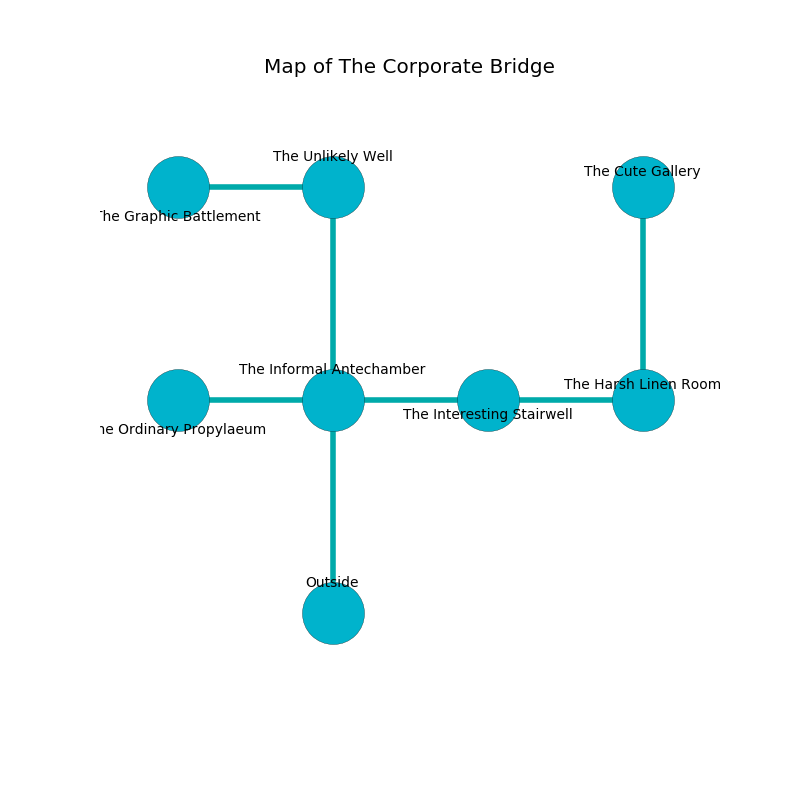

%Ruin Dogs

##The Corporate Bridge
###Overview
The Corporate Bridge is located under a volcanic mountain. Some areas of The Corporate Bridge are somewhat hot. The ruin is collapsing slowly. It is occupied by Kenku. Kieth Upton The Untrustworthy, a Fire Giant is here. The Kenku have been charmed by Kieth Upton The Untrustworthy. He  is founding a new religion. 

###Artifact
####Gecela Ieoca

Gecela Ieoca is a powerful artifact in the shape of a transparent cube. Power shifts away from it. When rubbed it levitates those nearby. 

###Locations

####the informal antechamber
Green mushrooms are growing in cracks in the floor. There are thirty six Kenkus here. The Kenku are willing to negotiate. 

* There is a flag here.
* To the west a torchlit walkway connects to [the ordinary propylaeum](#the-ordinary-propylaeum).
* To the east a dripping artery leads to [the interesting stairwell](#the-interesting-stairwell).
* To the north a dark opening leads to [the unlikely well](#the-unlikely-well).
* To the south is the entrance.

####the unlikely well
Blue moss is decaying in cracks in the floor. The concrete walls are covered in mold. There are thirty six Kenkus here. The floor is bloodstained. The Kenku are defending this room from intruders. 

There is an engraving on the ceiling written in Kenku Script. 

> A bird is a guitar
>
> but never inadequate
>
> yet academic
>
> A bird is a guitar
>

* There is a bee here.
* To the west a windy cave opens to [the graphic battlement](#the-graphic-battlement).
* To the south a dark opening opens to [the informal antechamber](#the-informal-antechamber).

####the interesting stairwell
The floor is cluttered with rocks. The stone walls are scratched. 

* To the west a dripping artery opens to [the informal antechamber](#the-informal-antechamber).
* To the east a long passageway leads to [the harsh linen room](#the-harsh-linen-room).

####the ordinary propylaeum
The air tastes like clove here. The brick walls are ruined. 

There is an engraving on the wall written in Kenku Script. 

> Leave now.
>

* To the east a torchlit walkway leads to [the informal antechamber](#the-informal-antechamber).

####the graphic battlement
The floor is glossy. There are thirty six Kenkus here. If the Kenku notice the Ruin Dogs, one of them will retreat and alert the others. 

* [Kieth Upton The Untrustworthy](#Kieth-Upton-The-Untrustworthy) is here.
* To the east a windy cave leads to [the unlikely well](#the-unlikely-well).

####the harsh linen room
The floor is sticky. There are thirty six Kenkus here. One of the Kenku is on watch, the rest are fighting amongst themselves. 

* [Gecela Ieoca](#Gecela-Ieoca) is here.
* To the west a long passageway connects to [the interesting stairwell](#the-interesting-stairwell).
* To the north a flooded cavern opens to [the cute gallery](#the-cute-gallery).

####the cute gallery
There are a Giant Poisonous Snake, a Crawling Claw, a Magmin, a Duodrone, a Giant fire beetle, a Cloud Giant, a Thri-Kreen, and a Draft Horse here. 

* To the south a flooded cavern leads to [the harsh linen room](#the-harsh-linen-room).

