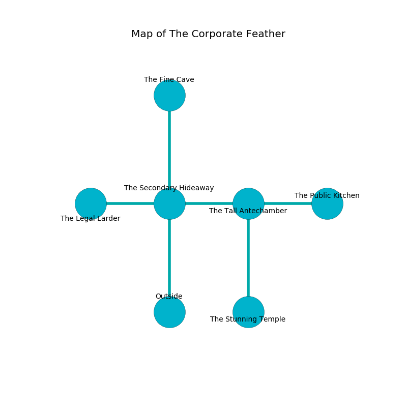

%Ruin Dogs

##The Corporate Feather
###Overview
The Corporate Feather is located under a cursed city. Parts of The Corporate Feather are frozen. The ruin is coming to life. It is occupied by Sahuagin. Sandi Paine The Cruel, a Hill Giant is here. The Sahuagin are ruled by Sandi Paine The Cruel. She  is trying to recover [The Proper Bail](#The-Proper-Bail). 

###Artifact
####The Proper Bail

The Proper Bail has the form of an opaque meteorite. Gravity pours towards it. When gazed upon it illuminates its surroundings. 

###Locations

####the secondary hideaway
The floor is glossy. The air tastes like dairy here. There are two Sahuagin and a Sahuagin Baron here. One of the Sahuagin is working a mechanism that can flood the room. 

There is an engraving on a monolith written in common. 

> Poor me! the memory of you is poor
>
> but varied
>
> but premature
>
> all is married
>

* To the west a small hall connects to [the legal larder](#the-legal-larder).
* To the east a long gap leads to [the tall antechamber](#the-tall-antechamber).
* To the north a small gap connects to [the fine cave](#the-fine-cave).
* To the south is the entrance.

####the fine cave
The floor is cluttered with shells. There is a Sahuagin Baron here. The concrete walls are scratched. The Sahuagin Baron is willing to negotiate. 

* To the south a small gap opens to [the secondary hideaway](#the-secondary-hideaway).

####the tall antechamber
The metallic walls are caving in. There is a Sahuagin Baron here. Red lichens are sprouting in a patch on the floor. One of the Sahuagin Baron is working a mechanism that can pour bees from the ceiling. 

* [The Proper Bail](#The-Proper-Bail) is here.
* To the west a long gap leads to [the secondary hideaway](#the-secondary-hideaway).
* To the east a twisted threshold leads to [the public kitchen](#the-public-kitchen).
* To the south a twisted walkway leads to [the stunning temple](#the-stunning-temple).

####the public kitchen
Blue razorgrass is growing in cracks in the floor. The concrete walls are ruined. The floor is flooded with eight inch deep lukewarm water. 

* [Sandi Paine The Cruel](#Sandi-Paine-The-Cruel) is here.
* To the west a twisted threshold connects to [the tall antechamber](#the-tall-antechamber).

####the legal larder
There are a Mummy and an Ettercap here. The floor is sticky. The stone walls are pristine. 

* To the east a small hall leads to [the secondary hideaway](#the-secondary-hideaway).

####the stunning temple

There is an engraving on a monolith written in common. 

> O my life is sadistic
>
> but optimistic
>
> addicted, current, blank
>
> hope is optimistic
>

* There is a fowl here.
* To the north a twisted walkway opens to [the tall antechamber](#the-tall-antechamber).

