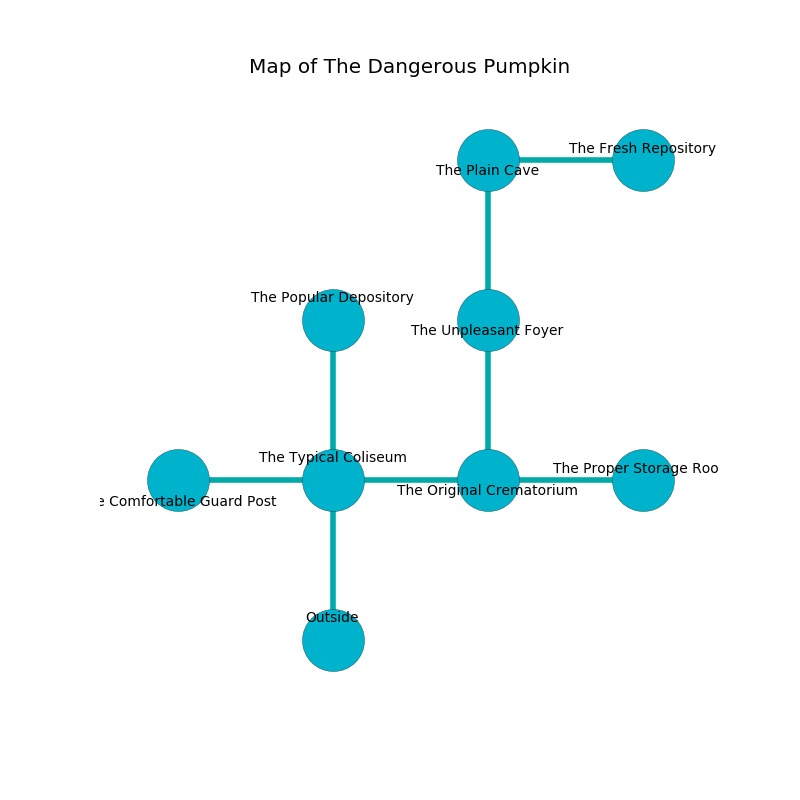

%Ruin Dogs

##The Dangerous Pumpkin
###Overview
The Dangerous Pumpkin is located on a haunted tree. Some areas of The Dangerous Pumpkin are inaccessible. A battle between raiders is happening outside. It is occupied by Lizardfolk. Marissa Tillman The Unkind, a Succubus is here. The Lizardfolk are the slaves of Marissa Tillman The Unkind. She  is trying to steal [Hfebbef](#Hfebbef). 

###Artifact
####Hfebbef

Hfebbef is a powerful artifact in the shape of a wet prism. When smelled it tunnels into the earth. 

###Locations

####the typical coliseum
The air smells like apple skin here. 

* [Hfebbef](#Hfebbef) is here.
* To the west a windy artery connects to [the comfortable guard post](#the-comfortable-guard-post).
* To the east a windy artery connects to [the original crematorium](#the-original-crematorium).
* To the north a dark pathway leads to [the popular depository](#the-popular-depository).
* To the south is the entrance.

####the original crematorium
The air smells like red rose here. There are two Lizardfolk Shamans and two Lizardfolk here. Blue mushrooms are swaying from the ceiling. If the Lizardfolk notice the Ruin Dogs, one of them will retreat and alert the others. 

There is an engraving on a monolith written in common. 

> Dear me! pitiful soul
>
> but whole
>
> it is always dry
>
> the world is shy
>

* [Marissa Tillman The Unkind](#Marissa-Tillman-The-Unkind) is here.
* To the west a windy artery connects to [the typical coliseum](#the-typical-coliseum).
* To the east a dripping walkway opens to [the proper storage room](#the-proper-storage-room).
* To the north a flooded gap leads to [the unpleasant foyer](#the-unpleasant-foyer).

####the unpleasant foyer
The air smells like mastic here. 

* There is a baby here.
* To the north a torchlit walkway opens to [the plain cave](#the-plain-cave).
* To the south a flooded gap opens to [the original crematorium](#the-original-crematorium).

####the plain cave
The air smells like pork here. White ferns are swaying in cracks in the floor. The obsidion walls are covered in mold. 

* There is a hook here.
* There is a shirt here.
* To the east a long gap connects to [the fresh repository](#the-fresh-repository).
* To the south a torchlit walkway opens to [the unpleasant foyer](#the-unpleasant-foyer).

####the fresh repository
The glass walls are pristine. The floor is bloodstained. 

There is an engraving on a monolith written in common. 

> O dire we
>
> it is never strong
>
> yet never free
>
> cruelty is long
>

* To the west a long gap opens to [the plain cave](#the-plain-cave).

####the popular depository
The brick walls are bloodstained. There are three Lizardfolk Shamans here. The Lizardfolk are fighting amongst themselves. 

There is an engraving on a tablet written in Lizardfolk Script. 

> I tried praying.
>

* To the south a dark pathway connects to [the typical coliseum](#the-typical-coliseum).

####the proper storage room
The floor is sticky. There are a Giant Spider, an Old Faerie Dragon, and a Knight here. White lichens are decaying in a patch on the floor. 

* To the west a dripping walkway leads to [the original crematorium](#the-original-crematorium).

####the comfortable guard post
The floor is cluttered with ashes. There are a Flameskull, a Cultist, a Knight, and a Rust Monster here. 

* To the east a windy artery leads to [the typical coliseum](#the-typical-coliseum).

