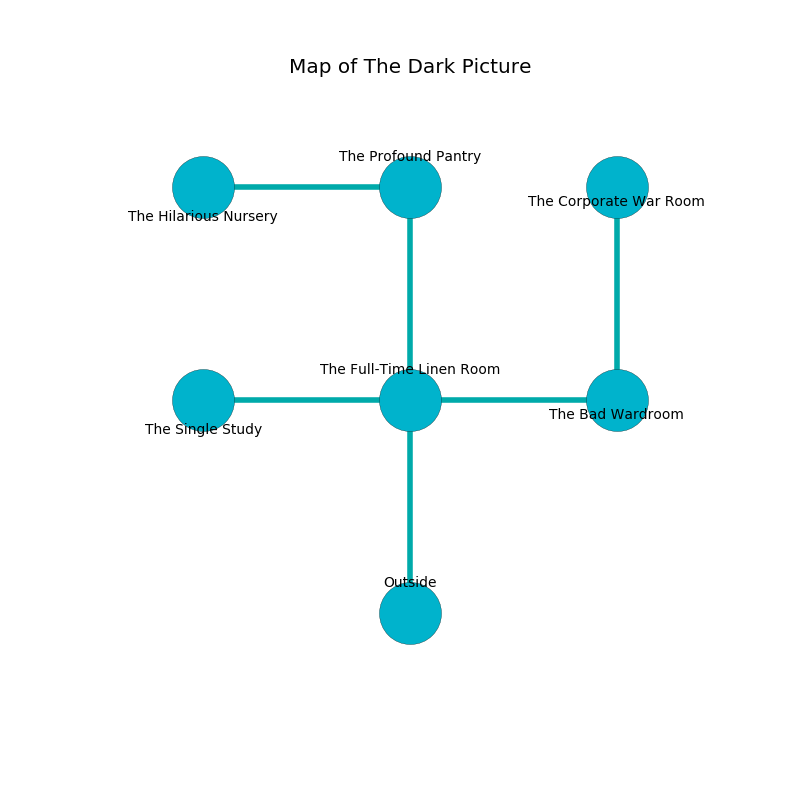

%Ruin Dogs

##The Dark Picture
###Overview
The Dark Picture is located under a spikey tree. Some rooms of The Dark Picture are flooded. The ruin is burning. It is occupied by Sprites. Dee Rigsby The Boring, a Kuo-Toa Monitor is here. The Sprites worship Dee Rigsby The Boring. She  is founding a new religion. 

###Artifact
####The Obese Plan

The Obese Plan has the form of a warm meteorite. It is a medium brown color. Magic glows towards it. When picked up it makes its owner invisible. 

###Locations

####the full-time linen room
The stone walls are caving in. The air tastes like zedoary here. There are a Sahuagin, a Giant Octopus, and a Displacer Beast here. Gray lichens are decaying in cracks in the floor. 

* There is a face here.
* There is a jewel here.
* To the west a dripping cave opens to [the single study](#the-single-study).
* To the east a long opening opens to [the bad wardroom](#the-bad-wardroom).
* To the north a twisted hallway connects to [the profound pantry](#the-profound-pantry).
* To the south is the entrance.

####the single study
The wooden walls are bloodstained. Gray ferns are growing in cracks in the floor. The floor is cluttered with bones. 

There is an engraving on a tablet written in Sprites Script. 

> Leave now.
>

* To the east a dripping cave connects to [the full-time linen room](#the-full-time-linen-room).

####the bad wardroom
The floor is smooth. 

* [The Obese Plan](#The-Obese-Plan) is here.
* [Dee Rigsby The Boring](#Dee-Rigsby-The-Boring) is here.
* To the west a long opening opens to [the full-time linen room](#the-full-time-linen-room).
* To the north a hazy path connects to [the corporate war Room](#the-corporate-war-Room).

####the profound pantry
There are twelve Sprites here. White mushrooms are sprouting from the walls. The Sprites are berserk with rage. 

* To the west a torchlit path opens to [the hilarious nursery](#the-hilarious-nursery).
* To the south a twisted hallway leads to [the full-time linen room](#the-full-time-linen-room).

####the hilarious nursery
The floor is smooth. Red moss is decaying in a patch on the floor. The concrete walls are pristine. 

* There is a leaf here.
* To the east a torchlit path opens to [the profound pantry](#the-profound-pantry).

####the corporate war Room
Green lichens are decaying in cracks in the floor. The floor is smooth. 

* To the south a hazy path opens to [the bad wardroom](#the-bad-wardroom).

