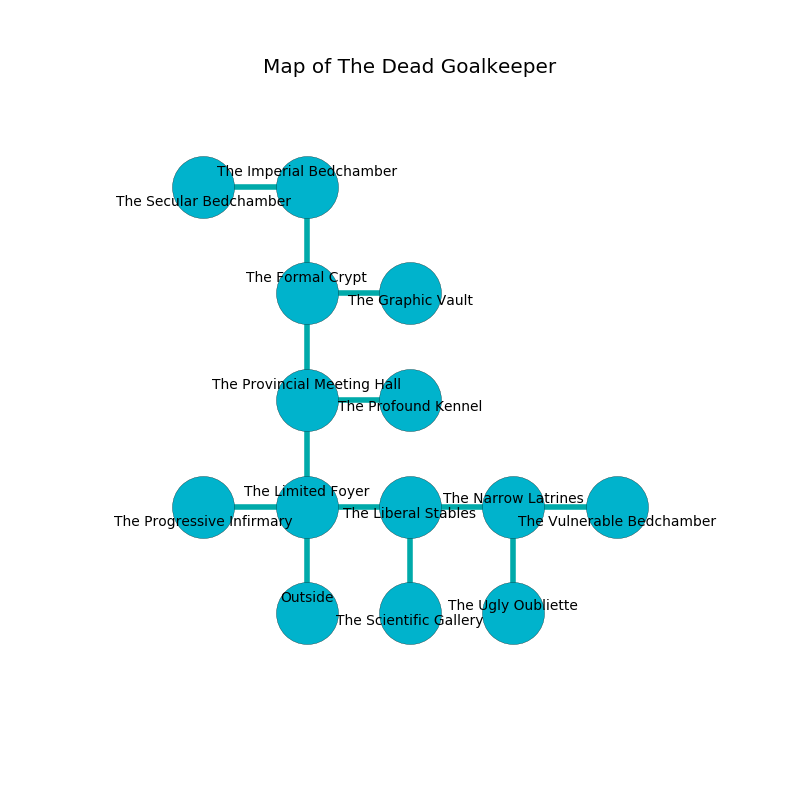

%Ruin Dogs

##The Dead Goalkeeper
###Overview
The Dead Goalkeeper is constructed on a flooded mountain. Some areas of The Dead Goalkeeper are flooded. The ruin is flooding. It is occupied by Thri-Kreens. Robt Hardman The Belligerent, an Incubus is here. The Thri-Kreens worship Robt Hardman The Belligerent. He  is founding a new religion. 

###Artifact
####The Outside Wonder

The Outside Wonder has the form of a glassy meteorite. Air slides near it. It smells like roasted peanut. When smelled it makes its owner invisible. 

###Locations

####the limited foyer
The obsidion walls are scratched. The floor is bloodstained. There is a trap here. When activated, a pressure plate will open a large pit in the floor. There are five Thri-Kreens here. The air tastes like pineapple here. White ferns are swaying from the ceiling. If the Thri-Kreens notice the Ruin Dogs, one of them will retreat and alert the others. 

* There is a bag here.
* To the west a long opening connects to [the progressive infirmary](#the-progressive-infirmary).
* To the east a flooded cavern connects to [the liberal stables](#the-liberal-stables).
* To the north a long pathway connects to [the provincial meeting hall](#the-provincial-meeting-hall).
* To the south is the entrance.

####the progressive infirmary

There is an engraving on the ceiling written in Thri-Kreens Script. 

> Oh meak soul
>
> current and whole
>
> conservative and vain
>
> death is plain
>

* To the east a long opening connects to [the limited foyer](#the-limited-foyer).

####the liberal stables
There are five Thri-Kreens here. Gray lichens are sprouting in broken urns. The mirrored walls are caving in. The floor is cluttered with shells. One of the Thri-Kreens is working a mechanism that can engulf the room in a fiery blaze. 

* To the west a flooded cavern opens to [the limited foyer](#the-limited-foyer).
* To the east a narrow walkway opens to [the narrow latrines](#the-narrow-latrines).
* To the south a dark passageway leads to [the scientific gallery](#the-scientific-gallery).

####the provincial meeting hall
There are a Lizard King, a Commoner, a Reef Shark, an Elk, a Kobold, and a Crocodile here. The floor is cluttered with ashes. Red mushrooms are swaying in a patch on the floor. 

* There is a potato here.
* To the east a hazy cavern opens to [the profound kennel](#the-profound-kennel).
* To the north a flooded path leads to [the formal crypt](#the-formal-crypt).
* To the south a long pathway connects to [the limited foyer](#the-limited-foyer).

####the scientific gallery
The wooden walls are ruined. The air tastes like immortelle here. The floor is flooded with six inch deep scalding water. 

* To the north a dark passageway opens to [the liberal stables](#the-liberal-stables).

####the formal crypt

* [The Outside Wonder](#The-Outside-Wonder) is here.
* To the east a dripping path leads to [the graphic vault](#the-graphic-vault).
* To the north a twisted pathway opens to [the imperial bedchamber](#the-imperial-bedchamber).
* To the south a flooded path opens to [the provincial meeting hall](#the-provincial-meeting-hall).

####the imperial bedchamber
There are a Weretiger and an Animated Armor here. The floor is glossy. 

There is an engraving on a stone written in Thri-Kreens Script. 

> Try leaving.
>

* To the west a hazy corridor opens to [the secular bedchamber](#the-secular-bedchamber).
* To the south a twisted pathway connects to [the formal crypt](#the-formal-crypt).

####the profound kennel
The floor is glossy. The air smells like juniper here. Yellow ferns are swaying in broken urns. 

* To the west a hazy cavern connects to [the provincial meeting hall](#the-provincial-meeting-hall).

####the narrow latrines
The brick walls are unsettled. 

* There is a sword here.
* There is a spring here.
* There is a ghost here.
* There is a basket here.
* [Robt Hardman The Belligerent](#Robt-Hardman-The-Belligerent) is here.
* To the west a narrow walkway leads to [the liberal stables](#the-liberal-stables).
* To the east a dripping path leads to [the vulnerable bedchamber](#the-vulnerable-bedchamber).
* To the south a long pathway opens to [the ugly oubliette](#the-ugly-oubliette).

####the vulnerable bedchamber
Yellow moss is swaying in cracks in the floor. The crystal walls are pristine. 

* To the west a dripping path opens to [the narrow latrines](#the-narrow-latrines).

####the secular bedchamber
The concrete walls are bloodstained. Blue lichens are decaying in broken urns. There are five Thri-Kreens here. The Thri-Kreens are celebrating. 

* There is a plow here.
* To the east a hazy corridor opens to [the imperial bedchamber](#the-imperial-bedchamber).

####the ugly oubliette
The concrete walls are bloodstained. There are five Thri-Kreens here. If the Thri-Kreens notice the Ruin Dogs, one of them will retreat and alert the others. 

* To the north a long pathway leads to [the narrow latrines](#the-narrow-latrines).

####the graphic vault
The air smells like green peas here. The concrete walls are scratched. 

* To the west a dripping path leads to [the formal crypt](#the-formal-crypt).

