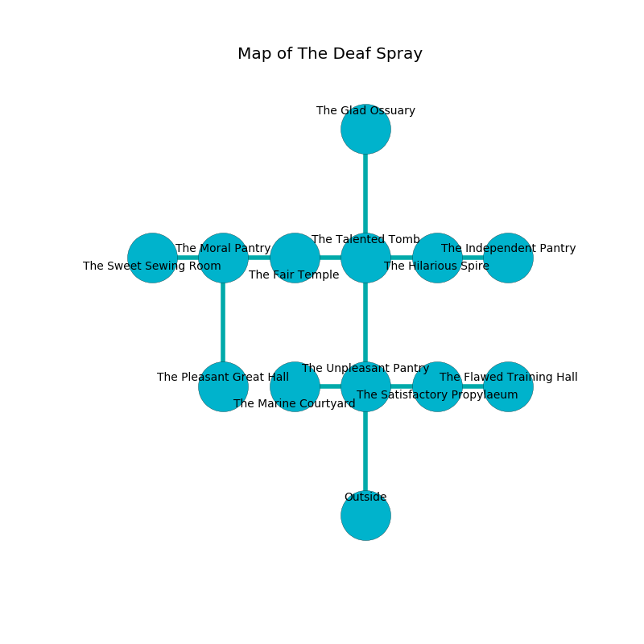

%Ruin Dogs

##The Deaf Spray
###Overview
The Deaf Spray is located in a spikey tree. Some rooms of it are inaccessible. The ruin is larger on the inside than the outside. It is occupied by Kobolds. Diego Eggleston The Miserly, a Gladiator is here. The Kobolds are battling Diego Eggleston The Miserly. He  is trying to understand [The Cheap Drawing](#The-Cheap-Drawing). 

###Artifact
####The Cheap Drawing

The Cheap Drawing looks like a cold prism. It is a medium white color. It smells like hyacinth. Cacophony bends from it. When worn it levitates surrounding objects. 

###Locations

####the unpleasant pantry
The concrete walls are unsettled. Gray mushrooms are sprouting from the ceiling. The floor is cluttered with ashes. 

* There is a feather here.
* There is an ant here.
* To the west a hazy threshold connects to [the marine courtyard](#the-marine-courtyard).
* To the east a dark corridor opens to [the satisfactory propylaeum](#the-satisfactory-propylaeum).
* To the north a hazy path leads to [the talented tomb](#the-talented-tomb).
* To the south is the entrance.

####the talented tomb
The obsidion walls are ruined. 

* To the west a twisted opening connects to [the fair temple](#the-fair-temple).
* To the east a dark opening opens to [the hilarious spire](#the-hilarious-spire).
* To the north a twisted corridor connects to [the glad ossuary](#the-glad-ossuary).
* To the south a hazy path leads to [the unpleasant pantry](#the-unpleasant-pantry).

####the fair temple
The floor is sticky. Gray mushrooms are sprouting in broken urns. The brick walls are unsettled. 

* [Diego Eggleston The Miserly](#Diego-Eggleston-The-Miserly) is here.
* To the west a flooded opening leads to [the moral pantry](#the-moral-pantry).
* To the east a twisted opening opens to [the talented tomb](#the-talented-tomb).

####the hilarious spire
White moss is sprouting in a patch on the floor. The air smells like popcorn here. The stone walls are caving in. 

* To the west a dark opening opens to [the talented tomb](#the-talented-tomb).
* To the east a windy passageway connects to [the independent pantry](#the-independent-pantry).

####the independent pantry
The wooden walls are unsettled. Green mushrooms are decaying from the ceiling. 

* To the west a windy passageway connects to [the hilarious spire](#the-hilarious-spire).

####the satisfactory propylaeum
The floor is cluttered with shells. Yellow moss is decaying in broken urns. The wooden walls are covered in mold. There are sixteen Winged Kobolds and nine Kobolds here. The Kobolds are willing to negotiate. 

* There is a screw here.
* To the west a dark corridor opens to [the unpleasant pantry](#the-unpleasant-pantry).
* To the east a flooded hallway connects to [the flawed training hall](#the-flawed-training-hall).

####the marine courtyard
The air tastes like roast beef here. Gray ferns are sprouting from the ceiling. 

* To the east a hazy threshold opens to [the unpleasant pantry](#the-unpleasant-pantry).

####the moral pantry
Red mushrooms are sprouting in a patch on the floor. There are a Steam Mephit, a Killer Whale, and a Mimic here. The air smells like honeysuckle here. The concrete walls are ruined. 

* [The Cheap Drawing](#The-Cheap-Drawing) is here.
* To the west a small corridor connects to [the sweet sewing room](#the-sweet-sewing-room).
* To the east a flooded opening leads to [the fair temple](#the-fair-temple).
* To the south a hazy pathway connects to [the pleasant great hall](#the-pleasant-great-hall).

####the glad ossuary
Yellow mushrooms are sprouting from the ceiling. The floor is sticky. There are twelve Winged Kobolds and sixteen Kobolds here. The Kobolds are performing a ritual. If not interrupted, the Kobolds will become more powerful. 

* There is an egg here.
* To the south a twisted corridor leads to [the talented tomb](#the-talented-tomb).

####the flawed training hall
The floor is sticky. The obsidion walls are pristine. 

* There is a sheep here.
* To the west a flooded hallway connects to [the satisfactory propylaeum](#the-satisfactory-propylaeum).

####the sweet sewing room
The floor is smooth. The metallic walls are ruined. The air smells like storax here. 

* To the east a small corridor opens to [the moral pantry](#the-moral-pantry).

####the pleasant great hall
The floor is cluttered with rocks. Red moss is swaying from the walls. 

* To the north a hazy pathway leads to [the moral pantry](#the-moral-pantry).

