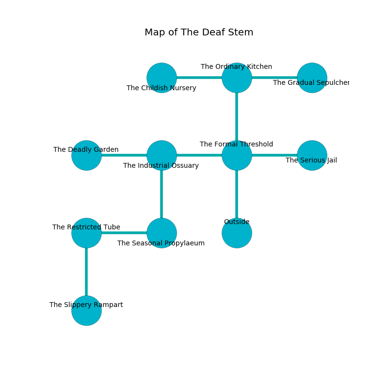

%Ruin Dogs

##The Deaf Stem
###Overview
The Deaf Stem is located on a volcanic plain. Some rooms of The Deaf Stem are foggy. The ruin is coming to life. It is occupied by Gnolls. Veola Aguayo The Stubborn, a Succubus is here. The Gnolls worship Veola Aguayo The Stubborn. She  is founding a new religion. 

###Artifact
####The Electronic Iron

The Electronic Iron looks like a wet orb. It is a dark green color. When worn it aids memory. 

###Locations

####the formal threshold
The floor is flooded with one inch deep hot water. White mushrooms are swaying from the ceiling. The air smells like sawdust here. The metallic walls are caving in. There are a Black Bear, a Knight, an Orc Eye of Gruumsh, and a Giant Goat here. 

There is an engraving on the ceiling written in Gnolls Script. 

> Dear me! cruel you
>
> equal and due
>
> main and daily
>
> fate is true
>

* To the west a dripping hallway leads to [the industrial ossuary](#the-industrial-ossuary).
* To the east a flooded passageway connects to [the serious jail](#the-serious-jail).
* To the north a small opening connects to [the ordinary kitchen](#the-ordinary-kitchen).
* To the south is the entrance.

####the industrial ossuary
The mirrored walls are ruined. Green mushrooms are decaying in broken urns. The air tastes like herbs here. 

There is an engraving on a monolith written in common. 

> Poor me! my life is sadistic
>
> political, major, realistic
>
> limited, blank, round
>
> death is sound
>

* There is a door here.
* To the west a small pathway connects to [the deadly garden](#the-deadly-garden).
* To the east a dripping hallway opens to [the formal threshold](#the-formal-threshold).
* To the south a hazy cavern leads to [the seasonal propylaeum](#the-seasonal-propylaeum).

####the seasonal propylaeum
The air tastes like cassia here. The stone walls are scratched. There is a trap here. When activated, a magical sound detector will open a large pit in the floor. 

There is an engraving on the floor written in Gnolls Script. 

> Poor me! pitiful god
>
> joint, proper, odd
>
> but never uncomfortable
>
> fate is comfortable
>

* To the west a torchlit cave leads to [the restricted tube](#the-restricted-tube).
* To the north a hazy cavern opens to [the industrial ossuary](#the-industrial-ossuary).

####the deadly garden
There are a Tridrone, a Commoner, a Scout, a Deer, a Bronze Dragon Wyrmling, and a Dire Wolf here. The air smells like marigold here. 

* There is a dragon here.
* There is a frame here.
* To the east a small pathway leads to [the industrial ossuary](#the-industrial-ossuary).

####the serious jail
The stone walls are unsettled. The floor is sticky. White ferns are sprouting in a patch on the floor. 

* To the west a flooded passageway leads to [the formal threshold](#the-formal-threshold).

####the restricted tube
The floor is cluttered with broken glass. There are a Quipper, a Manticore, a Noble, a Red Dragon Wyrmling, and a Darkmantle here. The concrete walls are caving in. 

* There is a nail here.
* To the east a torchlit cave opens to [the seasonal propylaeum](#the-seasonal-propylaeum).
* To the south a hazy passageway leads to [the slippery rampart](#the-slippery-rampart).

####the ordinary kitchen
Gray razorgrass is swaying from the ceiling. The metallic walls are unsettled. 

* [The Electronic Iron](#The-Electronic-Iron) is here.
* To the west a windy artery opens to [the childish nursery](#the-childish-nursery).
* To the east a flooded opening leads to [the gradual sepulcher](#the-gradual-sepulcher).
* To the south a small opening opens to [the formal threshold](#the-formal-threshold).

####the childish nursery
The floor is bloodstained. Gray ferns are swaying from the ceiling. There is a Gnoll Fang of Yeenoghu here. The air tastes like mahogany here. The Gnoll Fang of Yeenoghu is berserk with rage. 

* To the east a windy artery leads to [the ordinary kitchen](#the-ordinary-kitchen).

####the slippery rampart
The floor is cluttered with rocks. 

* To the north a hazy passageway leads to [the restricted tube](#the-restricted-tube).

####the gradual sepulcher
The air tastes like blueberry here. The floor is sticky. 

* [Veola Aguayo The Stubborn](#Veola-Aguayo-The-Stubborn) is here.
* To the west a flooded opening opens to [the ordinary kitchen](#the-ordinary-kitchen).

