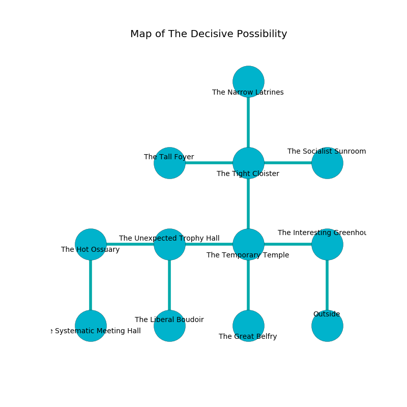

%Ruin Dogs

##The Decisive Possibility
###Overview
The Decisive Possibility is constructed on a crystal tree. Some areas of The Decisive Possibility are incredibly hot. The ruin is flooding. It is occupied by Sahuagin. Wes Vidal The Quarrelsome, a Yuan-Ti Malison is here. The Sahuagin are battling Wes Vidal The Quarrelsome. He  is founding a new religion. 

###Artifact
####Dufdfeaed

Dufdfeaed is a powerful artifact in the shape of a mushy orb. Water bends near it. It smells like egg yolk. When rubbed it destroys others. 

###Locations

####the interesting greenhouse
Green lichens are decaying in cracks in the floor. The air smells like mandarin here. The floor is cluttered with rocks. 

* To the west a windy walkway opens to [the temporary temple](#the-temporary-temple).
* To the south is the entrance.

####the temporary temple

* There is a pin here.
* There is a church here.
* There is an amulet here.
* To the west a flooded cave connects to [the unexpected trophy hall](#the-unexpected-trophy-hall).
* To the east a windy walkway opens to [the interesting greenhouse](#the-interesting-greenhouse).
* To the north a small threshold opens to [the tight cloister](#the-tight-cloister).
* To the south a torchlit walkway leads to [the great belfry](#the-great-belfry).

####the unexpected trophy hall
The floor is smooth. Blue ferns are sprouting from the ceiling. 

* There is a stocking here.
* There is a bone here.
* To the west a dripping path leads to [the hot ossuary](#the-hot-ossuary).
* To the east a flooded cave opens to [the temporary temple](#the-temporary-temple).
* To the south a windy cavern connects to [the liberal boudoir](#the-liberal-boudoir).

####the great belfry
The floor is smooth. White mushrooms are decaying in broken urns. The air tastes like oats here. 

There is an engraving on a tablet written in common. 

> Poor me! my life is sadistic
>
> it is never artistic
>
> it is never easy
>
> sadness is uneasy
>

* There is a rail here.
* To the north a torchlit walkway opens to [the temporary temple](#the-temporary-temple).

####the liberal boudoir
The air smells like filbert here. The obsidion walls are covered in mold. 

* There is a basket here.
* To the north a windy cavern opens to [the unexpected trophy hall](#the-unexpected-trophy-hall).

####the hot ossuary
The floor is sticky. The air smells like vegetables here. White ferns are swaying from the walls. There are a Troglodyte, an Axe Beak, a Pentadrone, a White Dragon Wyrmling, and a Pixie here. 

* To the east a dripping path connects to [the unexpected trophy hall](#the-unexpected-trophy-hall).
* To the south a long gap leads to [the systematic meeting hall](#the-systematic-meeting-hall).

####the tight cloister
The air tastes like berry here. 

* There is a femur here.
* [Dufdfeaed](#Dufdfeaed) is here.
* To the west a torchlit path opens to [the tall foyer](#the-tall-foyer).
* To the east a windy artery opens to [the socialist sunroom](#the-socialist-sunroom).
* To the north a small walkway connects to [the narrow latrines](#the-narrow-latrines).
* To the south a small threshold connects to [the temporary temple](#the-temporary-temple).

####the narrow latrines
The floor is glossy. The obsidion walls are scratched. 

* To the south a small walkway leads to [the tight cloister](#the-tight-cloister).

####the systematic meeting hall
There are eight Sahuagin here. The Sahuagin are willing to negotiate. 

There is an engraving on a monolith written in Sahuagin Script. 

> I am alone.
>

* There is a crossbow here.
* There is a gold coin here.
* To the north a long gap opens to [the hot ossuary](#the-hot-ossuary).

####the socialist sunroom
The glass walls are caving in. The floor is cluttered with shells. 

* [Wes Vidal The Quarrelsome](#Wes-Vidal-The-Quarrelsome) is here.
* To the west a windy artery opens to [the tight cloister](#the-tight-cloister).

####the tall foyer
There are a Swarm of Quippers, a Swarm of Bats, a Vine Blight, an Ettercap, and a White Dragon Wyrmling here. There is a trap here. When activated, a magical sound detector will launch stone blocks from the ceiling. The air tastes like gasoline here. Gray mushrooms are swaying in broken urns. The floor is glossy. 

* To the east a torchlit path opens to [the tight cloister](#the-tight-cloister).

