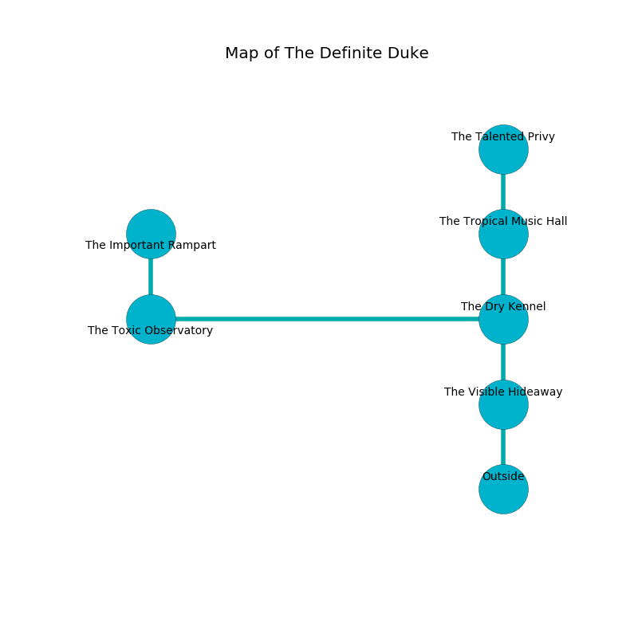

%Ruin Dogs

##The Definite Duke
###Overview
The Definite Duke is constructed on a haunted mountain. Some areas of it are cursed. The ruin is burning. It is occupied by Deep Gnomes. Clifford Leavitt The Impatient, a Yuan-Ti Abomination is here. The Deep Gnomes are the minions of Clifford Leavitt The Impatient. He  is founding a new religion. 

###Artifact
####Asdafaeamca Haedafecwi

Asdafaeamca Haedafecwi has the form of a mushy gem. It smells like plum. When held it ignites its surrroundings. 

###Locations

####the visible hideaway
There are fourteen Deep Gnomes here. Gray mushrooms are sprouting from the walls. One of the Deep Gnomes is working a mechanism that can pour liquid flames from the ceiling. 

* To the north a narrow threshold connects to [the dry kennel](#the-dry-kennel).
* To the south is the entrance.

####the dry kennel
There are fourteen Deep Gnomes here. The crystal walls are unsettled. The Deep Gnomes are caring for babies. 

* [Clifford Leavitt The Impatient](#Clifford-Leavitt-The-Impatient) is here.
* To the west a torchlit path leads to [the toxic observatory](#the-toxic-observatory).
* To the north a torchlit path leads to [the tropical music hall](#the-tropical-music-hall).
* To the south a narrow threshold connects to [the visible hideaway](#the-visible-hideaway).

####the tropical music hall
The floor is flooded with eight inch deep cold water. There are an Animated Armor, a Dire Wolf, a Giant Badger, and a Roper here. 

* To the north a torchlit cave opens to [the talented privy](#the-talented-privy).
* To the south a torchlit path leads to [the dry kennel](#the-dry-kennel).

####the talented privy
The air smells like leek here. The metallic walls are scratched. The floor is flooded with four inch deep lukewarm water. 

* There is a wight here.
* There is a casket here.
* There is a button here.
* To the south a torchlit cave leads to [the tropical music hall](#the-tropical-music-hall).

####the toxic observatory
There are a Revenant and a Giant Boar here. The air tastes like pennyroyal here. The concrete walls are ruined. 

* [Asdafaeamca Haedafecwi](#Asdafaeamca-Haedafecwi) is here.
* To the east a torchlit path leads to [the dry kennel](#the-dry-kennel).
* To the north a dark corridor leads to [the important rampart](#the-important-rampart).

####the important rampart
Red lichens are decaying in a patch on the floor. 

* To the south a dark corridor connects to [the toxic observatory](#the-toxic-observatory).

