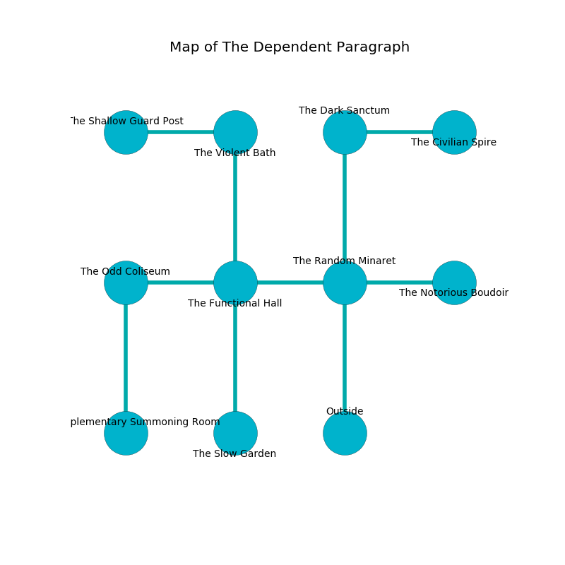

%Ruin Dogs

##The Dependent Paragraph
###Overview
The Dependent Paragraph is constructed on an obsidion tree. Some rooms of it are corrupted. The ruin is coming to life. It is occupied by Orcs. Julio Lawless The Greedy, a Quaggoth is here. The Orcs have been charmed by Julio Lawless The Greedy. He  is founding a new religion. 

###Artifact
####The Proper Lesson

The Proper Lesson has the form of a soft prism. It is a light red color. Fire flows away from it. It smells like weed. When touched it turns surrounding objects to ashes. 

###Locations

####the random minaret
There is a trap here. When activated, a tripwire will make the ceiling slowly lower. There are two Orc Eyes of Gruumsh here. The air tastes like roasted peanut here. The Orcs are willing to negotiate. 

* To the west a small walkway connects to [the functional hall](#the-functional-hall).
* To the east a flooded corridor leads to [the notorious boudoir](#the-notorious-boudoir).
* To the north a long hall opens to [the dark sanctum](#the-dark-sanctum).
* To the south is the entrance.

####the functional hall
There is a trap here. When activated, a magical sound detector will launch a fireball. 

There is an engraving on a tablet written in common. 

> I lost [The Proper Lesson](#The-Proper-Lesson).
>

* [Julio Lawless The Greedy](#Julio-Lawless-The-Greedy) is here.
* To the west a dark opening connects to [the odd coliseum](#the-odd-coliseum).
* To the east a small walkway opens to [the random minaret](#the-random-minaret).
* To the north a windy opening leads to [the violent bath](#the-violent-bath).
* To the south a narrow hall leads to [the slow garden](#the-slow-garden).

####the dark sanctum
The floor is smooth. The glass walls are caving in. The air tastes like laundered cloth here. There are a Twig Blight, a Weretiger, and a Hyena here. 

* [The Proper Lesson](#The-Proper-Lesson) is here.
* To the east a dark threshold leads to [the civilian spire](#the-civilian-spire).
* To the south a long hall connects to [the random minaret](#the-random-minaret).

####the violent bath
The floor is flooded with two inch deep cool water. The air tastes like custard here. 

* To the west a long corridor leads to [the shallow guard post](#the-shallow-guard-post).
* To the south a windy opening opens to [the functional hall](#the-functional-hall).

####the shallow guard post
There are an Orc War Chief and an Orc Eye of Gruumsh here. The stone walls are bloodstained. Blue razorgrass is sprouting from the walls. The floor is glossy. The Orcs are willing to fight to the death. 

* To the east a long corridor connects to [the violent bath](#the-violent-bath).

####the odd coliseum
The air tastes like cashew here. 

* There is a fowl here.
* To the east a dark opening opens to [the functional hall](#the-functional-hall).
* To the south a small walkway connects to [the supplementary summoning room](#the-supplementary-summoning-room).

####the supplementary summoning room
The floor is glossy. The air smells like mint here. Yellow moss is decaying in cracks in the floor. 

There is an engraving on a monolith written in Orcs Script. 

> Oh my! weak soul
>
> rural, profound, whole
>
> glorious and funny
>
> the world is whole
>

* There is an egg here.
* To the north a small walkway connects to [the odd coliseum](#the-odd-coliseum).

####the slow garden
White razorgrass is sprouting from the ceiling. The floor is flooded with one inch deep hot water. The air smells like myrrh here. 

* To the north a narrow hall leads to [the functional hall](#the-functional-hall).

####the notorious boudoir
Red razorgrass is growing in a patch on the floor. The floor is smooth. The air smells like anise here. There are an Orc War Chief and an Orc Eye of Gruumsh here. The Orcs are performing a ritual. If not interrupted, [Julio Lawless](#Julio-Lawless) will be magically alarmed. 

* To the west a flooded corridor opens to [the random minaret](#the-random-minaret).

####the civilian spire
Green ferns are growing from the ceiling. The air tastes like lychee here. 

There is an engraving on a stone written in common. 

> I worship [The Proper Lesson](#The-Proper-Lesson).
>
> I thought about digging.
>

* To the west a dark threshold opens to [the dark sanctum](#the-dark-sanctum).

