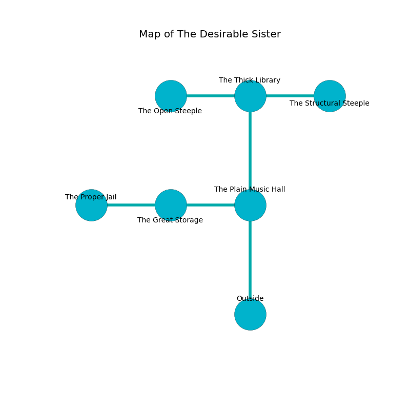

%Ruin Dogs

##The Desirable Sister
###Overview
The Desirable Sister is located under an obsidion rift. Some rooms of it are foggy. A windstorm is happening outside. It is occupied by Lizardfolk. Hai Haugen The Jealous, a Bulette is here. The Lizardfolk are ruled by Hai Haugen The Jealous. He  is trying to find [Dud](#Dud). 

###Artifact
####Dud

Dud is a powerful artifact in the shape of a smooth prism. Cacophony bends towards it. It is a medium green color. When worn it makes its owner invisible. 

###Locations

####the plain music hall

There is an engraving on the wall written in Lizardfolk Script. 

> All of us are free
>
> proud and thirsty
>
> yet never monstrous
>

* To the west a dripping gap opens to [the great storage](#the-great-storage).
* To the north a torchlit passageway leads to [the thick library](#the-thick-library).
* To the south is the entrance.

####the thick library
The floor is bloodstained. The air smells like deertongue here. 

* There is a wight here.
* There is a brick here.
* There is a box here.
* To the west a hazy hall connects to [the open steeple](#the-open-steeple).
* To the east a torchlit gap opens to [the structural steeple](#the-structural-steeple).
* To the south a torchlit passageway opens to [the plain music hall](#the-plain-music-hall).

####the great storage
The metallic walls are ruined. The air tastes like salt here. The floor is glossy. 

* There is a drake here.
* [Dud](#Dud) is here.
* To the west a windy hallway opens to [the proper jail](#the-proper-jail).
* To the east a dripping gap connects to [the plain music hall](#the-plain-music-hall).

####the open steeple
The concrete walls are ruined. 

* To the east a hazy hall connects to [the thick library](#the-thick-library).

####the structural steeple
The floor is smooth. There are a Quipper, an Ape, a Saber-Toothed Tiger, a Killer Whale, and an Animated Armor here. 

* [Hai Haugen The Jealous](#Hai-Haugen-The-Jealous) is here.
* To the west a torchlit gap opens to [the thick library](#the-thick-library).

####the proper jail
The floor is flooded with six inch deep lukewarm water. The concrete walls are pristine. 

* To the east a windy hallway leads to [the great storage](#the-great-storage).

