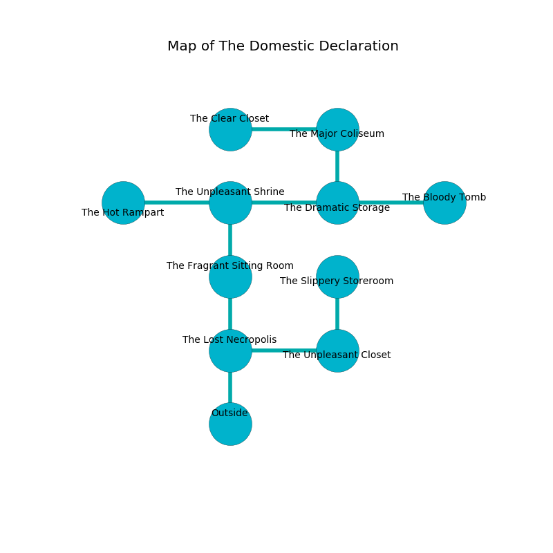

%Ruin Dogs

##The Domestic Declaration
###Overview
The Domestic Declaration is located on a ruined rift. Regions of it are foggy. A massive flood is happening outside. It is occupied by Satyrs. Mohammed Keller The Jealous, a Barbed Devil is here. The Satyrs are the minions of Mohammed Keller The Jealous. He  is founding a new religion. 

###Artifact
####The Vague Cruelty

The Vague Cruelty has the form of a hard monument. It is a bright purple color. Power pours towards it. When gazed upon it changes the past. 

###Locations

####the lost necropolis
The obsidion walls are pristine. There is a trap here. When activated, a magical sound detector will flood the room with water. Blue razorgrass is growing in cracks in the floor. 

There is an engraving on the ceiling written in common. 

> I tried giving up.
>

* To the east a torchlit opening opens to [the unpleasant closet](#the-unpleasant-closet).
* To the north a twisted artery connects to [the fragrant sitting Room](#the-fragrant-sitting-Room).
* To the south is the entrance.

####the fragrant sitting Room
The floor is cluttered with bones. 

* To the north a twisted passageway connects to [the unpleasant shrine](#the-unpleasant-shrine).
* To the south a twisted artery connects to [the lost necropolis](#the-lost-necropolis).

####the unpleasant shrine
There are twelve Satyrs here. The glass walls are ruined. The Satyrs are willing to negotiate. 

* There is a girl here.
* To the west a dripping cave opens to [the hot rampart](#the-hot-rampart).
* To the east a twisted artery connects to [the dramatic storage](#the-dramatic-storage).
* To the south a twisted passageway opens to [the fragrant sitting Room](#the-fragrant-sitting-Room).

####the hot rampart
The air smells like pine here. The floor is bloodstained. White lichens are sprouting from the walls. The wooden walls are unsettled. 

* There is a hook here.
* There is a horn here.
* [Mohammed Keller The Jealous](#Mohammed-Keller-The-Jealous) is here.
* To the east a dripping cave leads to [the unpleasant shrine](#the-unpleasant-shrine).

####the unpleasant closet
The air smells like acai here. Green mushrooms are growing in a patch on the floor. 

* There is an ant here.
* To the west a torchlit opening connects to [the lost necropolis](#the-lost-necropolis).
* To the north a small cavern opens to [the slippery storeroom](#the-slippery-storeroom).

####the slippery storeroom
The mirrored walls are covered in mold. The air tastes like chicken coup here. 

* To the south a small cavern leads to [the unpleasant closet](#the-unpleasant-closet).

####the dramatic storage
The stone walls are caving in. The air tastes like violet leaf here. 

* To the west a twisted artery leads to [the unpleasant shrine](#the-unpleasant-shrine).
* To the east a torchlit pathway connects to [the bloody tomb](#the-bloody-tomb).
* To the north a narrow corridor leads to [the major coliseum](#the-major-coliseum).

####the major coliseum
The air smells like violet leaf here. The concrete walls are unsettled. 

There is an engraving on a tablet written in common. 

> Oh our fate is poor
>
> nervous and secure
>
> ever distant
>
> fate is consistent
>

* There is a roof here.
* [The Vague Cruelty](#The-Vague-Cruelty) is here.
* To the west a windy passageway opens to [the clear closet](#the-clear-closet).
* To the south a narrow corridor leads to [the dramatic storage](#the-dramatic-storage).

####the bloody tomb
The obsidion walls are unsettled. There are a Brown Bear and a Xorn here. 

* To the west a torchlit pathway leads to [the dramatic storage](#the-dramatic-storage).

####the clear closet
White razorgrass is swaying in a patch on the floor. The floor is sticky. There are a Vampire Spawn and a Dire Wolf here. 

There is an engraving on a monolith written in Satyrs Script. 

> [The Vague Cruelty](#The-Vague-Cruelty)
>
> functional and old
>

* To the east a windy passageway opens to [the major coliseum](#the-major-coliseum).

