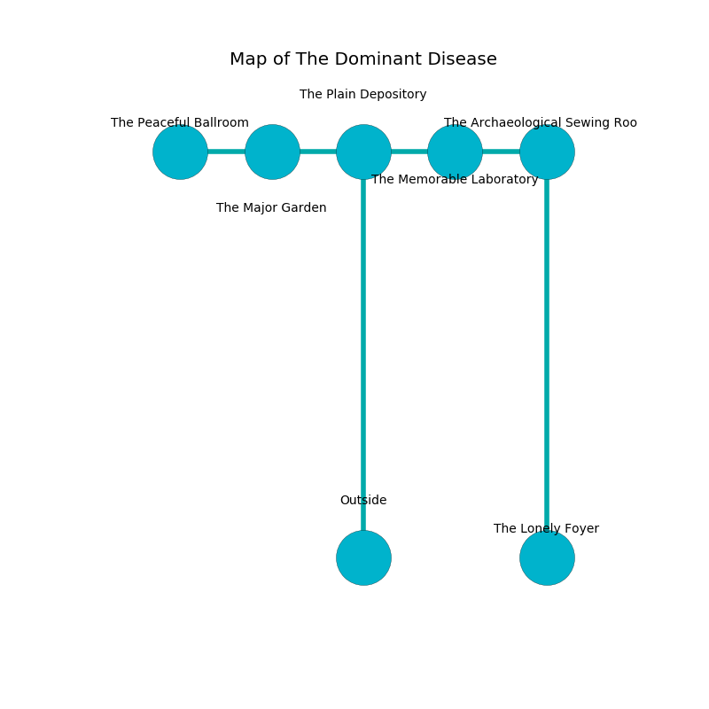

%Ruin Dogs

##The Dominant Disease
###Overview
The Dominant Disease is located in a ruined rift. Some rooms of it are unbearably cold. The ruin is coming to life. It is occupied by Cyclopses. Rene Machado The Compulsive, a Frost Giant is here. The Cyclopses worship Rene Machado The Compulsive. He  is trying to recover [The Friendly Protection](#The-Friendly-Protection). 

###Artifact
####The Friendly Protection

The Friendly Protection has the form of a soft doll. It is a bright gray color. When smelled it repels insects. 

###Locations

####the plain depository
The mirrored walls are covered in mold. The air smells like cucumber here. There are two Cyclopses here. The floor is sticky. One of the Cyclopses is pointing a ballista at the entrance. 

There is an engraving on a tablet written in Cyclopses Script. 

> I lost [The Friendly Protection](#The-Friendly-Protection).
>

* To the west a torchlit opening connects to [the major garden](#the-major-garden).
* To the east a long cavern leads to [the memorable laboratory](#the-memorable-laboratory).
* To the south is the entrance.

####the memorable laboratory
Gray razorgrass is decaying in cracks in the floor. The mirrored walls are caving in. The floor is glossy. 

* To the west a long cavern connects to [the plain depository](#the-plain-depository).
* To the east a dripping corridor leads to [the archaeological sewing room](#the-archaeological-sewing-room).

####the major garden
The air tastes like cassia here. There are two Cyclopses here. The Cyclopses are willing to negotiate. 

There is an engraving on a tablet written in common. 

> Maybe try dying.
>

* To the west a dripping path leads to [the peaceful ballroom](#the-peaceful-ballroom).
* To the east a torchlit opening opens to [the plain depository](#the-plain-depository).

####the peaceful ballroom
The air tastes like spinach here. Yellow moss is sprouting from the ceiling. The floor is flooded with eight inch deep lukewarm water. There are two Cyclopses here. The Cyclopses are meditating. 

* There is a comb here.
* To the east a dripping path leads to [the major garden](#the-major-garden).

####the archaeological sewing room
The air tastes like white chocolate here. The mirrored walls are pristine. The floor is cluttered with ashes. 

* [The Friendly Protection](#The-Friendly-Protection) is here.
* To the west a dripping corridor opens to [the memorable laboratory](#the-memorable-laboratory).
* To the south a windy threshold opens to [the lonely foyer](#the-lonely-foyer).

####the lonely foyer
Red mushrooms are swaying from the ceiling. The floor is flooded with two inch deep cool water. The air smells like clary sage here. There are two Cyclopses here. The Cyclopses are defending this room from intruders. 

* [Rene Machado The Compulsive](#Rene-Machado-The-Compulsive) is here.
* To the north a windy threshold leads to [the archaeological sewing room](#the-archaeological-sewing-room).

