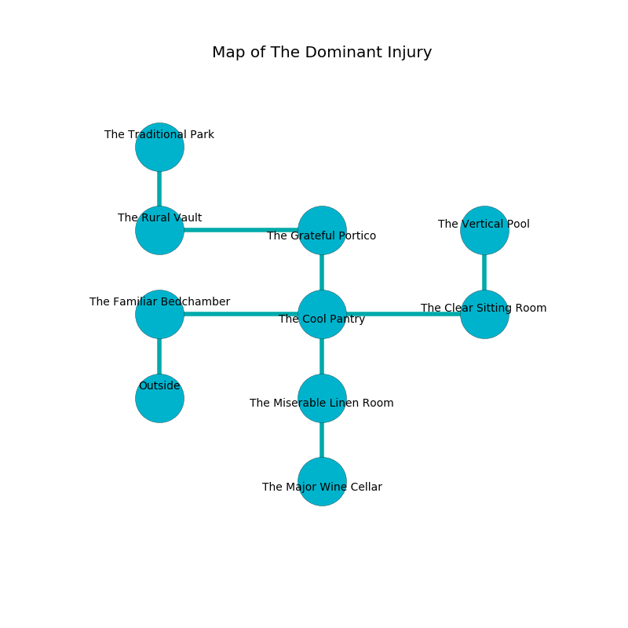

%Ruin Dogs

##The Dominant Injury
###Overview
The Dominant Injury is located under a haunted city. Regions of it are corrupted. The ruin is coming to life. It is occupied by Kobolds. Eusebio Hogan The Boring, a Kuo-Toa Archpriest is here. The Kobolds have been charmed by Eusebio Hogan The Boring. He  is founding a new religion. 

###Artifact
####The Unlawful Arm

The Unlawful Arm is a powerful artifact in the shape of a cold doll. When held it liquifies. 

###Locations

####the familiar bedchamber
The floor is sticky. The air smells like starch here. The wooden walls are bloodstained. There are an Ogre and a Shambling Mound here. 

* There is a shirt here.
* To the east a small hallway leads to [the cool pantry](#the-cool-pantry).
* To the south is the entrance.

####the cool pantry
Blue mushrooms are growing from the walls. The floor is flooded with eight inch deep cool water. The wooden walls are ruined. The air tastes like pennyroyal here. 

* To the west a small hallway opens to [the familiar bedchamber](#the-familiar-bedchamber).
* To the east a torchlit passageway connects to [the clear sitting Room](#the-clear-sitting-Room).
* To the north a small walkway opens to [the grateful portico](#the-grateful-portico).
* To the south a twisted opening connects to [the miserable linen room](#the-miserable-linen-room).

####the clear sitting Room
The air smells like goat here. 

* To the west a torchlit passageway leads to [the cool pantry](#the-cool-pantry).
* To the north a twisted pathway connects to [the vertical pool](#the-vertical-pool).

####the grateful portico
The air smells like cornmeal here. The floor is smooth. There is a trap here. When activated, a magical rune will cast a curse. 

* To the west a twisted cave opens to [the rural vault](#the-rural-vault).
* To the south a small walkway leads to [the cool pantry](#the-cool-pantry).

####the rural vault
The air smells like hyacinth here. Yellow razorgrass is growing from the ceiling. 

* [The Unlawful Arm](#The-Unlawful-Arm) is here.
* To the east a twisted cave connects to [the grateful portico](#the-grateful-portico).
* To the north a windy gap leads to [the traditional park](#the-traditional-park).

####the miserable linen room
The crystal walls are pristine. The air tastes like alcohol here. The floor is cluttered with bones. 

* [Eusebio Hogan The Boring](#Eusebio-Hogan-The-Boring) is here.
* To the north a twisted opening leads to [the cool pantry](#the-cool-pantry).
* To the south a hazy threshold connects to [the major wine cellar](#the-major-wine-cellar).

####the vertical pool
The air smells like violet leaf here. There are twenty three Winged Kobolds and eleven Kobolds here. The crystal walls are scratched. The floor is sticky. Blue razorgrass is growing from the ceiling. One of the Kobolds is working a mechanism that can launch acid at the Ruin Dogs. 

* There is a feather here.
* There is a tome here.
* To the south a twisted pathway opens to [the clear sitting Room](#the-clear-sitting-Room).

####the major wine cellar
There are nineteen Winged Kobolds and eighteen Kobolds here. The floor is cluttered with debris. Green ferns are growing in broken urns. One of the Kobolds is pointing a ballista at the entrance. 

* There is a cord here.
* To the north a hazy threshold connects to [the miserable linen room](#the-miserable-linen-room).

####the traditional park
The air smells like smoke here. The floor is sticky. Red moss is decaying in a patch on the floor. 

There is an engraving on the ceiling written in Kobolds Script. 

> I am looting this place.
>
> Leave now.
>

* There is a map here.
* To the south a windy gap opens to [the rural vault](#the-rural-vault).

