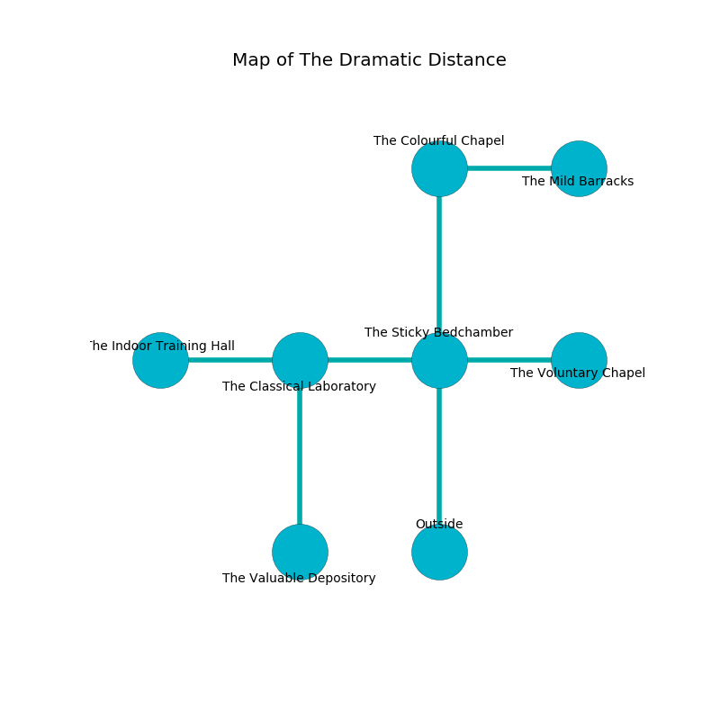

%Ruin Dogs

##The Dramatic Distance
###Overview
The Dramatic Distance is located under an alien mountain. Some areas of it are foggy. The ruin is coming to life. It is occupied by Pixies. Jessenia Estrada The Changeable, a Mind Flayer Arcanist is here. The Pixies are battling Jessenia Estrada The Changeable. She  is trying to recover [Cofwi Lagaed](#Cofwi-Lagaed). 

###Artifact
####Cofwi Lagaed

Cofwi Lagaed is a powerful artifact in the shape of a sharp cube. It smells like mimosa. When smelled it turns surrounding objects to ashes. 

###Locations

####the sticky bedchamber
There are twenty eight Pixies here. The air smells like roasted barley here. Gray ferns are decaying in broken urns. There is a trap here. When activated, a pressure plate will launch a poison dart. The Pixies are caring for babies. 

There is an engraving on the floor written in common. 

> I am lost in The Dramatic Distance.
>

* To the west a small pathway opens to [the classical laboratory](#the-classical-laboratory).
* To the east a hazy corridor opens to [the voluntary chapel](#the-voluntary-chapel).
* To the north a hazy opening leads to [the colourful chapel](#the-colourful-chapel).
* To the south is the entrance.

####the colourful chapel
The floor is flooded with three inch deep lukewarm water. The air smells like ginger here. Green mushrooms are swaying from the ceiling. 

* There is a basket here.
* There is a fork here.
* There is a pig here.
* To the east a twisted artery connects to [the mild barracks](#the-mild-barracks).
* To the south a hazy opening leads to [the sticky bedchamber](#the-sticky-bedchamber).

####the classical laboratory
The floor is glossy. There are twenty eight Pixies here. The Pixies are performing a ritual. If not interrupted, the Pixies will become more powerful. 

* [Cofwi Lagaed](#Cofwi-Lagaed) is here.
* To the west a narrow cavern opens to [the indoor training hall](#the-indoor-training-hall).
* To the east a small pathway leads to [the sticky bedchamber](#the-sticky-bedchamber).
* To the south a torchlit corridor connects to [the valuable depository](#the-valuable-depository).

####the valuable depository
There are a Wereboar, a Raven, a Mimic, and an Awakened Tree here. The stone walls are ruined. 

* To the north a torchlit corridor leads to [the classical laboratory](#the-classical-laboratory).

####the voluntary chapel
There are twenty eight Pixies here. The glass walls are bloodstained. The Pixies are celebrating. 

* To the west a hazy corridor connects to [the sticky bedchamber](#the-sticky-bedchamber).

####the mild barracks
There is a trap here. When activated, a tripwire will launch a ceiling pendulum. Yellow ferns are sprouting in a patch on the floor. The wooden walls are bloodstained. The floor is bloodstained. 

There is an engraving on a stone written in Pixies Script. 

> Dig here.
>

* [Jessenia Estrada The Changeable](#Jessenia-Estrada-The-Changeable) is here.
* To the west a twisted artery connects to [the colourful chapel](#the-colourful-chapel).

####the indoor training hall
There are twenty eight Pixies here. White moss is swaying from the ceiling. The floor is bloodstained. The brick walls are unsettled. The Pixies are willing to negotiate. 

* There is a wight here.
* To the east a narrow cavern leads to [the classical laboratory](#the-classical-laboratory).

