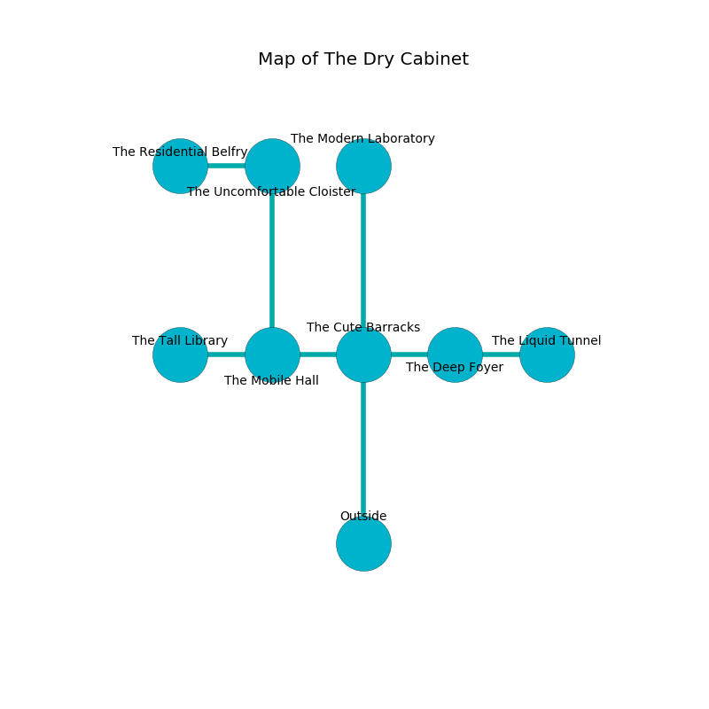

%Ruin Dogs

##The Dry Cabinet
###Overview
The Dry Cabinet is located under a haunted tree. Parts of The Dry Cabinet are somewhat hot. The ruin is coming to life. It is occupied by Kobolds. Ngoc Cherry The Cynical, a Yuan-Ti Abomination is here. The Kobolds are the minions of Ngoc Cherry The Cynical. She  is founding a new religion. 

###Artifact
####The Aloof Drawing

The Aloof Drawing looks like a warm monument. Power shifts away from it. It smells like humus. When picked up it becomes a shielding force. 

###Locations

####the cute barracks
The air smells like wormwood here. The concrete walls are bloodstained. The floor is glossy. 

There is an engraving on a stone written in common. 

> Try fighting.
>

* [Ngoc Cherry The Cynical](#Ngoc-Cherry-The-Cynical) is here.
* To the west a hazy cave leads to [the mobile hall](#the-mobile-hall).
* To the east a dripping opening connects to [the deep foyer](#the-deep-foyer).
* To the north a narrow pathway opens to [the modern laboratory](#the-modern-laboratory).
* To the south is the entrance.

####the deep foyer
The floor is bloodstained. The air smells like mold here. There are twenty Winged Kobolds and twenty four Kobolds here. Blue razorgrass is growing from the ceiling. The obsidion walls are scratched. If the Kobolds notice the Ruin Dogs, one of them will retreat and alert the others. 

* [The Aloof Drawing](#The-Aloof-Drawing) is here.
* To the west a dripping opening leads to [the cute barracks](#the-cute-barracks).
* To the east a twisted hallway connects to [the liquid tunnel](#the-liquid-tunnel).

####the mobile hall
The air tastes like black tea here. White moss is decaying in cracks in the floor. 

* To the west a flooded hallway opens to [the tall library](#the-tall-library).
* To the east a hazy cave leads to [the cute barracks](#the-cute-barracks).
* To the north a dripping gap opens to [the uncomfortable cloister](#the-uncomfortable-cloister).

####the uncomfortable cloister
The floor is sticky. There are a Giant Ape and a Phase Spider here. 

* To the west a small hall opens to [the residential belfry](#the-residential-belfry).
* To the south a dripping gap leads to [the mobile hall](#the-mobile-hall).

####the tall library
The mirrored walls are pristine. There are a Kuo-Toa Whip, a Guard, a Badger, a Gorgon, an Azer, a Hawk, and a Gray Ooze here. Gray moss is decaying in cracks in the floor. The floor is flooded with nine inch deep hot water. 

There is an engraving on the wall written in Kobolds Script. 

> Oh my! sad god
>
> inevitable, pleasant, fair
>
> solar, bureaucratic, odd
>
> sadness is unfair
>

* There is a nail here.
* To the east a flooded hallway opens to [the mobile hall](#the-mobile-hall).

####the modern laboratory
Yellow mushrooms are sprouting from the walls. The glass walls are bloodstained. There are an Ogre, a Young Remorhaz, and a Berserker here. 

* There is a boat here.
* There is a rail here.
* To the south a narrow pathway connects to [the cute barracks](#the-cute-barracks).

####the residential belfry
The air tastes like jasmin here. There are a Pony, a Cyclops, and a Bone Naga here. 

* There is an egg here.
* To the east a small hall opens to [the uncomfortable cloister](#the-uncomfortable-cloister).

####the liquid tunnel
There are twenty one Winged Kobolds and twenty two Kobolds here. The Kobolds are feasting. 

There is an engraving on a tablet written in common. 

> Hide here.
>

* To the west a twisted hallway leads to [the deep foyer](#the-deep-foyer).

