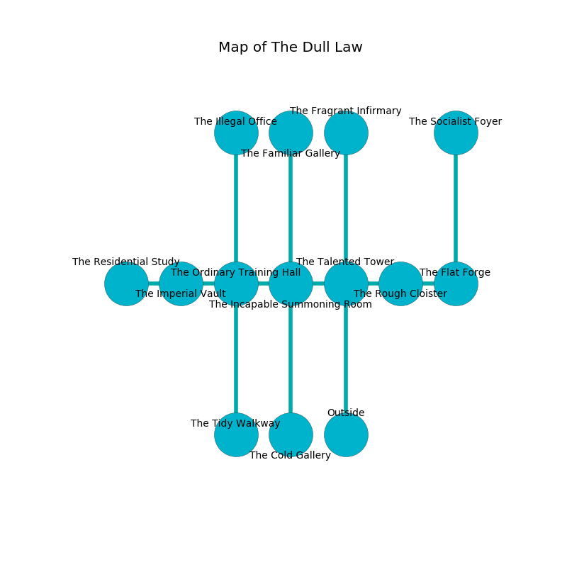

%Ruin Dogs

##The Dull Law
###Overview
The Dull Law is constructed on a giant plain. Parts of it are unbearably cold. A windstorm is happening outside. It is occupied by Kenku. Dean Mendoza The Cowardly, a Stone Giant is here. The Kenku are battling Dean Mendoza The Cowardly. He  is trying to research [Mufm Dmaemcaf](#Mufm-Dmaemcaf). 

###Artifact
####Mufm Dmaemcaf

Mufm Dmaemcaf is a powerful artifact in the shape of a hard spear. It is a dark gray color. Cacophony slides away from it. When thrown it flies into the air. 

###Locations

####the talented tower

* To the west a windy cavern connects to [the incapable summoning room](#the-incapable-summoning-room).
* To the east a small corridor opens to [the rough cloister](#the-rough-cloister).
* To the north a narrow passageway opens to [the fragrant infirmary](#the-fragrant-infirmary).
* To the south is the entrance.

####the incapable summoning room
The air tastes like grass here. There are twenty eight Kenkus here. Green lichens are growing in cracks in the floor. The floor is bloodstained. One of the Kenku is working a mechanism that can pour acid from the ceiling. 

There is an engraving on the wall written in Kenku Script. 

> I could not try running.
>

* To the west a flooded hallway connects to [the ordinary training hall](#the-ordinary-training-hall).
* To the east a windy cavern connects to [the talented tower](#the-talented-tower).
* To the north a long cavern connects to [the familiar gallery](#the-familiar-gallery).
* To the south a twisted opening opens to [the cold gallery](#the-cold-gallery).

####the rough cloister
The air tastes like malt here. 

* To the west a small corridor connects to [the talented tower](#the-talented-tower).
* To the east a hazy passageway connects to [the flat forge](#the-flat-forge).

####the ordinary training hall
There are a Drow Elite Warrior and a Sahuagin Priestess here. The brick walls are ruined. 

* To the west a narrow pathway connects to [the imperial vault](#the-imperial-vault).
* To the east a flooded hallway connects to [the incapable summoning room](#the-incapable-summoning-room).
* To the north a flooded threshold leads to [the illegal office](#the-illegal-office).
* To the south a torchlit passageway leads to [the tidy walkway](#the-tidy-walkway).

####the tidy walkway
The wooden walls are scratched. The air smells like elderflower here. There are a Swarm of Quippers, a Berserker, a Giant Spider, a Pixie, a Quaggoth, and a Giant Centipede here. 

* To the north a torchlit passageway opens to [the ordinary training hall](#the-ordinary-training-hall).

####the illegal office
The wooden walls are pristine. The air smells like plum skin here. 

* To the south a flooded threshold opens to [the ordinary training hall](#the-ordinary-training-hall).

####the cold gallery
The air smells like acerola here. White lichens are growing from the ceiling. There are twenty eight Kenkus here. If the Kenku notice the Ruin Dogs, one of them will retreat and alert [Dean Mendoza](#Dean-Mendoza). 

* To the north a twisted opening leads to [the incapable summoning room](#the-incapable-summoning-room).

####the imperial vault
The floor is cluttered with debris. Gray ferns are growing in cracks in the floor. There are twenty eight Kenkus here. The brick walls are bloodstained. One of the Kenku is pointing a ballista at the entrance. 

There is an engraving on a tablet written in Kenku Script. 

> [Mufm Dmaemcaf](#Mufm-Dmaemcaf)
>
> incredible and pure
>
> impossible and diplomatic
>
> inner, cruel, economic
>
> electronic, basic, great
>
> yet frequent
>
> pleasant and full
>
> A fowl is a lease
>
> able and conventional
>
> you will be cursed
>

* [Mufm Dmaemcaf](#Mufm-Dmaemcaf) is here.
* To the west a torchlit cavern opens to [the residential study](#the-residential-study).
* To the east a narrow pathway leads to [the ordinary training hall](#the-ordinary-training-hall).

####the flat forge
The mirrored walls are bloodstained. The air tastes like ocean here. The floor is glossy. There are twenty eight Kenkus here. If the Kenku notice the Ruin Dogs, one of them will retreat and alert the others. 

* To the west a hazy passageway connects to [the rough cloister](#the-rough-cloister).
* To the north a torchlit artery leads to [the socialist foyer](#the-socialist-foyer).

####the fragrant infirmary
The floor is smooth. Yellow razorgrass is swaying from the walls. The air smells like bouillon here. 

There is an engraving on the floor written in common. 

> I am lost in The Dull Law.
>

* [Dean Mendoza The Cowardly](#Dean-Mendoza-The-Cowardly) is here.
* To the south a narrow passageway leads to [the talented tower](#the-talented-tower).

####the familiar gallery
There are twenty eight Kenkus here. The floor is smooth. The air smells like strawberry here. One of the Kenku is pointing a ballista at the entrance. 

* To the south a long cavern leads to [the incapable summoning room](#the-incapable-summoning-room).

####the socialist foyer
The air tastes like carrot seed here. Blue mushrooms are swaying in broken urns. 

* To the south a torchlit artery opens to [the flat forge](#the-flat-forge).

####the residential study
The floor is cluttered with ashes. 

* There is a brooch here.
* To the east a torchlit cavern connects to [the imperial vault](#the-imperial-vault).

