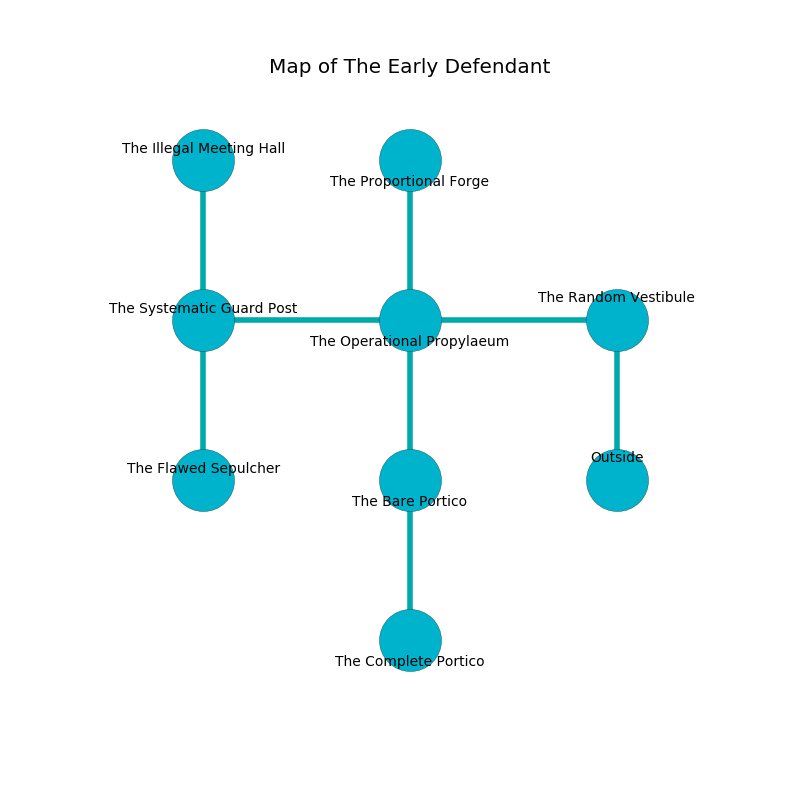

%Ruin Dogs

##The Early Defendant
###Overview
The Early Defendant is located under a crystal plain. Regions of it are flooded. The ruin is sinking into the earth. It is occupied by Thri-Kreens. Clemente Woodley The Cantankerous, a Yuan-Ti Malison is here. The Thri-Kreens have been charmed by Clemente Woodley The Cantankerous. He  is trying to research [Ihaela Iauhg](#Ihaela-Iauhg). 

###Artifact
####Ihaela Iauhg

Ihaela Iauhg looks like an opaque crystal. It smells like saffron. Psychic energy slips away from it. It is a pale purple color. When smelled it turns surrounding objects to ashes. 

###Locations

####the random vestibule
There is a trap here. When activated, a magical proximity detector will launch a fusillade of darts. The mirrored walls are covered in mold. The floor is smooth. 

* To the west a flooded cave opens to [the operational propylaeum](#the-operational-propylaeum).
* To the south is the entrance.

####the operational propylaeum
The air smells like praline here. There are three Thri-Kreens here. The floor is flooded with two inch deep lukewarm water. One of the Thri-Kreens is on watch, the rest are fighting amongst themselves. 

* There is a cart here.
* [Ihaela Iauhg](#Ihaela-Iauhg) is here.
* To the west a flooded cave opens to [the systematic guard post](#the-systematic-guard-post).
* To the east a flooded cave leads to [the random vestibule](#the-random-vestibule).
* To the north a dark hall connects to [the proportional forge](#the-proportional-forge).
* To the south a windy artery opens to [the bare portico](#the-bare-portico).

####the systematic guard post
White moss is sprouting in cracks in the floor. The floor is glossy. 

There is an engraving on the wall written in common. 

> I am lost in The Early Defendant.
>

* To the east a flooded cave connects to [the operational propylaeum](#the-operational-propylaeum).
* To the north a flooded walkway opens to [the illegal meeting hall](#the-illegal-meeting-hall).
* To the south a twisted passageway leads to [the flawed sepulcher](#the-flawed-sepulcher).

####the illegal meeting hall
There are three Thri-Kreens here. The air smells like nut flesh here. One of the Thri-Kreens is working a mechanism that can flood the room. 

* There is a basket here.
* To the south a flooded walkway leads to [the systematic guard post](#the-systematic-guard-post).

####the bare portico
The air smells like paper here. The floor is bloodstained. There are three Thri-Kreens here. One of the Thri-Kreens is working a mechanism that can launch acid at the Ruin Dogs. 

There is an engraving on the ceiling written in common. 

> Poor me! death is sadistic
>
> polite, federal, optimistic
>
> modest, loyal, unemployed
>
> all is characteristic
>

* To the north a windy artery leads to [the operational propylaeum](#the-operational-propylaeum).
* To the south a dripping threshold connects to [the complete portico](#the-complete-portico).

####the flawed sepulcher
The crystal walls are caving in. White lichens are growing in cracks in the floor. 

* There is a blade here.
* To the north a twisted passageway opens to [the systematic guard post](#the-systematic-guard-post).

####the complete portico
Green lichens are sprouting from the walls. The crystal walls are unsettled. The floor is flooded with eight inch deep lukewarm water. 

* [Clemente Woodley The Cantankerous](#Clemente-Woodley-The-Cantankerous) is here.
* To the north a dripping threshold opens to [the bare portico](#the-bare-portico).

####the proportional forge
The air tastes like coriander here. The glass walls are caving in. Green razorgrass is decaying from the ceiling. 

There is an engraving on a stone written in Thri-Kreens Script. 

> [Ihaela Iauhg](#Ihaela-Iauhg)
>
> personal and smooth
>
> yet never proportional
>
> holy, transparent, possible
>
> [Ihaela Iauhg](#Ihaela-Iauhg)
>
> minor, miserable, inappropriate
>
> helpless, right, good
>
> you shall be frozen
>

* There is a match here.
* To the south a dark hall opens to [the operational propylaeum](#the-operational-propylaeum).

