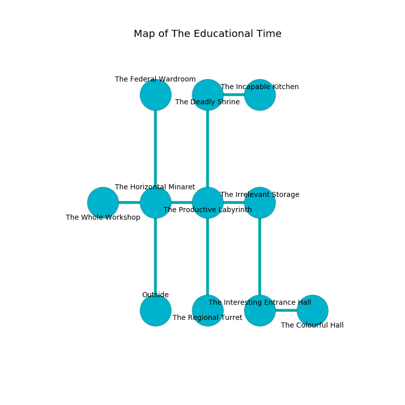

%Ruin Dogs

##The Educational Time
###Overview
The Educational Time is located in a crystal tree. Parts of it are flooded. The ruin is collapsing slowly. It is occupied by Harpies. Golda Silverman The Silly, a Fire Giant is here. The Harpies are the slaves of Golda Silverman The Silly. She  is founding a new religion. 

###Artifact
####Deaemd

Deaemd is a powerful artifact in the shape of an opaque gem. It smells like rosemary. Water flows near it. It is a bright pink color. When worshipped it become energized with a powerful vibration. 

###Locations

####the horizontal minaret
The obsidion walls are unsettled. There is a trap here. When activated, a magical proximity detector will collapse a column. 

* There is a jewel here.
* There is a pot here.
* There is a dragon here.
* There is a stamp here.
* There is an icon here.
* [Deaemd](#Deaemd) is here.
* To the west a dark opening connects to [the whole workshop](#the-whole-workshop).
* To the east a flooded hall opens to [the productive labyrinth](#the-productive-labyrinth).
* To the north a small cave leads to [the federal wardroom](#the-federal-wardroom).
* To the south is the entrance.

####the productive labyrinth
There are ten Harpies here. Blue ferns are decaying from the walls. One of the Harpies is on watch, the rest are caring for babies. 

* To the west a flooded hall opens to [the horizontal minaret](#the-horizontal-minaret).
* To the east a dripping gap leads to [the irrelevant storage](#the-irrelevant-storage).
* To the north a narrow pathway leads to [the deadly shrine](#the-deadly-shrine).
* To the south a dripping walkway opens to [the regional turret](#the-regional-turret).

####the federal wardroom
The concrete walls are scratched. The air tastes like gooseberry here. Red lichens are sprouting in a patch on the floor. There is a trap here. When activated, a magical rune will launch a rolling boulder. 

There is an engraving on the wall written in common. 

> I am lovely.
>

* To the south a small cave leads to [the horizontal minaret](#the-horizontal-minaret).

####the irrelevant storage
The floor is sticky. The obsidion walls are bloodstained. The air tastes like vetiver here. 

There is an engraving on a monolith written in Harpies Script. 

> Go away.
>

* To the west a dripping gap leads to [the productive labyrinth](#the-productive-labyrinth).
* To the south a small pathway connects to [the interesting entrance hall](#the-interesting-entrance-hall).

####the interesting entrance hall
The air smells like rancid butter here. The floor is bloodstained. There are ten Harpies here. If the Harpies notice the Ruin Dogs, one of them will retreat and alert the others. 

* To the east a dripping hallway opens to [the colourful hall](#the-colourful-hall).
* To the north a small pathway opens to [the irrelevant storage](#the-irrelevant-storage).

####the regional turret
Green ferns are sprouting in a patch on the floor. The glass walls are ruined. 

* To the north a dripping walkway opens to [the productive labyrinth](#the-productive-labyrinth).

####the deadly shrine
There are ten Harpies here. There is a trap here. When activated, a magical proximity detector will launch an arrow. White lichens are growing in a patch on the floor. The floor is bloodstained. The stone walls are pristine. If the Harpies notice the Ruin Dogs, one of them will retreat and alert the others. 

There is an engraving on a stone written in Harpies Script. 

> O! the memory of you is sadistic
>
> it is never characteristic
>
> it is never cold
>
> the world is bold
>

* [Golda Silverman The Silly](#Golda-Silverman-The-Silly) is here.
* To the east a windy passageway connects to [the incapable kitchen](#the-incapable-kitchen).
* To the south a narrow pathway opens to [the productive labyrinth](#the-productive-labyrinth).

####the colourful hall
Blue ferns are growing from the walls. The glass walls are scratched. 

There is an engraving on a stone written in common. 

> I am lost in The Educational Time.
>
> Hide here.
>

* To the west a dripping hallway opens to [the interesting entrance hall](#the-interesting-entrance-hall).

####the incapable kitchen
The floor is glossy. The concrete walls are scratched. 

* There is a card here.
* There is a sponge here.
* There is a ring here.
* To the west a windy passageway leads to [the deadly shrine](#the-deadly-shrine).

####the whole workshop
There are ten Harpies here. The air smells like salt here. The Harpies are willing to negotiate. 

* To the east a dark opening opens to [the horizontal minaret](#the-horizontal-minaret).

