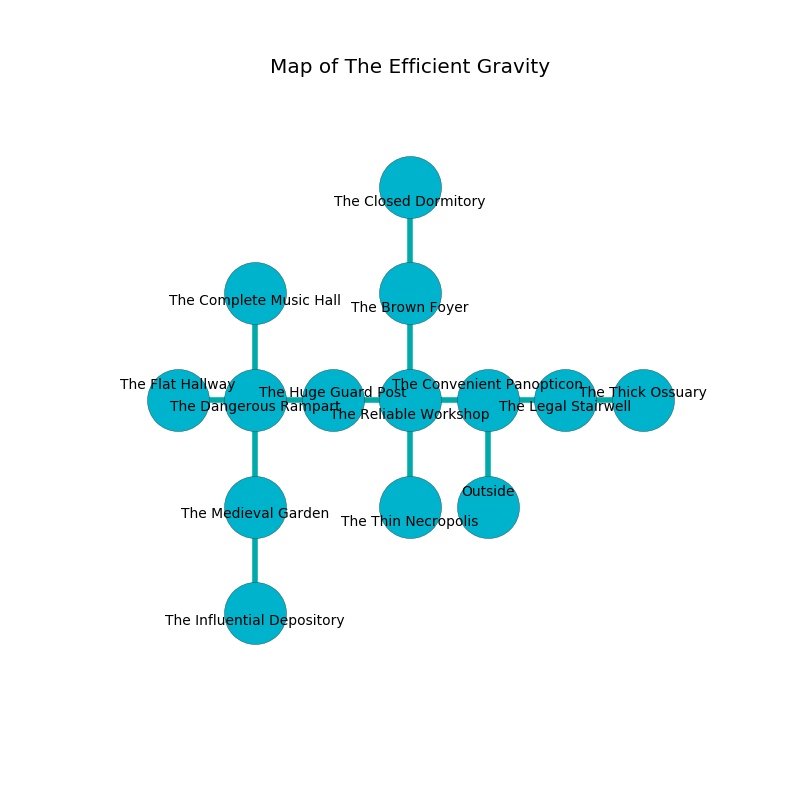

%Ruin Dogs

##The Efficient Gravity
###Overview
The Efficient Gravity is located under a volcanic mountain. Some areas of The Efficient Gravity are somewhat hot. A massive flood is happening outside. It is occupied by Dryads. Ronna Calhoun The Fussy, a Hobgoblin Warlord is here. The Dryads are the soldiers of Ronna Calhoun The Fussy. She  is trying to understand [The Bitter Firm](#The-Bitter-Firm). 

###Artifact
####The Bitter Firm

The Bitter Firm looks like an opaque monument. Air slides away from it. When rubbed it flies into the air. 

###Locations

####the convenient panopticon
There are six Dryads here. The Dryads are performing a ritual. If not interrupted, the ruin dogs will be weakened. 

* To the west a dripping gap opens to [the reliable workshop](#the-reliable-workshop).
* To the east a dark walkway opens to [the legal stairwell](#the-legal-stairwell).
* To the south is the entrance.

####the reliable workshop
The floor is smooth. There are six Dryads here. The crystal walls are ruined. The Dryads are crazy with bloodlust. 

There is an engraving on a monolith written in common. 

> Try leaving.
>

* There is an egg here.
* To the west a flooded cave leads to [the huge guard post](#the-huge-guard-post).
* To the east a dripping gap leads to [the convenient panopticon](#the-convenient-panopticon).
* To the north a dripping walkway leads to [the brown foyer](#the-brown-foyer).
* To the south a small passageway leads to [the thin necropolis](#the-thin-necropolis).

####the thin necropolis
The floor is smooth. Green ferns are sprouting in a patch on the floor. The air smells like burnt sugar here. 

There is an engraving on the ceiling written in Dryads Script. 

> Oh terrible we
>
> social, competitive, free
>
> yet certain
>
> sadness is free
>

* To the north a small passageway leads to [the reliable workshop](#the-reliable-workshop).

####the huge guard post
Gray lichens are growing from the walls. The air smells like mulberry here. The floor is flooded with five inch deep scalding water. 

* To the west a small opening leads to [the dangerous rampart](#the-dangerous-rampart).
* To the east a flooded cave connects to [the reliable workshop](#the-reliable-workshop).

####the dangerous rampart
Green mushrooms are swaying in broken urns. The air smells like potato chip here. There are six Dryads here. The floor is sticky. The Dryads are willing to negotiate. 

There is an engraving on a tablet written in Dryads Script. 

> I am alone.
>
> Leave now.
>

* To the west a hazy cavern connects to [the flat hallway](#the-flat-hallway).
* To the east a small opening leads to [the huge guard post](#the-huge-guard-post).
* To the north a long opening connects to [the complete music hall](#the-complete-music-hall).
* To the south a torchlit pathway opens to [the medieval garden](#the-medieval-garden).

####the flat hallway
The glass walls are scratched. There are six Dryads here. The floor is cluttered with rocks. The air smells like privet blossom here. The Dryads are crazy with bloodlust. 

* There is a horn here.
* To the east a hazy cavern opens to [the dangerous rampart](#the-dangerous-rampart).

####the legal stairwell
Gray mushrooms are swaying in a patch on the floor. The air smells like rose here. The floor is sticky. 

* To the west a dark walkway connects to [the convenient panopticon](#the-convenient-panopticon).
* To the east a twisted walkway leads to [the thick ossuary](#the-thick-ossuary).

####the complete music hall
The air smells like stringent here. The glass walls are unsettled. There are six Dryads here. If the Dryads notice the Ruin Dogs, one of them will retreat and alert [Ronna Calhoun](#Ronna-Calhoun). 

* To the south a long opening opens to [the dangerous rampart](#the-dangerous-rampart).

####the medieval garden
Red razorgrass is decaying in cracks in the floor. There are six Dryads here. The Dryads are performing a ritual. If not interrupted, the Dryads will become more powerful. 

There is an engraving on a monolith written in common. 

> I am lost in The Efficient Gravity.
>
> I thought about cowering.
>

* There is a trousers here.
* [The Bitter Firm](#The-Bitter-Firm) is here.
* To the north a torchlit pathway leads to [the dangerous rampart](#the-dangerous-rampart).
* To the south a dripping path connects to [the influential depository](#the-influential-depository).

####the brown foyer
The air smells like chrysanthemum here. The floor is bloodstained. Red lichens are swaying from the walls. There are a Chuul, a Copper Dragon Wyrmling, and a Knight here. The metallic walls are pristine. 

* There is a cake here.
* To the north a windy opening opens to [the closed dormitory](#the-closed-dormitory).
* To the south a dripping walkway opens to [the reliable workshop](#the-reliable-workshop).

####the thick ossuary
The crystal walls are unsettled. The floor is flooded with seven inch deep scalding water. There are six Dryads here. One of the Dryads is on watch, the rest are feasting. 

* [Ronna Calhoun The Fussy](#Ronna-Calhoun-The-Fussy) is here.
* To the west a twisted walkway opens to [the legal stairwell](#the-legal-stairwell).

####the closed dormitory
The floor is cluttered with bones. The air smells like autumn here. There are an Unicorn and an Old Faerie Dragon here. Gray ferns are growing from the ceiling. 

There is an engraving on a tablet written in Dryads Script. 

> I am fleeing this place.
>

* To the south a windy opening leads to [the brown foyer](#the-brown-foyer).

####the influential depository
There are six Dryads here. The Dryads are feasting. 

* There is a bell here.
* To the north a dripping path connects to [the medieval garden](#the-medieval-garden).

