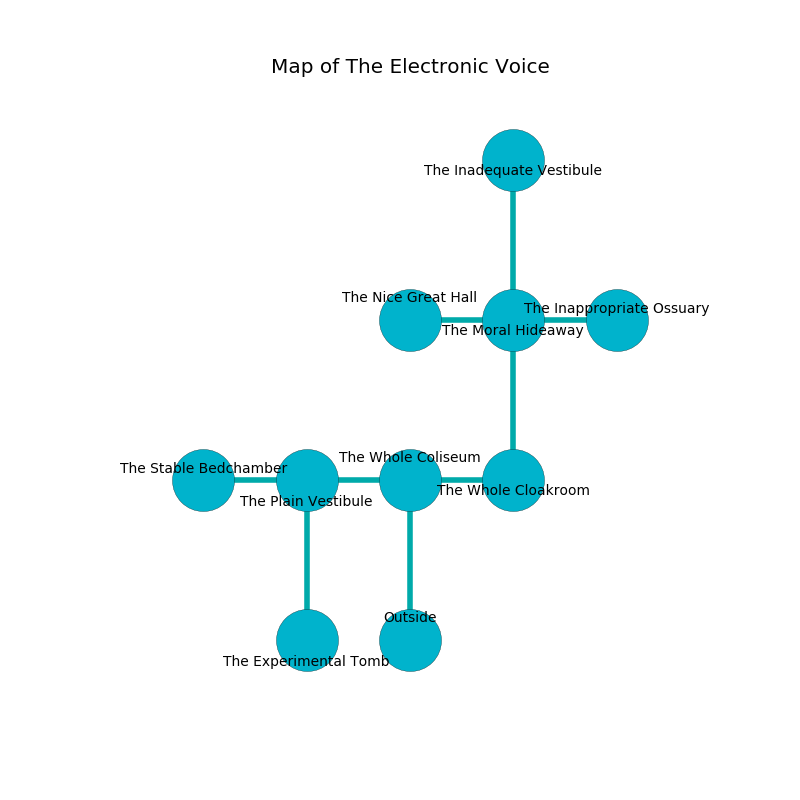

%Ruin Dogs

##The Electronic Voice
###Overview
The Electronic Voice is constructed on a volcanic city. Parts of it are cursed. A massive flood is happening outside. It is occupied by Deep Gnomes. Neida Xiong The Pessimistic, a Mind Flayer is here. The Deep Gnomes are battling Neida Xiong The Pessimistic. She  is trying to use [Baemaf Ihaeca](#Baemaf-Ihaeca). 

###Artifact
####Baemaf Ihaeca

Baemaf Ihaeca has the form of a cold doll. It is a pale red color. It smells like butterscotch. When worshipped it become energized with a powerful vibration. 

###Locations

####the whole coliseum
Gray mushrooms are sprouting in broken urns. The air smells like pecan here. 

* To the west a dark opening leads to [the plain vestibule](#the-plain-vestibule).
* To the east a torchlit walkway opens to [the whole cloakroom](#the-whole-cloakroom).
* To the south is the entrance.

####the whole cloakroom
Yellow razorgrass is swaying in cracks in the floor. The air tastes like frying here. 

* There is a belt here.
* To the west a torchlit walkway leads to [the whole coliseum](#the-whole-coliseum).
* To the north a hazy threshold leads to [the moral hideaway](#the-moral-hideaway).

####the moral hideaway
The air smells like carrot here. The floor is cluttered with broken glass. Blue razorgrass is sprouting in broken urns. 

* To the west a windy pathway leads to [the nice great hall](#the-nice-great-hall).
* To the east a dark gap opens to [the inappropriate ossuary](#the-inappropriate-ossuary).
* To the north a dripping hallway connects to [the inadequate vestibule](#the-inadequate-vestibule).
* To the south a hazy threshold opens to [the whole cloakroom](#the-whole-cloakroom).

####the plain vestibule
There are twelve Deep Gnomes here. The Deep Gnomes are crazy with bloodlust. 

* [Baemaf Ihaeca](#Baemaf-Ihaeca) is here.
* To the west a windy cavern opens to [the stable bedchamber](#the-stable-bedchamber).
* To the east a dark opening connects to [the whole coliseum](#the-whole-coliseum).
* To the south a small hall opens to [the experimental tomb](#the-experimental-tomb).

####the inadequate vestibule
There are a Quaggoth Thonot, a Rhinoceros, a Flumph, a Gray Ooze, and a Polar Bear here. The air smells like orange peel here. Red ferns are sprouting from the walls. 

There is an engraving on the floor written in Deep Gnomes Script. 

> O our fate is woe
>
> yet slow
>
> blind, fine, manual
>
> cruelty is annual
>

* [Neida Xiong The Pessimistic](#Neida-Xiong-The-Pessimistic) is here.
* To the south a dripping hallway leads to [the moral hideaway](#the-moral-hideaway).

####the nice great hall
The air tastes like incense here. 

There is an engraving on the ceiling written in common. 

> I am lost in The Electronic Voice.
>

* There is a bell here.
* To the east a windy pathway connects to [the moral hideaway](#the-moral-hideaway).

####the inappropriate ossuary
There are twelve Deep Gnomes here. The floor is cluttered with debris. The air tastes like honey here. Blue moss is sprouting in cracks in the floor. The Deep Gnomes are performing a ritual. If not interrupted, [Neida Xiong](#Neida-Xiong) will be magically alarmed. 

* To the west a dark gap opens to [the moral hideaway](#the-moral-hideaway).

####the stable bedchamber
There are twelve Deep Gnomes here. The air smells like rubber here. White lichens are decaying in cracks in the floor. The Deep Gnomes are crazy with bloodlust. 

* To the east a windy cavern leads to [the plain vestibule](#the-plain-vestibule).

####the experimental tomb
The mirrored walls are covered in mold. 

* To the north a small hall leads to [the plain vestibule](#the-plain-vestibule).

