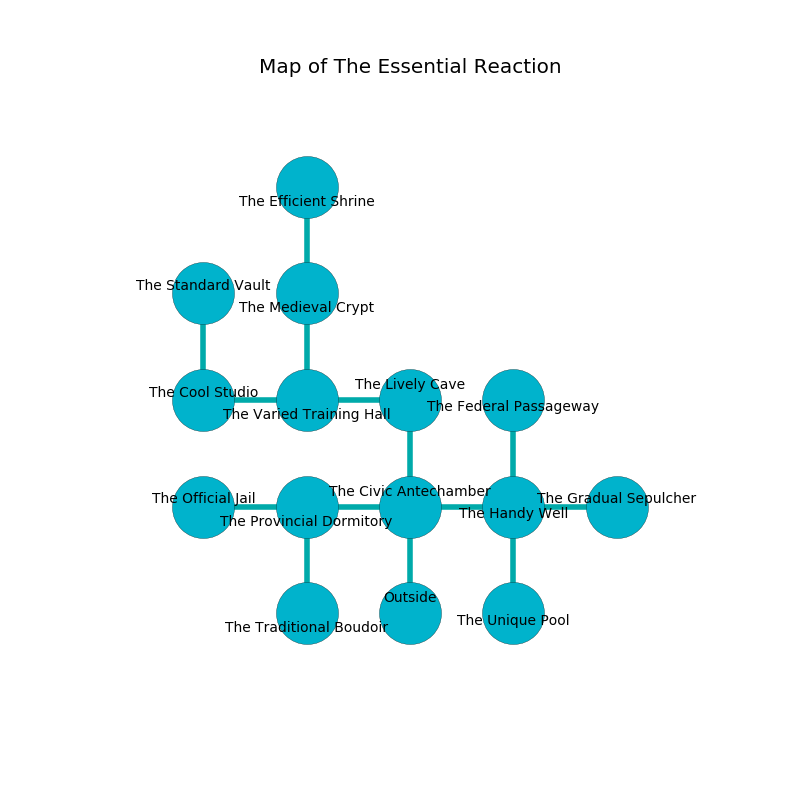

%Ruin Dogs

##The Essential Reaction
###Overview
The Essential Reaction is located on an obsidion plain. Some areas of it are cursed. A windstorm is happening outside. It is occupied by Goblins. Ellsworth Dillon The Harsh, a Kuo-Toa Archpriest is here. The Goblins are the slaves of Ellsworth Dillon The Harsh. He  is founding a new religion. 

###Artifact
####Lagaemaedaeum Gaehdaf

Lagaemaedaeum Gaehdaf has the form of a smooth rock. It is a shifting brown color. It smells like spice. When thrown it frightens children. 

###Locations

####the civic antechamber
Red mushrooms are decaying in a patch on the floor. There are two Hobgoblin Captains here. The floor is cluttered with ashes. The Goblins are willing to fight to the death. 

* There is a face here.
* To the west a dripping path leads to [the provincial dormitory](#the-provincial-dormitory).
* To the east a windy cave connects to [the handy well](#the-handy-well).
* To the north a dripping corridor leads to [the lively cave](#the-lively-cave).
* To the south is the entrance.

####the lively cave
There are a Goblin, four Hobgoblins, a Hobgoblin Captain,  here. The concrete walls are covered in mold. The floor is glossy. The air tastes like peony here. The Goblins are celebrating. 

* To the west a windy hallway opens to [the varied training hall](#the-varied-training-hall).
* To the south a dripping corridor leads to [the civic antechamber](#the-civic-antechamber).

####the varied training hall
Green lichens are decaying in cracks in the floor. The floor is smooth. The air smells like ambergris here. 

* To the west a hazy passageway connects to [the cool studio](#the-cool-studio).
* To the east a windy hallway leads to [the lively cave](#the-lively-cave).
* To the north a flooded corridor opens to [the medieval crypt](#the-medieval-crypt).

####the provincial dormitory
The air tastes like unripe banana here. There are a Goblin, a Hobgoblin, two Hobgoblin Captains, and  here. There is a trap here. When activated, a pressure plate will launch a swinging block. The obsidion walls are unsettled. One of the Goblins is on watch, the rest are fighting amongst themselves. 

* [Lagaemaedaeum Gaehdaf](#Lagaemaedaeum-Gaehdaf) is here.
* To the west a dripping gap opens to [the official jail](#the-official-jail).
* To the east a dripping path connects to [the civic antechamber](#the-civic-antechamber).
* To the south a twisted path opens to [the traditional boudoir](#the-traditional-boudoir).

####the handy well
Yellow razorgrass is swaying in broken urns. There are two Goblins, a Hobgoblin, two Hobgoblin Captains,  here. The floor is cluttered with shells. The brick walls are unsettled. The Goblins are caring for babies. 

* To the west a windy cave opens to [the civic antechamber](#the-civic-antechamber).
* To the east a twisted hall leads to [the gradual sepulcher](#the-gradual-sepulcher).
* To the north a small corridor opens to [the federal passageway](#the-federal-passageway).
* To the south a long pathway opens to [the unique pool](#the-unique-pool).

####the federal passageway
The glass walls are caving in. There are a Cult Fanatic and a Barbed Devil here. 

There is an engraving on a stone written in common. 

> I am lost in The Essential Reaction.
>
> Leave at once.
>

* There is a cord here.
* There is a rod here.
* To the south a small corridor opens to [the handy well](#the-handy-well).

####the gradual sepulcher
The air smells like frankincense here. White ferns are growing from the ceiling. 

* [Ellsworth Dillon The Harsh](#Ellsworth-Dillon-The-Harsh) is here.
* To the west a twisted hall opens to [the handy well](#the-handy-well).

####the cool studio
The floor is cluttered with bones. The air tastes like beef here. 

* There is a glove here.
* To the east a hazy passageway opens to [the varied training hall](#the-varied-training-hall).
* To the north a twisted path connects to [the standard vault](#the-standard-vault).

####the medieval crypt
The floor is flooded with five inch deep scalding water. There are a Thug, a Hook Horror, an Orc Eye of Gruumsh, and a Manes here. The metallic walls are pristine. 

* There is a button here.
* To the north a small hallway opens to [the efficient shrine](#the-efficient-shrine).
* To the south a flooded corridor opens to [the varied training hall](#the-varied-training-hall).

####the unique pool
The crystal walls are pristine. There are a Peryton, a Tribal Warrior, and a Yuan-Ti Malison here. 

* There is a collar here.
* There is a goblin here.
* To the north a long pathway connects to [the handy well](#the-handy-well).

####the standard vault
White mushrooms are growing in cracks in the floor. The air smells like old wood here. The brick walls are unsettled. 

There is an engraving on a stone written in Goblins Script. 

> Leave at once.
>

* There is a ghost here.
* To the south a twisted path leads to [the cool studio](#the-cool-studio).

####the efficient shrine
The brick walls are ruined. 

* There is a salamander here.
* To the south a small hallway connects to [the medieval crypt](#the-medieval-crypt).

####the official jail
The air smells like orris here. There are two Hobgoblins and two Hobgoblin Captains here. Green ferns are sprouting in a patch on the floor. The Goblins are willing to negotiate. 

* To the east a dripping gap leads to [the provincial dormitory](#the-provincial-dormitory).

####the traditional boudoir
The crystal walls are covered in mold. Gray mushrooms are sprouting in broken urns. The air tastes like mimosa here. 

* There is a carriage here.
* To the north a twisted path connects to [the provincial dormitory](#the-provincial-dormitory).

