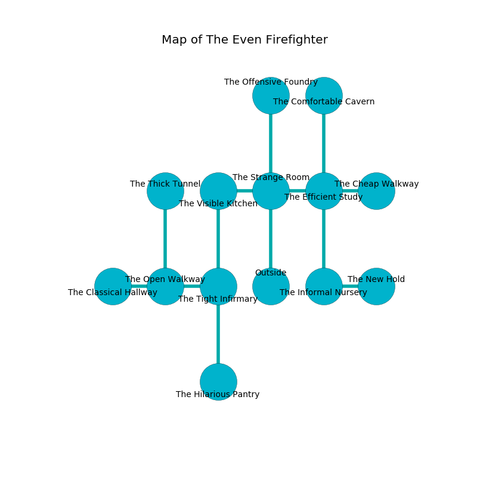

%Ruin Dogs

##The Even Firefighter
###Overview
The Even Firefighter is located in a cursed mountain. Regions of it are foggy. A windstorm is happening outside. It is occupied by Humans. Enoch Henry The Compulsive, a Cloud Giant is here. The Humans are the minions of Enoch Henry The Compulsive. He  is trying to find [Idedha Daem](#Idedha-Daem). 

###Artifact
####Idedha Daem

Idedha Daem has the form of a hard blade. It smells like mold. Gravity flows near it. When rubbed it changes probabilities. 

###Locations

####the strange room
The air smells like apple here. The mirrored walls are covered in mold. Yellow razorgrass is swaying in cracks in the floor. The floor is sticky. 

* To the west a dark corridor connects to [the visible kitchen](#the-visible-kitchen).
* To the east a windy hall connects to [the efficient study](#the-efficient-study).
* To the north a narrow pathway leads to [the offensive foundry](#the-offensive-foundry).
* To the south is the entrance.

####the visible kitchen
White moss is growing in broken urns. 

There is an engraving on a monolith written in Humans Script. 

> A trap ahead.
>

* To the east a dark corridor leads to [the strange room](#the-strange-room).
* To the south a windy gap opens to [the tight infirmary](#the-tight-infirmary).

####the tight infirmary
The floor is sticky. The brick walls are pristine. There are a Cult Fanatic, a Veteran, a Tribal Warrior, a Gladiator, a Scout, a Thug, and an Acolyte here. The Humans are berserk with rage. 

* To the west a long hall connects to [the open walkway](#the-open-walkway).
* To the north a windy gap opens to [the visible kitchen](#the-visible-kitchen).
* To the south a long hall connects to [the hilarious pantry](#the-hilarious-pantry).

####the open walkway
There are a Kuo-Toa Monitor, a Nycaloth, a Sea Hag, and an Acolyte here. The air smells like fig here. 

* [Idedha Daem](#Idedha-Daem) is here.
* To the west a torchlit pathway leads to [the classical hallway](#the-classical-hallway).
* To the east a long hall connects to [the tight infirmary](#the-tight-infirmary).
* To the north a twisted hallway opens to [the thick tunnel](#the-thick-tunnel).

####the offensive foundry
Red razorgrass is decaying in cracks in the floor. The air tastes like narcissus here. The wooden walls are covered in mold. 

* To the south a narrow pathway opens to [the strange room](#the-strange-room).

####the efficient study
There are a Jackal, a Spectator, a Gladiator, a Giant Frog, a Copper Dragon Wyrmling, an Orc, and a Knight here. The floor is smooth. 

There is an engraving on the floor written in Humans Script. 

> [Idedha Daem](#Idedha-Daem)
>
> human, unemployed, civic
>
> color-blind and regional
>
> physical, structural, separate
>
> A fish is a soprano
>
> bureaucratic and indirect
>
> you are joined
>

* There is a wand here.
* There is a screw here.
* There is a coat here.
* To the west a windy hall opens to [the strange room](#the-strange-room).
* To the east a dripping cave leads to [the cheap walkway](#the-cheap-walkway).
* To the north a dark gap leads to [the comfortable cavern](#the-comfortable-cavern).
* To the south a long threshold connects to [the informal nursery](#the-informal-nursery).

####the classical hallway
The air tastes like graham cracker here. The floor is sticky. 

* To the east a torchlit pathway opens to [the open walkway](#the-open-walkway).

####the comfortable cavern
The air tastes like absinthe here. There is a trap here. When activated, a pressure plate will launch a blade. 

* To the south a dark gap connects to [the efficient study](#the-efficient-study).

####the hilarious pantry
Gray moss is decaying in a patch on the floor. There are an Otyugh, a Gray Ooze, a Hobgoblin Warlord, a Crawling Claw, and a Griffon here. The floor is flooded with one inch deep lukewarm water. The crystal walls are pristine. 

* To the north a long hall connects to [the tight infirmary](#the-tight-infirmary).

####the informal nursery
There are a Glabrezu, a Silver Dragon Wyrmling, and a Knight here. White ferns are decaying from the walls. The floor is smooth. 

* [Enoch Henry The Compulsive](#Enoch-Henry-The-Compulsive) is here.
* To the east a small passageway connects to [the new hold](#the-new-hold).
* To the north a long threshold opens to [the efficient study](#the-efficient-study).

####the new hold
The floor is glossy. There are a Giant Vulture, a Hobgoblin Warlord, a Sea Hag, and a Gas Spore here. There is a trap here. When activated, a pressure plate will launch a fusillade of darts. Yellow lichens are swaying in a patch on the floor. 

* To the west a small passageway opens to [the informal nursery](#the-informal-nursery).

####the cheap walkway
There are two Cult Fanatics, a Tribal Warrior, an Acolyte, a Guard, a Scout, a Cultist, two Bandit Captains,  here. The floor is smooth. One of the Humans is on watch, the rest are drunk. 

* To the west a dripping cave connects to [the efficient study](#the-efficient-study).

####the thick tunnel
The brick walls are bloodstained. The floor is glossy. There are a Flameskull, a Tridrone, a Homunculus, a Young Copper Dragon, a Giant Hyena, a Gibbering Mouther, and a Flying Snake here. 

* There is an arch here.
* There is a trophy here.
* To the south a twisted hallway leads to [the open walkway](#the-open-walkway).

