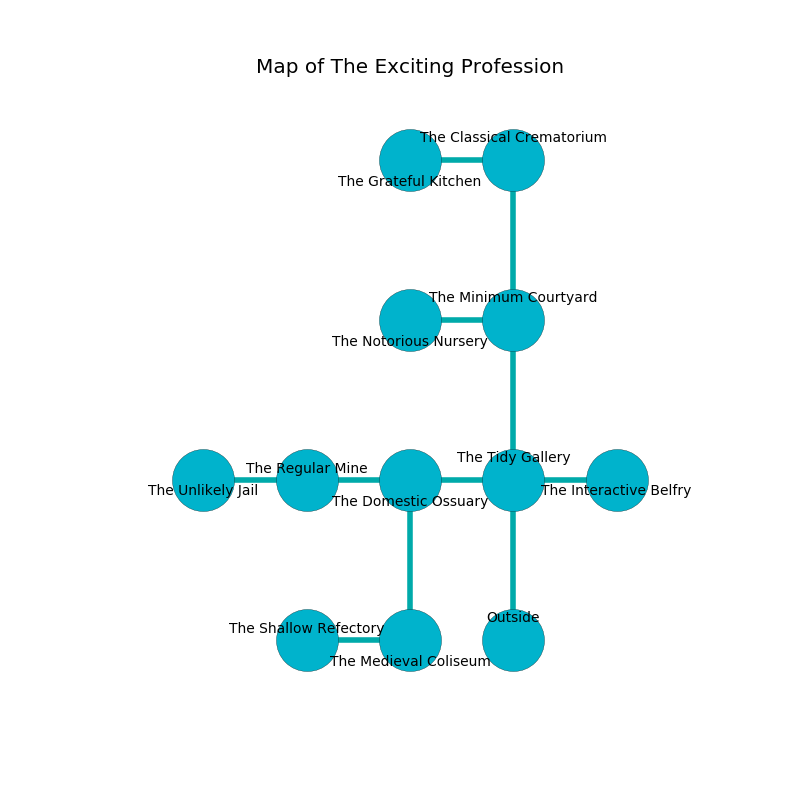

%Ruin Dogs

##The Exciting Profession
###Overview
The Exciting Profession is located in a cursed rift. Regions of The Exciting Profession are frozen. A battle between raiders is happening outside. It is occupied by Gnolls. Glen Hildebrand The Cynical, a Druid is here. The Gnolls are ruled by Glen Hildebrand The Cynical. He  is trying to use [The Ultimate Steak](#The-Ultimate-Steak). 

###Artifact
####The Ultimate Steak

The Ultimate Steak looks like a wet sphere. Fire shifts near it. When held it liquifies. 

###Locations

####the tidy gallery
Yellow moss is swaying from the ceiling. There are a Minotaur, a Camel, and a Worg here. The floor is flooded with six inch deep cool water. The obsidion walls are covered in mold. 

* [The Ultimate Steak](#The-Ultimate-Steak) is here.
* To the west a flooded hallway leads to [the domestic ossuary](#the-domestic-ossuary).
* To the east a dripping hall opens to [the interactive belfry](#the-interactive-belfry).
* To the north a dripping cave connects to [the minimum courtyard](#the-minimum-courtyard).
* To the south is the entrance.

####the domestic ossuary
The floor is cluttered with bones. The air smells like caramel here. 

There is an engraving on the ceiling written in common. 

> We are envious
>
> vacant, illegal, persistent
>
> nuclear and municipal
>
> A rat is a kinship
>
> minimum, indirect, round
>

* To the west a flooded path leads to [the regular mine](#the-regular-mine).
* To the east a flooded hallway leads to [the tidy gallery](#the-tidy-gallery).
* To the south a torchlit hall connects to [the medieval coliseum](#the-medieval-coliseum).

####the regular mine
The air smells like freesia here. The wooden walls are unsettled. 

* To the west a windy pathway connects to [the unlikely jail](#the-unlikely-jail).
* To the east a flooded path connects to [the domestic ossuary](#the-domestic-ossuary).

####the minimum courtyard
Red razorgrass is sprouting in cracks in the floor. There are a Gnoll and two Gnoll Pack Lords here. The Gnolls are performing a ritual. If not interrupted, the Gnolls will become more powerful. 

* To the west a torchlit corridor leads to [the notorious nursery](#the-notorious-nursery).
* To the north a long opening leads to [the classical crematorium](#the-classical-crematorium).
* To the south a dripping cave leads to [the tidy gallery](#the-tidy-gallery).

####the medieval coliseum
The floor is glossy. There are a Myconid Sovereign and a Black Dragon Wyrmling here. The air tastes like incense here. Red ferns are decaying from the ceiling. 

* To the west a small hall connects to [the shallow refectory](#the-shallow-refectory).
* To the north a torchlit hall leads to [the domestic ossuary](#the-domestic-ossuary).

####the shallow refectory
There are two Gnolls and a Gnoll Pack Lord here. The air smells like tansy here. The Gnolls are performing a ritual. If not interrupted, the Gnolls will become more powerful. 

* There is a brush here.
* To the east a small hall connects to [the medieval coliseum](#the-medieval-coliseum).

####the classical crematorium
The floor is bloodstained. The air smells like nutmeg here. 

* There is an icon here.
* To the west a long path leads to [the grateful kitchen](#the-grateful-kitchen).
* To the south a long opening opens to [the minimum courtyard](#the-minimum-courtyard).

####the grateful kitchen
The obsidion walls are caving in. 

* To the east a long path connects to [the classical crematorium](#the-classical-crematorium).

####the notorious nursery
The air smells like fruit here. Red mushrooms are growing in cracks in the floor. The mirrored walls are ruined. 

* To the east a torchlit corridor connects to [the minimum courtyard](#the-minimum-courtyard).

####the unlikely jail
There are a Blue Dragon Wyrmling, a Giant Poisonous Snake, two Boars, a Griffon, and  here. The floor is flooded with four inch deep hot water. Red mushrooms are swaying in cracks in the floor. The brick walls are caving in. The air smells like basil here. 

There is an engraving on the floor written in common. 

> [The Ultimate Steak](#The-Ultimate-Steak)
>
> physical and bold
>
> transparent and close
>
> We are corrupted
>
> but never sweet
>
> but never possible
>
> yet official
>
> A farm is a questionnaire
>
> yet never shy
>

* To the east a windy pathway leads to [the regular mine](#the-regular-mine).

####the interactive belfry
The air smells like powder here. Green razorgrass is growing in broken urns. The glass walls are ruined. 

* [Glen Hildebrand The Cynical](#Glen-Hildebrand-The-Cynical) is here.
* To the west a dripping hall connects to [the tidy gallery](#the-tidy-gallery).

