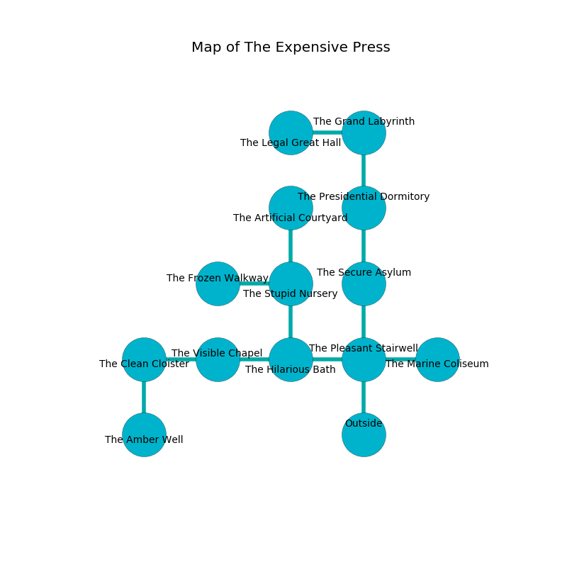

%Ruin Dogs

##The Expensive Press
###Overview
The Expensive Press is constructed on a crystal tree. Some rooms of it are flooded. A lunar eclipse is happening outside. It is occupied by Orc. Joshua Ash The Self-Centred, an Assassin is here. The Orc are the slaves of Joshua Ash The Self-Centred. He  is founding a new religion. 

###Artifact
####Uaecdaeb Fuhh

Uaecdaeb Fuhh looks like a glassy monument. It smells like moss. Light bends near it. When eaten it burns the mind. 

###Locations

####the pleasant stairwell
There is a trap here. When activated, a magical sound detector will shoot a lightning bolt. The air smells like rye bread here. There are a Giant Vulture, a Giant Poisonous Snake, a Mezzoloth, a Baboon, a Will-O’-Wisp, and a Half-Ogre here. The wooden walls are covered in mold. 

* There is a horse here.
* To the west a dripping cavern connects to [the hilarious bath](#the-hilarious-bath).
* To the east a long opening leads to [the marine coliseum](#the-marine-coliseum).
* To the north a long threshold connects to [the secure asylum](#the-secure-asylum).
* To the south is the entrance.

####the marine coliseum
The concrete walls are covered in mold. 

There is an engraving on the ceiling written in common. 

> O dire you
>
> even, appropriate, due
>
> yet informal
>
> all is true
>

* To the west a long opening opens to [the pleasant stairwell](#the-pleasant-stairwell).

####the secure asylum
The floor is cluttered with bones. Yellow ferns are growing in a patch on the floor. The air tastes like pennyroyal here. 

* To the north a narrow opening leads to [the presidential dormitory](#the-presidential-dormitory).
* To the south a long threshold leads to [the pleasant stairwell](#the-pleasant-stairwell).

####the hilarious bath
The floor is glossy. The concrete walls are scratched. 

* To the west a long pathway leads to [the visible chapel](#the-visible-chapel).
* To the east a dripping cavern leads to [the pleasant stairwell](#the-pleasant-stairwell).
* To the north a torchlit cavern opens to [the stupid nursery](#the-stupid-nursery).

####the stupid nursery
The air tastes like acetone here. There are a Grell and a Young Bronze Dragon here. White ferns are decaying in broken urns. 

* [Uaecdaeb Fuhh](#Uaecdaeb-Fuhh) is here.
* To the west a small corridor connects to [the frozen walkway](#the-frozen-walkway).
* To the north a hazy corridor opens to [the artificial courtyard](#the-artificial-courtyard).
* To the south a torchlit cavern connects to [the hilarious bath](#the-hilarious-bath).

####the presidential dormitory
There is a trap here. When activated, a magical rune will launch a swinging block. Blue lichens are swaying in cracks in the floor. There are a Winter Wolf, a Sahuagin Baron, a Bronze Dragon Wyrmling, and a Deer here. 

* There is a boat here.
* To the north a long cave connects to [the grand labyrinth](#the-grand-labyrinth).
* To the south a narrow opening opens to [the secure asylum](#the-secure-asylum).

####the grand labyrinth
There are eighteen Orcs here. The air smells like orris here. One of the Orc is pointing a ballista at the entrance. 

* To the west a hazy artery opens to [the legal great hall](#the-legal-great-hall).
* To the south a long cave connects to [the presidential dormitory](#the-presidential-dormitory).

####the legal great hall
There are an Imp, a Quaggoth, a Kuo-Toa Archpriest, a Succubus, and a Flying Snake here. The floor is sticky. The air smells like herbs here. Red lichens are sprouting from the ceiling. 

* To the east a hazy artery leads to [the grand labyrinth](#the-grand-labyrinth).

####the visible chapel
There is a trap here. When activated, a magical proximity detector will open a large pit in the floor. 

There is an engraving on a stone written in common. 

> I found The Expensive Press.
>
> I could not try hiding.
>

* To the west a narrow hall connects to [the clean cloister](#the-clean-cloister).
* To the east a long pathway connects to [the hilarious bath](#the-hilarious-bath).

####the clean cloister
Green mushrooms are sprouting in a patch on the floor. There are eighteen Orcs here. One of the Orc is pointing a ballista at the entrance. 

* There is a branch here.
* There is a brooch here.
* To the east a narrow hall connects to [the visible chapel](#the-visible-chapel).
* To the south a flooded cave connects to [the amber well](#the-amber-well).

####the amber well
The air tastes like cucumber skin here. There is a trap here. When activated, a tripwire will make the walls close in. 

There is an engraving on a stone written in common. 

> They are maddened
>
> but never tense
>
> legislative and informal
>
> always comprehensive
>

* To the north a flooded cave opens to [the clean cloister](#the-clean-cloister).

####the frozen walkway
The floor is sticky. The wooden walls are bloodstained. The air smells like peach here. 

* [Joshua Ash The Self-Centred](#Joshua-Ash-The-Self-Centred) is here.
* To the east a small corridor opens to [the stupid nursery](#the-stupid-nursery).

####the artificial courtyard
The air tastes like laundered cloth here. Green razorgrass is growing in a patch on the floor. The metallic walls are bloodstained. 

* To the south a hazy corridor connects to [the stupid nursery](#the-stupid-nursery).

