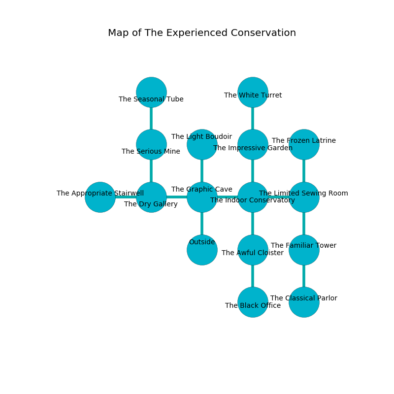

%Ruin Dogs

##The Experienced Conservation
###Overview
The Experienced Conservation is constructed on a flooded rift. Some areas of it are flooded. The ruin is collapsing slowly. It is occupied by Satyrs. Kisha Tipton The Sarcastic, a Drow Priestess of Lolth is here. The Satyrs are the soldiers of Kisha Tipton The Sarcastic. She  is trying to steal [Eael Baelmaehmd](#Eael-Baelmaehmd). 

###Artifact
####Eael Baelmaehmd

Eael Baelmaehmd has the form of a glassy cube. Magic slides near it. When carried it changes probabilities. 

###Locations

####the graphic cave
Gray mushrooms are sprouting from the walls. 

* To the west a dripping corridor opens to [the dry gallery](#the-dry-gallery).
* To the east a windy hallway connects to [the indoor conservatory](#the-indoor-conservatory).
* To the north a windy corridor leads to [the light boudoir](#the-light-boudoir).
* To the south is the entrance.

####the indoor conservatory
The stone walls are unsettled. Red moss is decaying in a patch on the floor. The air tastes like hops here. 

* To the west a windy hallway leads to [the graphic cave](#the-graphic-cave).
* To the east a torchlit passageway connects to [the limited sewing room](#the-limited-sewing-room).
* To the north a small hall leads to [the impressive garden](#the-impressive-garden).
* To the south a windy pathway opens to [the awful cloister](#the-awful-cloister).

####the awful cloister
There is a Treant here. Blue razorgrass is growing from the ceiling. The obsidion walls are bloodstained. 

There is an engraving on the ceiling written in Satyrs Script. 

> They are dying
>
> but never cold
>
> They are dying
>

* To the north a windy pathway opens to [the indoor conservatory](#the-indoor-conservatory).
* To the south a windy gap opens to [the black office](#the-black-office).

####the dry gallery
The floor is cluttered with ashes. Red mushrooms are growing from the walls. 

There is an engraving on the wall written in common. 

> You are sorrowful
>
> but never rational
>
> You are sorrowful
>

* There is a brush here.
* There is a berry here.
* [Kisha Tipton The Sarcastic](#Kisha-Tipton-The-Sarcastic) is here.
* To the west a flooded pathway leads to [the appropriate stairwell](#the-appropriate-stairwell).
* To the east a dripping corridor opens to [the graphic cave](#the-graphic-cave).
* To the north a windy hall leads to [the serious mine](#the-serious-mine).

####the limited sewing room
The air tastes like cloth here. The floor is sticky. 

* There is a demon here.
* To the west a torchlit passageway leads to [the indoor conservatory](#the-indoor-conservatory).
* To the north a narrow artery opens to [the frozen latrine](#the-frozen-latrine).
* To the south a flooded threshold opens to [the familiar tower](#the-familiar-tower).

####the impressive garden
There are eighteen Satyrs here. Blue mushrooms are decaying from the walls. The obsidion walls are unsettled. The floor is glossy. The air smells like mutton here. One of the Satyrs is working a mechanism that can flood the room. 

There is an engraving on the floor written in Satyrs Script. 

> A trap ahead.
>

* To the north a twisted corridor opens to [the white turret](#the-white-turret).
* To the south a small hall opens to [the indoor conservatory](#the-indoor-conservatory).

####the white turret
The air smells like dill here. White mushrooms are sprouting in cracks in the floor. The brick walls are ruined. There are eighteen Satyrs here. The floor is cluttered with debris. If the Satyrs notice the Ruin Dogs, one of them will retreat and alert [Kisha Tipton](#Kisha-Tipton). 

There is an engraving on the wall written in common. 

> Oh my! weak fate
>
> but formal
>
> but great
>
> fate is normal
>

* To the south a twisted corridor opens to [the impressive garden](#the-impressive-garden).

####the familiar tower
Blue moss is sprouting from the walls. There are eighteen Satyrs here. The obsidion walls are scratched. The Satyrs are crazy with bloodlust. 

* To the north a flooded threshold opens to [the limited sewing room](#the-limited-sewing-room).
* To the south a flooded opening leads to [the classical parlor](#the-classical-parlor).

####the black office
Red ferns are swaying from the walls. There are eighteen Satyrs here. If the Satyrs notice the Ruin Dogs, one of them will retreat and alert [Kisha Tipton](#Kisha-Tipton). 

* To the north a windy gap connects to [the awful cloister](#the-awful-cloister).

####the light boudoir
The air smells like brandy here. Yellow lichens are swaying in broken urns. There are a Pony, a Wight, a Mezzoloth, a Berserker, an Ice Mephit, and a Swarm of Quippers here. 

* To the south a windy corridor connects to [the graphic cave](#the-graphic-cave).

####the classical parlor
There are eighteen Satyrs here. Yellow mushrooms are growing in cracks in the floor. The floor is flooded with three inch deep hot water. The air tastes like civet here. The Satyrs are defending this room from intruders. 

There is an engraving on a monolith written in common. 

> Do not try cowering.
>

* There is a table here.
* To the north a flooded opening opens to [the familiar tower](#the-familiar-tower).

####the serious mine
There are a Drow Priestess of Lolth and an Old Faerie Dragon here. There is a trap here. When activated, a pressure plate will flood the room with water. The air tastes like carnation here. The glass walls are scratched. The floor is bloodstained. 

* [Eael Baelmaehmd](#Eael-Baelmaehmd) is here.
* To the north a narrow threshold connects to [the seasonal tube](#the-seasonal-tube).
* To the south a windy hall leads to [the dry gallery](#the-dry-gallery).

####the appropriate stairwell
There are an Earth Elemental, a Banshee, a Gnoll Pack Lord, a Scout, an Awakened Shrub, and an Animated Armor here. The glass walls are pristine. The air smells like wintergreen here. 

There is an engraving on a monolith written in Satyrs Script. 

> O my fate is woe
>
> it is never low
>
> yet never electronic
>
> the world is low
>

* To the east a flooded pathway leads to [the dry gallery](#the-dry-gallery).

####the frozen latrine
The floor is smooth. There are eighteen Satyrs here. The Satyrs are performing a ritual. If not interrupted, the ruin dogs will be weakened. 

* There is a dog here.
* To the south a narrow artery opens to [the limited sewing room](#the-limited-sewing-room).

####the seasonal tube
The floor is flooded with three inch deep scalding water. The obsidion walls are pristine. 

* There is a door here.
* There is a table here.
* There is a stocking here.
* There is an eye here.
* To the south a narrow threshold leads to [the serious mine](#the-serious-mine).

