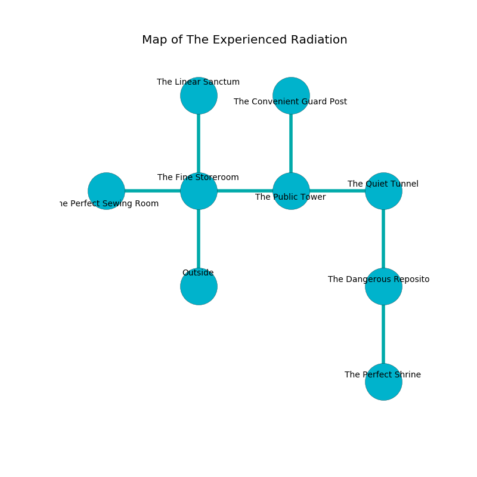

%Ruin Dogs

##The Experienced Radiation
###Overview
The Experienced Radiation is located on a spikey plain. Regions of The Experienced Radiation are flooded. A windstorm is happening outside. It is occupied by Cyclopses. Denis Victor The Parsimonious, a Fire Giant is here. The Cyclopses are battling Denis Victor The Parsimonious. He  is trying to research [The Round Document](#The-Round-Document). 

###Artifact
####The Round Document

The Round Document looks like a transparent amulet. It smells like coconut. It is a light purple color. When eaten it sings the hymn of the damned. 

###Locations

####the fine storeroom
There are two Cyclopses here. The floor is flooded with five inch deep cool water. If the Cyclopses notice the Ruin Dogs, one of them will retreat and alert [Denis Victor](#Denis-Victor). 

* [Denis Victor The Parsimonious](#Denis-Victor-The-Parsimonious) is here.
* To the west a narrow corridor leads to [the perfect sewing room](#the-perfect-sewing-room).
* To the east a twisted walkway connects to [the public tower](#the-public-tower).
* To the north a narrow artery leads to [the linear sanctum](#the-linear-sanctum).
* To the south is the entrance.

####the perfect sewing room
The air tastes like neroli here. 

* To the east a narrow corridor opens to [the fine storeroom](#the-fine-storeroom).

####the public tower
There are a Red Slaad and a Vampire Spawn here. The air smells like cologne here. The floor is bloodstained. 

* To the west a twisted walkway connects to [the fine storeroom](#the-fine-storeroom).
* To the east a flooded threshold leads to [the quiet tunnel](#the-quiet-tunnel).
* To the north a torchlit gap opens to [the convenient guard post](#the-convenient-guard-post).

####the quiet tunnel
There are a Goat, a Treant, and a Xorn here. The obsidion walls are scratched. The floor is flooded with nine inch deep lukewarm water. 

* To the west a flooded threshold connects to [the public tower](#the-public-tower).
* To the south a small walkway leads to [the dangerous repository](#the-dangerous-repository).

####the convenient guard post
The air tastes like rum here. The wooden walls are pristine. 

* To the south a torchlit gap connects to [the public tower](#the-public-tower).

####the dangerous repository
The air smells like bread crust here. Red razorgrass is sprouting from the walls. The floor is sticky. 

* [The Round Document](#The-Round-Document) is here.
* To the north a small walkway opens to [the quiet tunnel](#the-quiet-tunnel).
* To the south a flooded artery opens to [the perfect shrine](#the-perfect-shrine).

####the linear sanctum
The air tastes like raisin here. The mirrored walls are scratched. The floor is glossy. 

* To the south a narrow artery leads to [the fine storeroom](#the-fine-storeroom).

####the perfect shrine
White lichens are decaying in a patch on the floor. 

* To the north a flooded artery connects to [the dangerous repository](#the-dangerous-repository).

