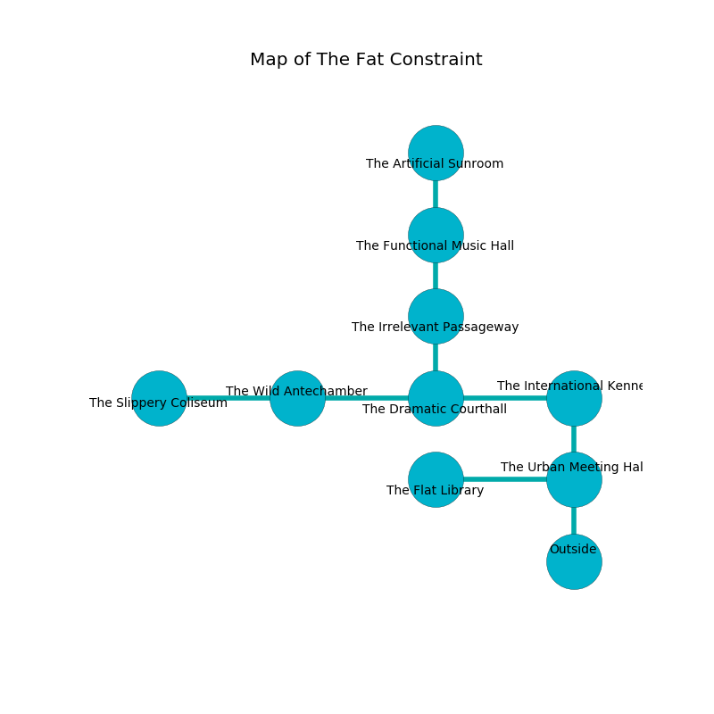

%Ruin Dogs

##The Fat Constraint
###Overview
The Fat Constraint is located in a spikey tree. Parts of The Fat Constraint are flooded. The ruin is collapsing slowly. It is occupied by Kenku. Preston Knudson The Vague, an Orc War Chief is here. The Kenku are battling Preston Knudson The Vague. He  is founding a new religion. 

###Artifact
####Cumdfeid

Cumdfeid has the form of a broken amulet. It is a shifting yellow color. It smells like agarwood. When smelled it becomes lost. 

###Locations

####the urban meeting hall
Red moss is growing in a patch on the floor. The floor is cluttered with debris. The mirrored walls are scratched. The air tastes like carrot seed here. 

* To the west a dripping artery leads to [the flat library](#the-flat-library).
* To the north a hazy hallway connects to [the international kennel](#the-international-kennel).
* To the south is the entrance.

####the international kennel
The floor is sticky. The obsidion walls are unsettled. There are twenty Kenkus here. The air tastes like plum skin here. One of the Kenku is on watch, the rest are drunk. 

* There is a skull here.
* [Preston Knudson The Vague](#Preston-Knudson-The-Vague) is here.
* To the west a hazy hallway opens to [the dramatic courthall](#the-dramatic-courthall).
* To the south a hazy hallway opens to [the urban meeting hall](#the-urban-meeting-hall).

####the dramatic courthall
The air tastes like seaweed here. The floor is cluttered with debris. Yellow razorgrass is sprouting in cracks in the floor. There are twenty Kenkus here. One of the Kenku is on watch, the rest are celebrating. 

* To the west a hazy hall opens to [the wild antechamber](#the-wild-antechamber).
* To the east a hazy hallway leads to [the international kennel](#the-international-kennel).
* To the north a dark hallway opens to [the irrelevant passageway](#the-irrelevant-passageway).

####the wild antechamber
The glass walls are covered in mold. The air smells like ginseng here. Blue lichens are sprouting in broken urns. 

* [Cumdfeid](#Cumdfeid) is here.
* To the west a long cavern leads to [the slippery coliseum](#the-slippery-coliseum).
* To the east a hazy hall connects to [the dramatic courthall](#the-dramatic-courthall).

####the flat library
The floor is cluttered with ashes. The air smells like clove here. 

* To the east a dripping artery leads to [the urban meeting hall](#the-urban-meeting-hall).

####the irrelevant passageway
The air smells like valerian root here. Gray ferns are swaying from the ceiling. 

There is an engraving on a tablet written in Kenku Script. 

> Oh cruel fate
>
> it is always straight
>
> short and right
>
> the world is light
>

* To the north a narrow gap opens to [the functional music hall](#the-functional-music-hall).
* To the south a dark hallway opens to [the dramatic courthall](#the-dramatic-courthall).

####the functional music hall
There are twenty Kenkus here. The stone walls are scratched. Red razorgrass is sprouting in a patch on the floor. The Kenku are willing to fight to the death. 

* To the north a windy threshold opens to [the artificial sunroom](#the-artificial-sunroom).
* To the south a narrow gap leads to [the irrelevant passageway](#the-irrelevant-passageway).

####the artificial sunroom
There are a Giant Octopus, an Unicorn, a Constrictor Snake, and a Bat here. The obsidion walls are scratched. The floor is sticky. White lichens are swaying from the walls. 

There is an engraving on the wall written in common. 

> A brain is a remark
>
> weekly and new
>
> A brain is a remark
>

* To the south a windy threshold leads to [the functional music hall](#the-functional-music-hall).

####the slippery coliseum
The mirrored walls are covered in mold. Yellow ferns are sprouting from the walls. There are a Night Hag, a Brown Bear, and a Berserker here. 

There is an engraving on a tablet written in common. 

> O! pitiful god
>
> always complete
>
> always odd
>
> everything is sweet
>

* To the east a long cavern connects to [the wild antechamber](#the-wild-antechamber).

