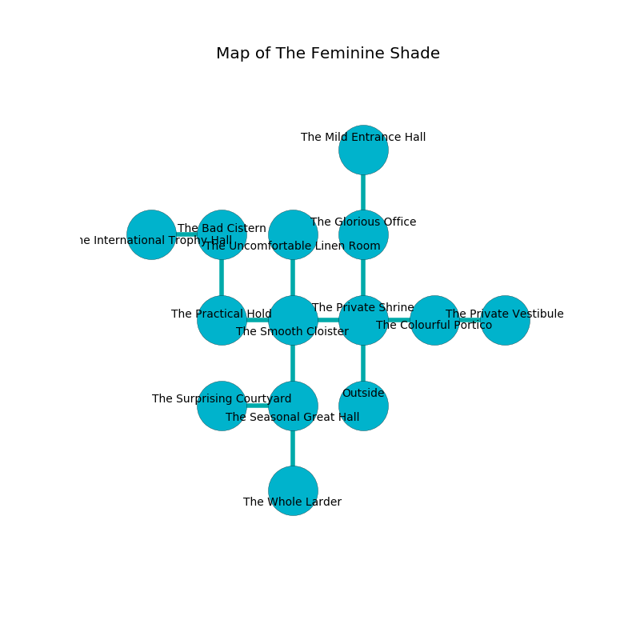

%Ruin Dogs

##The Feminine Shade
###Overview
The Feminine Shade is constructed on a spikey rift. Some rooms of it are flooded. The ruin is flooding. It is occupied by Duergars. Daisy Mcpherson The Sarcastic, a Sahuagin Priestess is here. The Duergars are battling Daisy Mcpherson The Sarcastic. She  is trying to destroy [Dufcm Dolhad](#Dufcm-Dolhad). 

###Artifact
####Dufcm Dolhad

Dufcm Dolhad looks like a broken figurine. It smells like seashore. When carried it floats in the air. 

###Locations

####the private shrine
The mirrored walls are scratched. There are three Duergars here. The Duergars are feasting. 

* To the west a long threshold opens to [the smooth cloister](#the-smooth-cloister).
* To the east a twisted cave connects to [the colourful portico](#the-colourful-portico).
* To the north a dripping corridor opens to [the glorious office](#the-glorious-office).
* To the south is the entrance.

####the smooth cloister
The floor is sticky. The concrete walls are covered in mold. There are a Giant Rat, an Imp, and a Phase Spider here. 

* To the west a narrow path opens to [the practical hold](#the-practical-hold).
* To the east a long threshold connects to [the private shrine](#the-private-shrine).
* To the north a dark opening leads to [the uncomfortable linen room](#the-uncomfortable-linen-room).
* To the south a flooded cave opens to [the seasonal great hall](#the-seasonal-great-hall).

####the practical hold
The wooden walls are bloodstained. There are a Saber-Toothed Tiger, a Sea Horse, and an Old Faerie Dragon here. 

There is an engraving on the ceiling written in Duergars Script. 

> I am lost.
>

* To the east a narrow path leads to [the smooth cloister](#the-smooth-cloister).
* To the north a dark hall connects to [the bad cistern](#the-bad-cistern).

####the uncomfortable linen room
Gray mushrooms are sprouting in broken urns. The floor is cluttered with bones. 

* To the south a dark opening leads to [the smooth cloister](#the-smooth-cloister).

####the glorious office
The wooden walls are covered in mold. The floor is smooth. The air smells like flowers here. There are a Hook Horror, a Brass Dragon Wyrmling, and a Crocodile here. 

* There is a hare here.
* [Dufcm Dolhad](#Dufcm-Dolhad) is here.
* To the north a torchlit passageway leads to [the mild entrance hall](#the-mild-entrance-hall).
* To the south a dripping corridor leads to [the private shrine](#the-private-shrine).

####the seasonal great hall
There is a Minotaur here. 

* To the west a narrow pathway opens to [the surprising courtyard](#the-surprising-courtyard).
* To the north a flooded cave leads to [the smooth cloister](#the-smooth-cloister).
* To the south a flooded opening leads to [the whole larder](#the-whole-larder).

####the bad cistern
The floor is glossy. The brick walls are scratched. 

* To the west a hazy pathway leads to [the international trophy hall](#the-international-trophy-hall).
* To the south a dark hall leads to [the practical hold](#the-practical-hold).

####the surprising courtyard
There are an Imp, a Draft Horse, two Fire Snakes, and  here. The floor is bloodstained. Red moss is sprouting in broken urns. The brick walls are covered in mold. The air tastes like turni here. 

* To the east a narrow pathway leads to [the seasonal great hall](#the-seasonal-great-hall).

####the colourful portico
The floor is glossy. There are three Duergars here. The Duergars are crazy with bloodlust. 

* There is a brain here.
* There is a crossbow here.
* To the west a twisted cave connects to [the private shrine](#the-private-shrine).
* To the east a narrow passageway connects to [the private vestibule](#the-private-vestibule).

####the international trophy hall
The mirrored walls are pristine. 

* To the east a hazy pathway opens to [the bad cistern](#the-bad-cistern).

####the whole larder
The floor is glossy. 

* To the north a flooded opening connects to [the seasonal great hall](#the-seasonal-great-hall).

####the private vestibule
There are a Sea Horse, a Vine Blight, a Scarecrow, a Tridrone, and a Yuan-Ti Pureblood here. The concrete walls are unsettled. The air tastes like saffron here. 

* There is a wall here.
* To the west a narrow passageway opens to [the colourful portico](#the-colourful-portico).

####the mild entrance hall
There are three Duergars here. The air tastes like soup here. The stone walls are ruined. Red mushrooms are growing from the ceiling. The Duergars are performing a ritual. If not interrupted, [Daisy Mcpherson](#Daisy-Mcpherson) will be magically alarmed. 

There is an engraving on the ceiling written in Duergars Script. 

> O! weak we
>
> eager, unlike, direct
>
> it is never free
>
> fate is perfect
>

* [Daisy Mcpherson The Sarcastic](#Daisy-Mcpherson-The-Sarcastic) is here.
* To the south a torchlit passageway opens to [the glorious office](#the-glorious-office).

