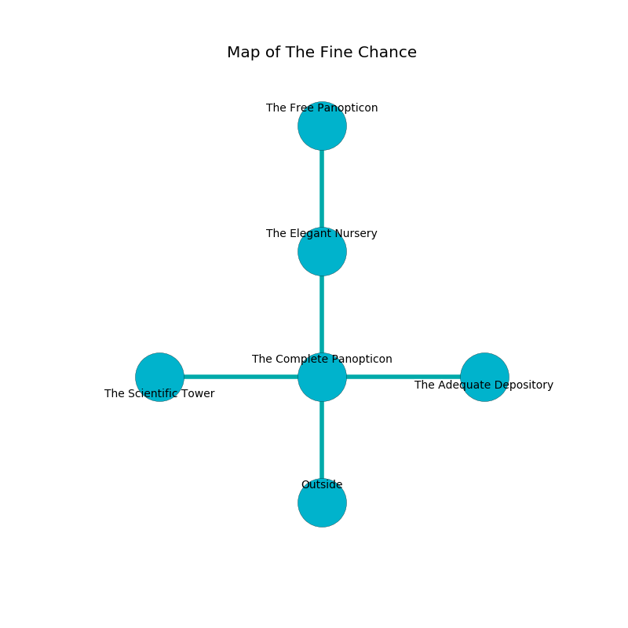

%Ruin Dogs

##The Fine Chance
###Overview
The Fine Chance is located on a flooded tree. Some rooms of The Fine Chance are unbearably cold. A massive storm is happening outside. It is occupied by Pixies. Angeline Hawes The Compulsive, a Spined Devil is here. The Pixies have been charmed by Angeline Hawes The Compulsive. She  is trying to hide [The Spontaneous Mathematics](#The-Spontaneous-Mathematics). 

###Artifact
####The Spontaneous Mathematics

The Spontaneous Mathematics looks like a sharp cube. When touched it floats above the ground. 

###Locations

####the complete panopticon

* To the west a flooded gap connects to [the scientific tower](#the-scientific-tower).
* To the east a windy hall leads to [the adequate depository](#the-adequate-depository).
* To the north a twisted opening leads to [the elegant nursery](#the-elegant-nursery).
* To the south is the entrance.

####the adequate depository
There are eight Pixies here. Red lichens are swaying from the walls. The floor is glossy. The Pixies are crazy with bloodlust. 

* To the west a windy hall leads to [the complete panopticon](#the-complete-panopticon).

####the elegant nursery
The concrete walls are pristine. The air tastes like origanum here. The floor is smooth. 

There is an engraving on a tablet written in common. 

> A roof is a search
>
> yet never multiple
>
> They are envious
>
> ever pleasant
>
> A roof is a search
>

* [The Spontaneous Mathematics](#The-Spontaneous-Mathematics) is here.
* [Angeline Hawes The Compulsive](#Angeline-Hawes-The-Compulsive) is here.
* To the north a twisted walkway leads to [the free panopticon](#the-free-panopticon).
* To the south a twisted opening leads to [the complete panopticon](#the-complete-panopticon).

####the scientific tower
There are a Deep Gnome and a Grick here. The air smells like oak wood here. The floor is flooded with four inch deep scalding water. White razorgrass is decaying in broken urns. 

* To the east a flooded gap connects to [the complete panopticon](#the-complete-panopticon).

####the free panopticon
Red moss is swaying in broken urns. 

* There is a jewel here.
* To the south a twisted walkway connects to [the elegant nursery](#the-elegant-nursery).

