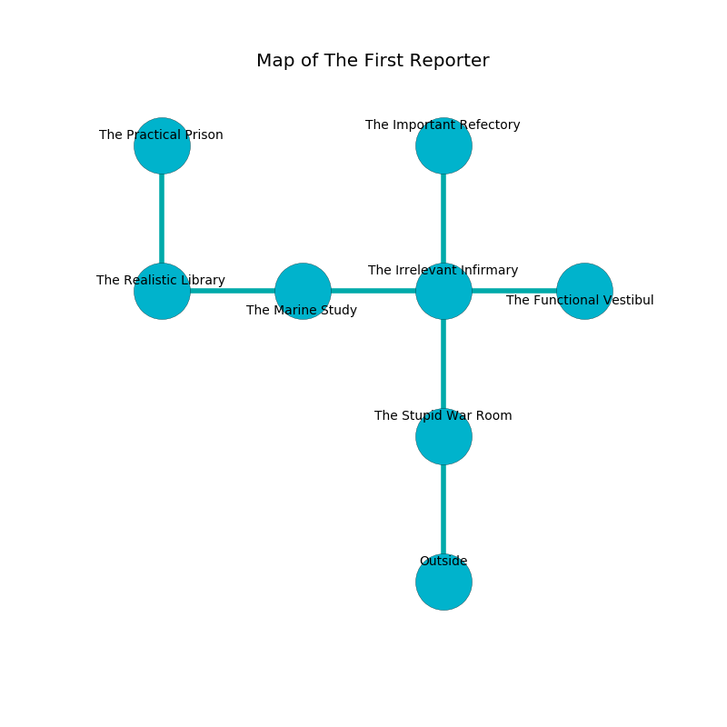

%Ruin Dogs

##The First Reporter
###Overview
The First Reporter is located in an obsidion mountain. Some areas of The First Reporter are flooded. A massive flood is happening outside. It is occupied by Demons. Valrie Addison The Domineering, a Yuan-Ti Abomination is here. The Demons are the minions of Valrie Addison The Domineering. She  is trying to recover [Iaeaha](#Iaeaha). 

###Artifact
####Iaeaha

Iaeaha looks like a transparent figurine. It is a sickly yellow color. It smells like thyme. When cradled it grants psychic powers. 

###Locations

####the stupid war Room
The floor is glossy. 

* There is a trousers here.
* There is a sock here.
* There is a horse here.
* There is a hare here.
* [Valrie Addison The Domineering](#Valrie-Addison-The-Domineering) is here.
* To the north a dripping walkway connects to [the irrelevant infirmary](#the-irrelevant-infirmary).
* To the south is the entrance.

####the irrelevant infirmary
The air smells like malt here. The brick walls are ruined. 

* There is a book here.
* To the west a dark hallway connects to [the marine study](#the-marine-study).
* To the east a torchlit cave opens to [the functional vestibule](#the-functional-vestibule).
* To the north a long artery leads to [the important refectory](#the-important-refectory).
* To the south a dripping walkway opens to [the stupid war Room](#the-stupid-war-Room).

####the marine study
The air tastes like green onion here. There are two Succubi here. The Demons are berserk with rage. 

There is an engraving on the wall written in Demons Script. 

> Hide here.
>

* To the west a windy cave connects to [the realistic library](#the-realistic-library).
* To the east a dark hallway opens to [the irrelevant infirmary](#the-irrelevant-infirmary).

####the realistic library

* [Iaeaha](#Iaeaha) is here.
* To the east a windy cave leads to [the marine study](#the-marine-study).
* To the north a long cavern connects to [the practical prison](#the-practical-prison).

####the important refectory
There is a trap here. When activated, a magical proximity detector will launch a fireball. Blue ferns are sprouting from the ceiling. The floor is glossy. 

* To the south a long artery opens to [the irrelevant infirmary](#the-irrelevant-infirmary).

####the functional vestibule
The wooden walls are scratched. The floor is smooth. There are a Barbed Devil and a Bearded Devil here. The air tastes like corn chip here. Red ferns are growing from the ceiling. The Demons are meditating. 

* To the west a torchlit cave leads to [the irrelevant infirmary](#the-irrelevant-infirmary).

####the practical prison
The air tastes like blueberry here. The floor is smooth. There are a Barbed Devil and a Succubus here. The Demons are berserk with rage. 

* To the south a long cavern opens to [the realistic library](#the-realistic-library).

