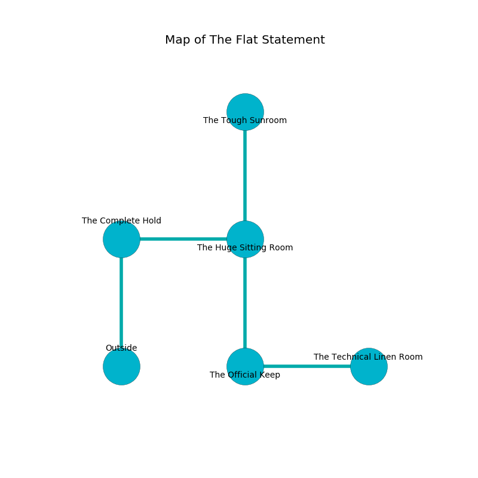

%Ruin Dogs

##The Flat Statement
###Overview
The Flat Statement is located on a flooded plain. Some rooms of it are incredibly cold. The ruin is collapsing slowly. It is occupied by Yuan-Ti. Arnetta Wolff The Interfering, a Mind Flayer Arcanist is here. The Yuan-Ti are ruled by Arnetta Wolff The Interfering. She  is trying to discover [Daed Maefd](#Daed-Maefd). 

###Artifact
####Daed Maefd

Daed Maefd has the form of a hard orb. It smells like immortelle. When smelled it liquifies. 

###Locations

####the complete hold
The floor is cluttered with ashes. The concrete walls are bloodstained. 

* There is a finger here.
* To the east a flooded corridor opens to [the huge sitting Room](#the-huge-sitting-Room).
* To the south is the entrance.

####the huge sitting Room
There are two Yuan-Ti Abominations here. The air smells like kumquat here. Green ferns are growing from the walls. If the Yuan-Ti notice the Ruin Dogs, one of them will retreat and alert the others. 

There is an engraving on the ceiling written in common. 

> Dear me! my life is woe
>
> it is never slow
>
> always true
>
> sadness is low
>

* To the west a flooded corridor leads to [the complete hold](#the-complete-hold).
* To the north a small corridor opens to [the tough sunroom](#the-tough-sunroom).
* To the south a narrow pathway connects to [the official keep](#the-official-keep).

####the official keep
The air smells like oak wood here. There are a Drider and a Succubus here. The crystal walls are ruined. 

* [Daed Maefd](#Daed-Maefd) is here.
* To the east a windy opening opens to [the technical linen room](#the-technical-linen-room).
* To the north a narrow pathway opens to [the huge sitting Room](#the-huge-sitting-Room).

####the tough sunroom
There are a Bone Naga, an Aarakocra, a Shadow Demon, an Old Faerie Dragon, a Bandit, a Brown Bear, and a Flying Snake here. The air tastes like black currant here. Gray razorgrass is decaying from the walls. The wooden walls are ruined. 

* To the south a small corridor connects to [the huge sitting Room](#the-huge-sitting-Room).

####the technical linen room
The obsidion walls are unsettled. There are a Ghoul, an Allosaurus, a Giant Toad, a Poltergeist, a Knight, and a Scorpion here. 

* [Arnetta Wolff The Interfering](#Arnetta-Wolff-The-Interfering) is here.
* To the west a windy opening connects to [the official keep](#the-official-keep).

