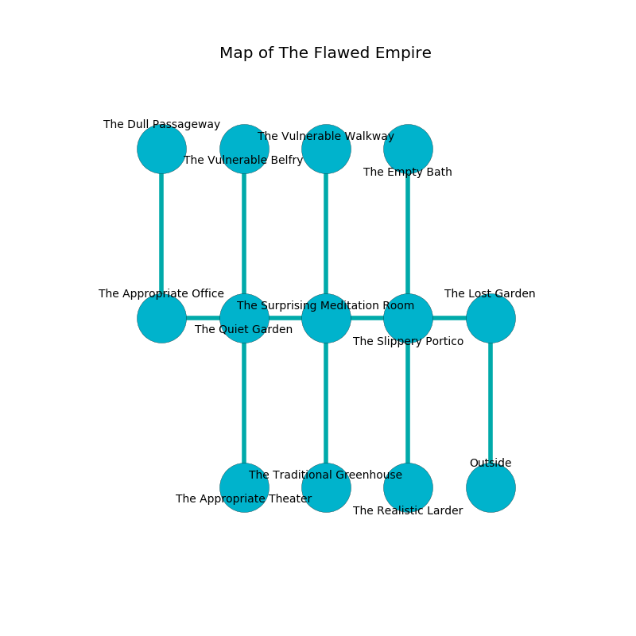

%Ruin Dogs

##The Flawed Empire
###Overview
The Flawed Empire is located in a poisoned city. Regions of it are somewhat cold. The ruin is flooding. It is occupied by Giants. Stan Lyons The Self-Centred, a Frost Giant is here. The Giants worship Stan Lyons The Self-Centred. He  is founding a new religion. 

###Artifact
####Duuh Gaefagaehmdaf

Duuh Gaefagaehmdaf looks like a hard gem. It smells like lamb. When cradled it becomes hot. 

###Locations

####the lost garden
The floor is glossy. The air smells like onion here. There are a Young Copper Dragon and a Brown Bear here. 

There is an engraving on a monolith written in common. 

> I worship [Duuh Gaefagaehmdaf](#Duuh-Gaefagaehmdaf).
>
> Leave at once.
>

* [Stan Lyons The Self-Centred](#Stan-Lyons-The-Self-Centred) is here.
* To the west a long cavern opens to [the slippery portico](#the-slippery-portico).
* To the south is the entrance.

####the slippery portico
The mirrored walls are scratched. The air smells like ham here. 

There is an engraving on a monolith written in Giants Script. 

> I am starving.
>

* [Duuh Gaefagaehmdaf](#Duuh-Gaefagaehmdaf) is here.
* To the west a narrow hallway connects to [the surprising meditation room](#the-surprising-meditation-room).
* To the east a long cavern leads to [the lost garden](#the-lost-garden).
* To the north a dark gap leads to [the empty bath](#the-empty-bath).
* To the south a dripping passageway connects to [the realistic larder](#the-realistic-larder).

####the surprising meditation room
Blue lichens are sprouting in broken urns. The floor is cluttered with debris. 

* To the west a narrow corridor leads to [the quiet garden](#the-quiet-garden).
* To the east a narrow hallway leads to [the slippery portico](#the-slippery-portico).
* To the north a dripping cavern opens to [the vulnerable walkway](#the-vulnerable-walkway).
* To the south a narrow cave opens to [the traditional greenhouse](#the-traditional-greenhouse).

####the vulnerable walkway
Gray ferns are swaying in broken urns. There is a Frost Giant here. The Frost Giant is crazy with bloodlust. 

* To the south a dripping cavern opens to [the surprising meditation room](#the-surprising-meditation-room).

####the realistic larder
Gray razorgrass is swaying from the walls. The floor is glossy. 

* To the north a dripping passageway leads to [the slippery portico](#the-slippery-portico).

####the quiet garden
The air smells like petroleum here. There are a Sprite, a Veteran, a Wereboar, and a Gelatinous Cube here. 

There is an engraving on a monolith written in common. 

> [Duuh Gaefagaehmdaf](#Duuh-Gaefagaehmdaf)
>
> common, original, charismatic
>
> always manual
>
> current and bare
>
> ordinary, brown, formal
>
> informal and shy
>

* To the west a dripping threshold opens to [the appropriate office](#the-appropriate-office).
* To the east a narrow corridor connects to [the surprising meditation room](#the-surprising-meditation-room).
* To the north a dripping path opens to [the vulnerable belfry](#the-vulnerable-belfry).
* To the south a long artery connects to [the appropriate theater](#the-appropriate-theater).

####the vulnerable belfry
The wooden walls are pristine. There are a Drider, a Giant Boar, a Specter, a Giant Centipede, a Brass Dragon Wyrmling, and a Pixie here. 

* There is a demon here.
* To the south a dripping path leads to [the quiet garden](#the-quiet-garden).

####the traditional greenhouse
The air smells like animal here. White lichens are sprouting from the ceiling. 

* To the north a narrow cave connects to [the surprising meditation room](#the-surprising-meditation-room).

####the appropriate theater
The brick walls are covered in mold. Yellow razorgrass is sprouting from the ceiling. The floor is smooth. 

* There is a match here.
* To the north a long artery connects to [the quiet garden](#the-quiet-garden).

####the appropriate office
The air tastes like deertongue here. The metallic walls are pristine. There are a Hill Giant and a Stone Giant here. Gray ferns are decaying in cracks in the floor. One of the Giants is working a mechanism that can engulf the room in a fiery blaze. 

There is an engraving on the ceiling written in Giants Script. 

> Hide here.
>

* To the east a dripping threshold opens to [the quiet garden](#the-quiet-garden).
* To the north a twisted hall connects to [the dull passageway](#the-dull-passageway).

####the dull passageway
The crystal walls are ruined. There are a Giant Constrictor Snake, a Half-Ogre, a Shrieker, a Giant Goat, a Hobgoblin, a Giant Elk, and a Bronze Dragon Wyrmling here. 

There is an engraving on the wall written in Giants Script. 

> I thought about giving up.
>

* To the south a twisted hall leads to [the appropriate office](#the-appropriate-office).

####the empty bath
The obsidion walls are pristine. 

* To the south a dark gap leads to [the slippery portico](#the-slippery-portico).

