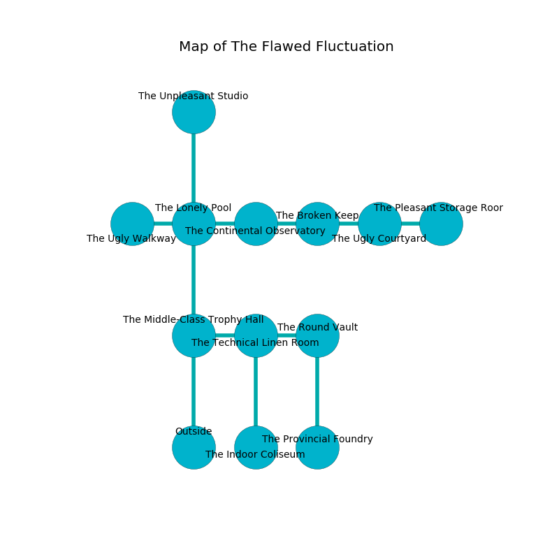

%Ruin Dogs

##The Flawed Fluctuation
###Overview
The Flawed Fluctuation is located in a cursed mountain. Some rooms of it are somewhat hot. The ruin is sinking into the earth. It is occupied by Githzerai. Chris Gerard The Interfering, a Fire Giant is here. The Githzerai are ruled by Chris Gerard The Interfering. He  is founding a new religion. 

###Artifact
####Hebd

Hebd looks like a cold prism. Fire incinerates away from it. When gazed upon it levitates surrounding objects. 

###Locations

####the middle-class trophy hall
The air tastes like lavender here. There is a Mind Flayer Arcanist here. Blue ferns are swaying in broken urns. 

There is an engraving on a monolith written in Githzerai Script. 

> A drop is a barrier
>
> ugly, aesthetic, unpleasant
>
> surprised, exotic, presidential
>
> A cushion is a joint
>
> precise, smart, useful
>
> ever open
>
> A drop is a barrier
>

* To the east a narrow hall opens to [the technical linen room](#the-technical-linen-room).
* To the north a narrow path leads to [the lonely pool](#the-lonely-pool).
* To the south is the entrance.

####the lonely pool
There are four Githzerai Monks here. Green lichens are decaying from the ceiling. The air tastes like roasted peanut here. The wooden walls are ruined. The Githzerai are willing to negotiate. 

* [Hebd](#Hebd) is here.
* To the west a narrow walkway opens to [the ugly walkway](#the-ugly-walkway).
* To the east a long pathway connects to [the continental observatory](#the-continental-observatory).
* To the north a long hallway leads to [the unpleasant studio](#the-unpleasant-studio).
* To the south a narrow path connects to [the middle-class trophy hall](#the-middle-class-trophy-hall).

####the continental observatory
White lichens are growing from the ceiling. The obsidion walls are pristine. The air tastes like peanut here. The floor is flooded with eight inch deep cool water. 

* There is a fly here.
* [Chris Gerard The Interfering](#Chris-Gerard-The-Interfering) is here.
* To the west a long pathway connects to [the lonely pool](#the-lonely-pool).
* To the east a small pathway connects to [the broken keep](#the-broken-keep).

####the technical linen room
The air smells like bergamot here. 

* To the west a narrow hall connects to [the middle-class trophy hall](#the-middle-class-trophy-hall).
* To the east a twisted corridor leads to [the round vault](#the-round-vault).
* To the south a torchlit opening opens to [the indoor coliseum](#the-indoor-coliseum).

####the round vault
The floor is cluttered with broken glass. There are four Githzerai Monks here. The Githzerai are willing to negotiate. 

There is an engraving on a tablet written in common. 

> Run away.
>

* To the west a twisted corridor opens to [the technical linen room](#the-technical-linen-room).
* To the south a flooded gap leads to [the provincial foundry](#the-provincial-foundry).

####the broken keep

* There is a hat here.
* To the west a small pathway connects to [the continental observatory](#the-continental-observatory).
* To the east a dripping opening opens to [the ugly courtyard](#the-ugly-courtyard).

####the ugly courtyard
The floor is smooth. There are a Swarm of Bats, a Merrow, a Bearded Devil, a Scout, a Hawk, and a Veteran here. 

There is an engraving on a tablet written in common. 

> Dear me! pitiful we
>
> it is never free
>
> yet never statistical
>
> fate is free
>

* To the west a dripping opening connects to [the broken keep](#the-broken-keep).
* To the east a small hallway opens to [the pleasant storage room](#the-pleasant-storage-room).

####the ugly walkway
Blue ferns are sprouting in a patch on the floor. 

There is an engraving on the ceiling written in common. 

> I am hidden.
>
> I could not try dying.
>

* To the east a narrow walkway opens to [the lonely pool](#the-lonely-pool).

####the indoor coliseum
The metallic walls are caving in. There are a Kuo-Toa Whip and a Mind Flayer here. The air smells like lemongrass here. Red ferns are sprouting in broken urns. The floor is glossy. 

* There is a cake here.
* To the north a torchlit opening connects to [the technical linen room](#the-technical-linen-room).

####the pleasant storage room
The concrete walls are pristine. The floor is bloodstained. 

* To the west a small hallway leads to [the ugly courtyard](#the-ugly-courtyard).

####the provincial foundry
There are four Githzerai Monks here. The Githzerai are celebrating. 

* To the north a flooded gap leads to [the round vault](#the-round-vault).

####the unpleasant studio
The air tastes like carrot seed here. The floor is sticky. 

There is an engraving on the ceiling written in common. 

> O! our fate is inhumane
>
> always plain
>
> unlike and distinct
>
> sadness is vain
>

* To the south a long hallway leads to [the lonely pool](#the-lonely-pool).

