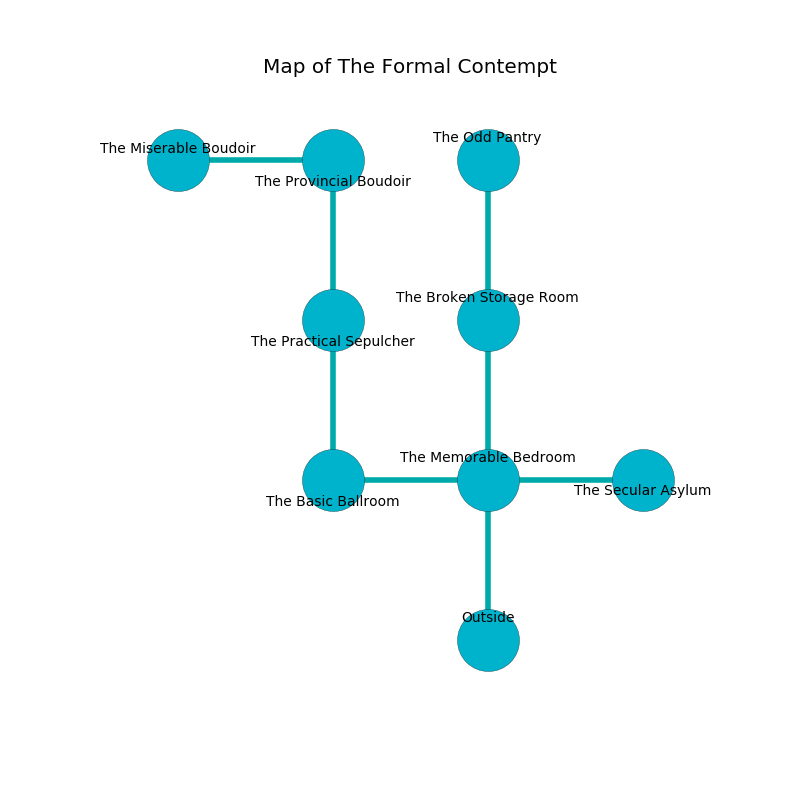

%Ruin Dogs

##The Formal Contempt
###Overview
The Formal Contempt is located under a ruined plain. Some rooms of it are inaccessible. A battle between raiders is happening outside. It is occupied by Kobolds. Meghan Matos The Pessimistic, a Gladiator is here. The Kobolds are the slaves of Meghan Matos The Pessimistic. She  is trying to hide [Fahaeum](#Fahaeum). 

###Artifact
####Fahaeum

Fahaeum has the form of a hard sphere. It is a medium gray color. When rubbed it becomes a shielding force. 

###Locations

####the memorable bedroom
Yellow moss is decaying in a patch on the floor. 

* There is a skirt here.
* To the west a windy gap opens to [the basic ballroom](#the-basic-ballroom).
* To the east a hazy cavern opens to [the secular asylum](#the-secular-asylum).
* To the north a long gap leads to [the broken storage room](#the-broken-storage-room).
* To the south is the entrance.

####the broken storage room
The air tastes like seafood here. The floor is glossy. There is a trap here. When activated, a magical sound detector will launch a swinging block. 

* There is a wall here.
* There is a skull here.
* [Fahaeum](#Fahaeum) is here.
* To the north a twisted opening connects to [the odd pantry](#the-odd-pantry).
* To the south a long gap opens to [the memorable bedroom](#the-memorable-bedroom).

####the basic ballroom
Gray razorgrass is growing in broken urns. There are twelve Winged Kobolds and sixteen Kobolds here. The air tastes like weed here. The Kobolds are fighting amongst themselves. 

* There is a map here.
* To the east a windy gap opens to [the memorable bedroom](#the-memorable-bedroom).
* To the north a narrow path opens to [the practical sepulcher](#the-practical-sepulcher).

####the practical sepulcher
There are seventeen Winged Kobolds and seven Kobolds here. Red razorgrass is growing from the walls. If the Kobolds notice the Ruin Dogs, one of them will retreat and alert the others. 

There is an engraving on a monolith written in common. 

> A map is a leather
>
> kind, unaware, rich
>
> A dog is a preservation
>
> but unfair
>
> [Fahaeum](#Fahaeum)
>
> yet dry
>
> yet never charismatic
>

* There is a tome here.
* To the north a dark path leads to [the provincial boudoir](#the-provincial-boudoir).
* To the south a narrow path connects to [the basic ballroom](#the-basic-ballroom).

####the secular asylum
The air smells like logenberry here. 

* To the west a hazy cavern leads to [the memorable bedroom](#the-memorable-bedroom).

####the provincial boudoir
There is a trap here. When activated, a magical sound detector will collapse a column. The air smells like laundered cloth here. 

* To the west a flooded cave opens to [the miserable boudoir](#the-miserable-boudoir).
* To the south a dark path connects to [the practical sepulcher](#the-practical-sepulcher).

####the miserable boudoir
There are fourteen Winged Kobolds and twelve Kobolds here. The floor is glossy. The crystal walls are covered in mold. One of the Kobolds is on watch, the rest are drunk. 

* There is a frame here.
* [Meghan Matos The Pessimistic](#Meghan-Matos-The-Pessimistic) is here.
* To the east a flooded cave connects to [the provincial boudoir](#the-provincial-boudoir).

####the odd pantry
The air tastes like cedar here. The metallic walls are bloodstained. Green lichens are growing in cracks in the floor. The floor is bloodstained. 

* To the south a twisted opening opens to [the broken storage room](#the-broken-storage-room).

