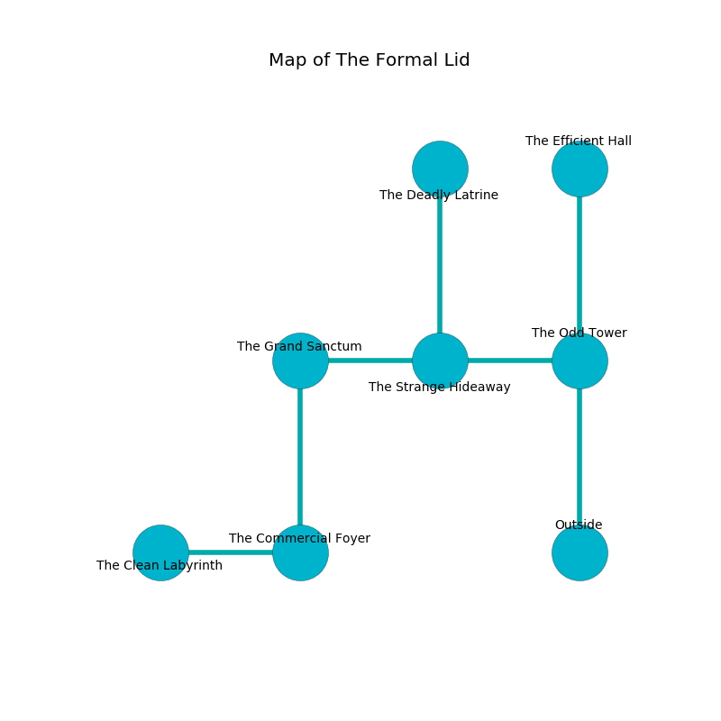

%Ruin Dogs

##The Formal Lid
###Overview
The Formal Lid is located on a spikey city. Regions of The Formal Lid are foggy. A lunar eclipse is happening outside. It is occupied by Duergars. Orville Ball The Naughty, an Orc War Chief is here. The Duergars are ruled by Orville Ball The Naughty. He  is founding a new religion. 

###Artifact
####Iamia

Iamia looks like a wet cube. Cacophony flows from it. When cradled it tunnels into the earth. 

###Locations

####the odd tower
There are four Duergars here. The stone walls are unsettled. The Duergars are meditating. 

There is an engraving on a monolith written in Duergars Script. 

> [Iamia](#Iamia)
>
> yet available
>
> but effective
>
> you must be joined
>

* To the west a torchlit threshold opens to [the strange hideaway](#the-strange-hideaway).
* To the north a narrow gap connects to [the efficient hall](#the-efficient-hall).
* To the south is the entrance.

####the strange hideaway
The floor is glossy. 

* [Orville Ball The Naughty](#Orville-Ball-The-Naughty) is here.
* To the west a torchlit pathway leads to [the grand sanctum](#the-grand-sanctum).
* To the east a torchlit threshold leads to [the odd tower](#the-odd-tower).
* To the north a dripping hall opens to [the deadly latrine](#the-deadly-latrine).

####the grand sanctum
The air tastes like brandy here. 

* To the east a torchlit pathway connects to [the strange hideaway](#the-strange-hideaway).
* To the south a long hall leads to [the commercial foyer](#the-commercial-foyer).

####the deadly latrine
The glass walls are ruined. There are four Duergars here. There is a trap here. When activated, a magical rune will launch a ceiling pendulum. The Duergars are willing to negotiate. 

* To the south a dripping hall leads to [the strange hideaway](#the-strange-hideaway).

####the commercial foyer
Blue ferns are growing in a patch on the floor. The floor is flooded with one inch deep scalding water. 

* [Iamia](#Iamia) is here.
* To the west a dark artery connects to [the clean labyrinth](#the-clean-labyrinth).
* To the north a long hall leads to [the grand sanctum](#the-grand-sanctum).

####the efficient hall
The floor is glossy. Blue ferns are growing from the ceiling. The air tastes like boysenberry here. 

* There is a lock here.
* To the south a narrow gap leads to [the odd tower](#the-odd-tower).

####the clean labyrinth
The glass walls are bloodstained. 

There is an engraving on a stone written in Duergars Script. 

> We are sorrowful
>
> bad and clean
>
> [Iamia](#Iamia)
>
> yet never handy
>

* To the east a dark artery connects to [the commercial foyer](#the-commercial-foyer).

