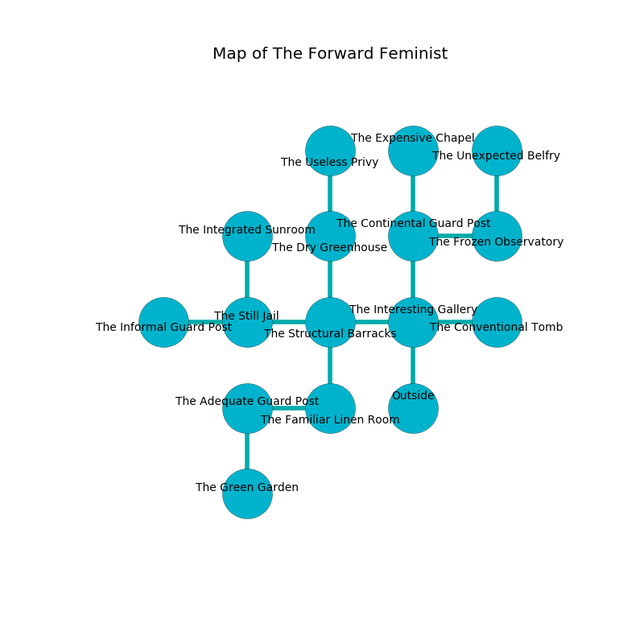

%Ruin Dogs

##The Forward Feminist
###Overview
The Forward Feminist is located under a crystal tree. Some areas of The Forward Feminist are flooded. A battle between raiders is happening outside. It is occupied by Sahuagin. Rochel Wenzel The Domineering, a Bearded Devil is here. The Sahuagin are the soldiers of Rochel Wenzel The Domineering. She  is trying to recover [The Legal Decay](#The-Legal-Decay). 

###Artifact
####The Legal Decay

The Legal Decay looks like a wet rock. It smells like sage. When smelled it curses all nearby. 

###Locations

####the interesting gallery
The floor is flooded with four inch deep hot water. Blue razorgrass is decaying in cracks in the floor. 

* [Rochel Wenzel The Domineering](#Rochel-Wenzel-The-Domineering) is here.
* To the west a long passageway connects to [the structural barracks](#the-structural-barracks).
* To the east a small cavern leads to [the conventional tomb](#the-conventional-tomb).
* To the north a hazy hallway opens to [the continental guard post](#the-continental-guard-post).
* To the south is the entrance.

####the conventional tomb
The crystal walls are pristine. The floor is sticky. Gray lichens are decaying from the walls. There are a Magma Mephit, a Giant Octopus, a Thug, a Giant Badger, and a Hobgoblin Captain here. 

There is an engraving on a tablet written in Sahuagin Script. 

> [The Legal Decay](#The-Legal-Decay)
>
> ever forward
>
> latest and adequate
>

* There is a nut here.
* To the west a small cavern connects to [the interesting gallery](#the-interesting-gallery).

####the structural barracks
The stone walls are pristine. There is a trap here. When activated, a tripwire will launch a javelin. There are a Doppelganger and an Awakened Shrub here. The floor is bloodstained. 

* To the west a twisted cave opens to [the still jail](#the-still-jail).
* To the east a long passageway opens to [the interesting gallery](#the-interesting-gallery).
* To the north a flooded gap connects to [the dry greenhouse](#the-dry-greenhouse).
* To the south a dark corridor connects to [the familiar linen room](#the-familiar-linen-room).

####the continental guard post
The mirrored walls are covered in mold. The air tastes like cornmint here. The floor is glossy. 

* There is a finger here.
* To the east a twisted hallway connects to [the frozen observatory](#the-frozen-observatory).
* To the north a small passageway connects to [the expensive chapel](#the-expensive-chapel).
* To the south a hazy hallway leads to [the interesting gallery](#the-interesting-gallery).

####the frozen observatory
There are six Sahuagin here. White moss is swaying in a patch on the floor. The Sahuagin are sleeping. 

There is an engraving on the floor written in common. 

> Leave at once.
>

* To the west a twisted hallway opens to [the continental guard post](#the-continental-guard-post).
* To the north a torchlit artery opens to [the unexpected belfry](#the-unexpected-belfry).

####the dry greenhouse
The mirrored walls are ruined. The air smells like asparagus here. 

There is an engraving on the wall written in common. 

> O meak god
>
> late, right, odd
>
> informal, standard, genetic
>
> cruelty is magnetic
>

* There is a bone here.
* To the north a hazy hall opens to [the useless privy](#the-useless-privy).
* To the south a flooded gap opens to [the structural barracks](#the-structural-barracks).

####the familiar linen room
There are six Sahuagin here. Red moss is swaying in broken urns. The floor is cluttered with broken glass. The Sahuagin are performing a ritual. If not interrupted, [Rochel Wenzel](#Rochel-Wenzel) will be magically alarmed. 

* To the west a flooded cavern leads to [the adequate guard post](#the-adequate-guard-post).
* To the north a dark corridor opens to [the structural barracks](#the-structural-barracks).

####the adequate guard post
There are six Sahuagin here. The floor is flooded with six inch deep cold water. The brick walls are bloodstained. The Sahuagin are willing to negotiate. 

* To the east a flooded cavern opens to [the familiar linen room](#the-familiar-linen-room).
* To the south a torchlit cave leads to [the green garden](#the-green-garden).

####the expensive chapel
There are six Sahuagin here. The floor is sticky. The air tastes like raisin here. The mirrored walls are pristine. One of the Sahuagin is on watch, the rest are meditating. 

There is an engraving on a stone written in Sahuagin Script. 

> I am lost in The Forward Feminist.
>

* There is a picture here.
* To the south a small passageway connects to [the continental guard post](#the-continental-guard-post).

####the green garden
The air smells like radish here. The metallic walls are unsettled. Green razorgrass is sprouting in cracks in the floor. There are a Hook Horror, a Zombie, and a Spider here. 

There is an engraving on the floor written in common. 

> I am lost in The Forward Feminist.
>
> Maybe try cowering.
>

* To the north a torchlit cave connects to [the adequate guard post](#the-adequate-guard-post).

####the unexpected belfry
There is a trap here. When activated, a magical proximity detector will fire a scything blade. The floor is glossy. Yellow ferns are sprouting in broken urns. The air smells like pineapple here. There are a Quasit and a Gold Dragon Wyrmling here. 

* To the south a torchlit artery leads to [the frozen observatory](#the-frozen-observatory).

####the still jail
The air tastes like valerian root here. There are six Sahuagin here. The Sahuagin are sleeping. 

* [The Legal Decay](#The-Legal-Decay) is here.
* To the west a hazy hallway opens to [the informal guard post](#the-informal-guard-post).
* To the east a twisted cave opens to [the structural barracks](#the-structural-barracks).
* To the north a twisted walkway connects to [the integrated sunroom](#the-integrated-sunroom).

####the informal guard post
There are an Azer, a Gray Ooze, and a Sea Hag here. 

There is an engraving on the wall written in Sahuagin Script. 

> O death is woe
>
> tired and slow
>
> parallel, military, vicious
>
> hope is ambitious
>

* There is a knife here.
* To the east a hazy hallway leads to [the still jail](#the-still-jail).

####the useless privy
The air smells like ginger here. Gray mushrooms are growing in a patch on the floor. 

* To the south a hazy hall connects to [the dry greenhouse](#the-dry-greenhouse).

####the integrated sunroom
There are six Sahuagin here. The floor is glossy. If the Sahuagin notice the Ruin Dogs, one of them will retreat and alert the others. 

* To the south a twisted walkway opens to [the still jail](#the-still-jail).

