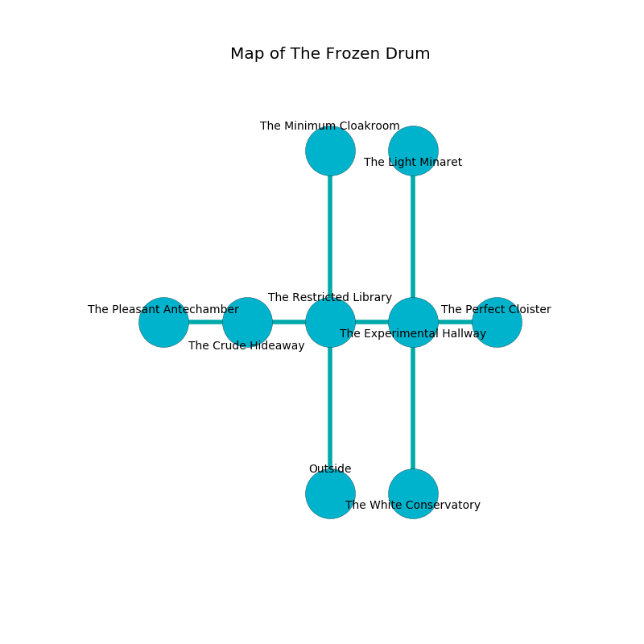

%Ruin Dogs

##The Frozen Drum
###Overview
The Frozen Drum is located under an alien city. Regions of it are frozen. A massive storm is happening outside. It is occupied by Demons. Hiram Morin The Rude, a Succubus is here. The Demons have been charmed by Hiram Morin The Rude. He  is trying to discover [Dasdofa Elbaefedaeum](#Dasdofa-Elbaefedaeum). 

###Artifact
####Dasdofa Elbaefedaeum

Dasdofa Elbaefedaeum is a powerful artifact in the shape of a transparent meteorite. Light slides towards it. When worshipped it curses all nearby. 

###Locations

####the restricted library
The wooden walls are bloodstained. The air tastes like magnolia here. There is a trap here. When activated, a magical rune will swing a tripping chain. Green mushrooms are sprouting from the walls. 

* To the west a torchlit walkway leads to [the crude hideaway](#the-crude-hideaway).
* To the east a long walkway opens to [the experimental hallway](#the-experimental-hallway).
* To the north a hazy hallway leads to [the minimum cloakroom](#the-minimum-cloakroom).
* To the south is the entrance.

####the experimental hallway
The mirrored walls are unsettled. The air smells like sulfur here. Blue lichens are decaying in cracks in the floor. 

* There is a stick here.
* There is a goat here.
* [Dasdofa Elbaefedaeum](#Dasdofa-Elbaefedaeum) is here.
* To the west a long walkway leads to [the restricted library](#the-restricted-library).
* To the east a twisted threshold leads to [the perfect cloister](#the-perfect-cloister).
* To the north a torchlit corridor connects to [the light minaret](#the-light-minaret).
* To the south a flooded pathway leads to [the white conservatory](#the-white-conservatory).

####the white conservatory
There are an Incubus and a Swarm of Ravens here. There is a trap here. When activated, a magical proximity detector will shoot a lightning bolt. 

* [Hiram Morin The Rude](#Hiram-Morin-The-Rude) is here.
* To the north a flooded pathway opens to [the experimental hallway](#the-experimental-hallway).

####the minimum cloakroom
There is a trap here. When activated, a pressure plate will launch a ceiling pendulum. The air tastes like valerian root here. Green moss is decaying in broken urns. 

* There is a seed here.
* To the south a hazy hallway opens to [the restricted library](#the-restricted-library).

####the crude hideaway
The mirrored walls are bloodstained. Red razorgrass is sprouting in a patch on the floor. 

* To the west a small cavern opens to [the pleasant antechamber](#the-pleasant-antechamber).
* To the east a torchlit walkway leads to [the restricted library](#the-restricted-library).

####the light minaret
The air smells like tequila here. The concrete walls are pristine. The floor is flooded with seven inch deep hot water. Green ferns are swaying in broken urns. 

* To the south a torchlit corridor leads to [the experimental hallway](#the-experimental-hallway).

####the pleasant antechamber
The air tastes like rum here. 

* To the east a small cavern opens to [the crude hideaway](#the-crude-hideaway).

####the perfect cloister
The floor is sticky. The air tastes like vinegar here. There are a Spined Devil and a Bearded Devil here. There is a trap here. When activated, a tripwire will launch a blade. The Demons are celebrating. 

There is an engraving on the wall written in Demons Script. 

> I am hiding in this place.
>

* To the west a twisted threshold opens to [the experimental hallway](#the-experimental-hallway).

