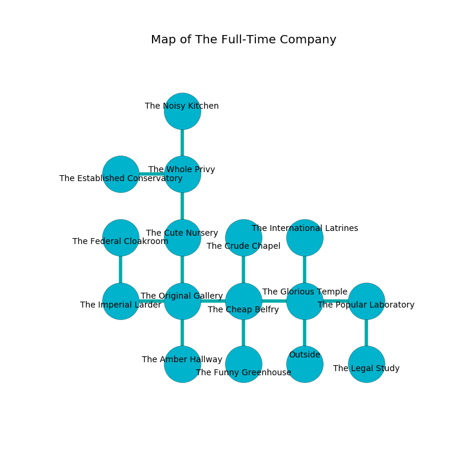

%Ruin Dogs

##The Full-Time Company
###Overview
The Full-Time Company is constructed on a ruined tree. Some areas of it are flooded. The ruin is flooding. It is occupied by Lizardfolk. Janita Hilliard The Foolish, a Druid is here. The Lizardfolk are battling Janita Hilliard The Foolish. She  is trying to discover [Iabaemef Deddafm](#Iabaemef-Deddafm). 

###Artifact
####Iabaemef Deddafm

Iabaemef Deddafm looks like a transparent spear. It is a pale green color. It smells like leather. When gazed upon it becomes hot. 

###Locations

####the glorious temple
There are a Swarm of Bats, a Swarm of Poisonous Snakes, and a Gibbering Mouther here. The floor is bloodstained. The mirrored walls are caving in. Yellow razorgrass is decaying in a patch on the floor. The air tastes like davana here. 

* To the west a flooded threshold leads to [the cheap belfry](#the-cheap-belfry).
* To the east a windy passageway opens to [the popular laboratory](#the-popular-laboratory).
* To the north a windy path leads to [the international latrines](#the-international-latrines).
* To the south is the entrance.

####the popular laboratory
Yellow ferns are sprouting in a patch on the floor. The floor is bloodstained. There are a Lizardfolk Shaman and two Lizardfolk here. One of the Lizardfolk is on watch, the rest are celebrating. 

* There is a brain here.
* To the west a windy passageway connects to [the glorious temple](#the-glorious-temple).
* To the south a dripping threshold opens to [the legal study](#the-legal-study).

####the international latrines
The air tastes like neroli here. There is a Wight here. Yellow moss is swaying in a patch on the floor. 

There is an engraving on a stone written in Lizardfolk Script. 

> I want to find [Iabaemef Deddafm](#Iabaemef-Deddafm).
>
> Leave at once.
>

* To the south a windy path opens to [the glorious temple](#the-glorious-temple).

####the cheap belfry
Blue ferns are swaying in broken urns. The air smells like beef here. The floor is glossy. 

* There is a knot here.
* To the west a dark artery opens to [the original gallery](#the-original-gallery).
* To the east a flooded threshold leads to [the glorious temple](#the-glorious-temple).
* To the north a windy cavern opens to [the crude chapel](#the-crude-chapel).
* To the south a hazy gap opens to [the funny greenhouse](#the-funny-greenhouse).

####the crude chapel
The air tastes like roast beef here. Blue lichens are swaying from the walls. 

There is an engraving on a tablet written in common. 

> I could not try praying.
>

* To the south a windy cavern opens to [the cheap belfry](#the-cheap-belfry).

####the funny greenhouse
Yellow ferns are growing in broken urns. The crystal walls are caving in. 

* There is a dragon here.
* To the north a hazy gap opens to [the cheap belfry](#the-cheap-belfry).

####the original gallery
The mirrored walls are bloodstained. There are a Nothic, a Giant Badger, and a Quadrone here. The air tastes like lemongrass here. 

There is an engraving on a stone written in common. 

> Do not try leaving.
>

* To the west a long passageway opens to [the imperial larder](#the-imperial-larder).
* To the east a dark artery opens to [the cheap belfry](#the-cheap-belfry).
* To the north a twisted cavern connects to [the cute nursery](#the-cute-nursery).
* To the south a dark passageway connects to [the amber hallway](#the-amber-hallway).

####the cute nursery
The floor is bloodstained. There is a trap here. When activated, a tripwire will fire a net. There are a Guard, an Awakened Shrub, a Sea Hag, and a Basilisk here. Green mushrooms are sprouting from the ceiling. 

There is an engraving on a monolith written in Lizardfolk Script. 

> I am lost in The Full-Time Company.
>

* To the north a windy artery connects to [the whole privy](#the-whole-privy).
* To the south a twisted cavern connects to [the original gallery](#the-original-gallery).

####the whole privy
The air smells like rain here. The floor is cluttered with shells. 

There is an engraving on the wall written in Lizardfolk Script. 

> Poor me! meak soul
>
> color-blind and whole
>
> it is never kind
>
> life is blind
>

* [Janita Hilliard The Foolish](#Janita-Hilliard-The-Foolish) is here.
* To the west a small cavern leads to [the established conservatory](#the-established-conservatory).
* To the north a dripping passageway leads to [the noisy kitchen](#the-noisy-kitchen).
* To the south a windy artery opens to [the cute nursery](#the-cute-nursery).

####the imperial larder
There are a Displacer Beast and a Cultist here. The wooden walls are ruined. The air tastes like praline here. 

* [Iabaemef Deddafm](#Iabaemef-Deddafm) is here.
* To the east a long passageway opens to [the original gallery](#the-original-gallery).
* To the north a torchlit opening connects to [the federal cloakroom](#the-federal-cloakroom).

####the legal study
There are a Slaad Tadpole, a Giant Wolf Spider, a Specter, and a Nightmare here. 

There is an engraving on the wall written in Lizardfolk Script. 

> Oh cruel soul
>
> uncomfortable, applied, whole
>
> positive and effective
>
> nothing is whole
>

* To the north a dripping threshold connects to [the popular laboratory](#the-popular-laboratory).

####the amber hallway
There are a Berserker, a Phase Spider, and a Flying Snake here. The floor is smooth. The air smells like spearmint here. The stone walls are bloodstained. Gray moss is growing in a patch on the floor. 

* To the north a dark passageway leads to [the original gallery](#the-original-gallery).

####the noisy kitchen
There are a Lizardfolk Shaman and three Lizardfolk here. The metallic walls are ruined. The Lizardfolk are performing a ritual. If not interrupted, the ruin dogs will be weakened. 

* To the south a dripping passageway leads to [the whole privy](#the-whole-privy).

####the established conservatory
The floor is cluttered with broken glass. Blue ferns are decaying in cracks in the floor. The crystal walls are caving in. 

There is an engraving on a monolith written in common. 

> I am lost in The Full-Time Company.
>
> Do not try cowering.
>

* To the east a small cavern opens to [the whole privy](#the-whole-privy).

####the federal cloakroom
The floor is sticky. The glass walls are ruined. The air smells like autumn here. 

* To the south a torchlit opening opens to [the imperial larder](#the-imperial-larder).

