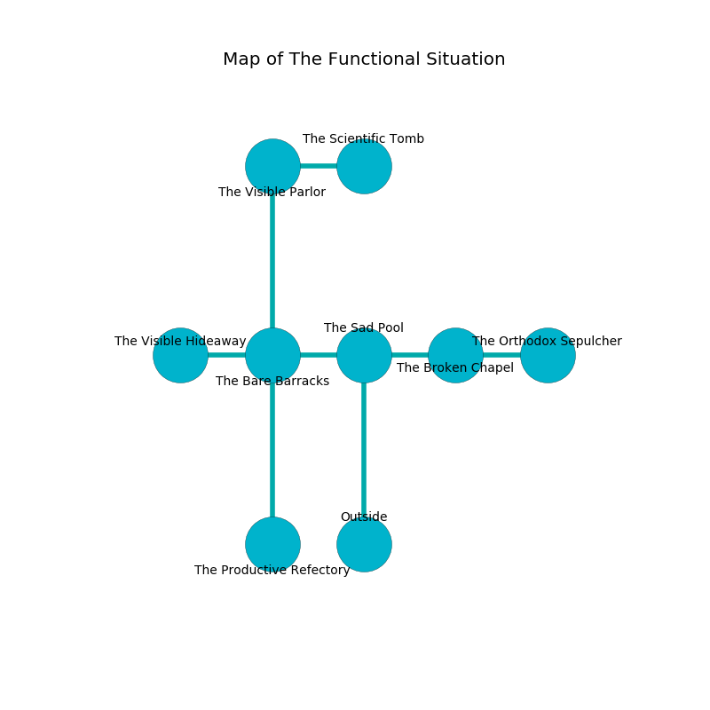

%Ruin Dogs

##The Functional Situation
###Overview
The Functional Situation is located in a giant tree. Some areas of it are foggy. The ruin is collapsing slowly. It is occupied by Myconids. Craig Ivey The Touchy, a Frost Giant is here. The Myconids are ruled by Craig Ivey The Touchy. He  is founding a new religion. 

###Artifact
####Iaehh

Iaehh is a powerful artifact in the shape of a cold figurine. It smells like autumn. When worn it shows an image of the future. 

###Locations

####the sad pool
The floor is smooth. There are four Myconid Sovereigns and two Myconid Adults here. The Myconids are performing a ritual. If not interrupted, the ruin dogs will be weakened. 

* To the west a torchlit threshold leads to [the bare barracks](#the-bare-barracks).
* To the east a small artery leads to [the broken chapel](#the-broken-chapel).
* To the south is the entrance.

####the bare barracks
The floor is bloodstained. The air tastes like mushroom here. The concrete walls are ruined. There are four Myconid Sovereigns and two Myconid Adults here. If the Myconids notice the Ruin Dogs, one of them will retreat and alert the others. 

* To the west a narrow cave leads to [the visible hideaway](#the-visible-hideaway).
* To the east a torchlit threshold connects to [the sad pool](#the-sad-pool).
* To the north a narrow cavern leads to [the visible parlor](#the-visible-parlor).
* To the south a flooded cavern opens to [the productive refectory](#the-productive-refectory).

####the visible parlor
There are a Jackalwere, an Axe Beak, an Ice Mephit, an Awakened Shrub, a Clay Golem, two Hell Hounds, and  here. Gray moss is swaying from the ceiling. The air tastes like petitgrain here. The floor is flooded with eight inch deep cool water. There is a trap here. When activated, a pressure plate will cast a curse. The stone walls are ruined. 

* To the east a torchlit path connects to [the scientific tomb](#the-scientific-tomb).
* To the south a narrow cavern connects to [the bare barracks](#the-bare-barracks).

####the visible hideaway
The air smells like patchouli here. Blue ferns are growing in cracks in the floor. The floor is smooth. There are a Red Dragon Wyrmling, an Incubus, a Tribal Warrior, a Mastiff, and a Death Dog here. 

* To the east a narrow cave opens to [the bare barracks](#the-bare-barracks).

####the broken chapel
The air smells like citronella here. The glass walls are scratched. There are a Water Elemental, two Sahuagin Priestesses, a Yuan-Ti Pureblood, and  here. 

There is an engraving on the ceiling written in common. 

> Dear me! meak fate
>
> resident, loose, late
>
> it is never long
>
> life is wrong
>

* [Iaehh](#Iaehh) is here.
* To the west a small artery leads to [the sad pool](#the-sad-pool).
* To the east a long pathway leads to [the orthodox sepulcher](#the-orthodox-sepulcher).

####the productive refectory
Gray moss is sprouting in cracks in the floor. 

* [Craig Ivey The Touchy](#Craig-Ivey-The-Touchy) is here.
* To the north a flooded cavern leads to [the bare barracks](#the-bare-barracks).

####the scientific tomb
The air smells like elderflower here. The concrete walls are unsettled. Red mushrooms are sprouting in broken urns. 

* To the west a torchlit path leads to [the visible parlor](#the-visible-parlor).

####the orthodox sepulcher
The air smells like camphoreous here. The metallic walls are ruined. 

* To the west a long pathway leads to [the broken chapel](#the-broken-chapel).

