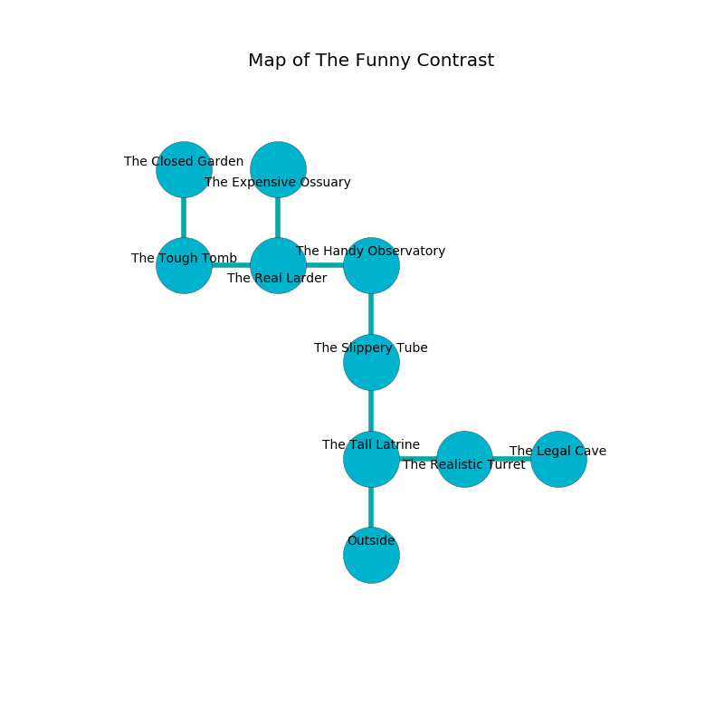

%Ruin Dogs

##The Funny Contrast
###Overview
The Funny Contrast is located in a haunted rift. Parts of it are unbearably cold. A massive flood is happening outside. It is occupied by Ogres. Jerri Baez The Intolerant, a Fire Giant is here. The Ogres are battling Jerri Baez The Intolerant. She  is trying to hide [Udhaehedaeum](#Udhaehedaeum). 

###Artifact
####Udhaehedaeum

Udhaehedaeum looks like a transparent spear. It is a light green color. When worshipped it ignites its surrroundings. 

###Locations

####the tall latrine
The concrete walls are ruined. 

* To the east a twisted path opens to [the realistic turret](#the-realistic-turret).
* To the north a dark corridor connects to [the slippery tube](#the-slippery-tube).
* To the south is the entrance.

####the slippery tube
The floor is glossy. There are a Stirge, a Death Dog, a Dryad, a Dust Mephit, a Hell Hound, a Gas Spore, an Ape, a Poisonous Snake, an Ankheg, and a Gold Dragon Wyrmling here. The obsidion walls are pristine. 

* To the north a long passageway leads to [the handy observatory](#the-handy-observatory).
* To the south a dark corridor leads to [the tall latrine](#the-tall-latrine).

####the realistic turret
The floor is glossy. The wooden walls are ruined. There are a Gnoll Fang of Yeenoghu, a Grick Alpha, a Goat, and a Flying Snake here. 

* There is a lyre here.
* [Udhaehedaeum](#Udhaehedaeum) is here.
* To the west a twisted path opens to [the tall latrine](#the-tall-latrine).
* To the east a narrow threshold opens to [the legal cave](#the-legal-cave).

####the handy observatory

* To the west a torchlit hallway leads to [the real larder](#the-real-larder).
* To the south a long passageway opens to [the slippery tube](#the-slippery-tube).

####the real larder
The air tastes like cornmeal here. The floor is flooded with eight inch deep cold water. There are a Tyrannosaurus Rex and a Shambling Mound here. Yellow moss is decaying from the walls. 

* To the west a windy cavern opens to [the tough tomb](#the-tough-tomb).
* To the east a torchlit hallway opens to [the handy observatory](#the-handy-observatory).
* To the north a dripping path connects to [the expensive ossuary](#the-expensive-ossuary).

####the expensive ossuary
Red razorgrass is decaying from the walls. 

* There is a roof here.
* To the south a dripping path leads to [the real larder](#the-real-larder).

####the tough tomb
The floor is flooded with four inch deep cold water. The air tastes like licorice here. 

* [Jerri Baez The Intolerant](#Jerri-Baez-The-Intolerant) is here.
* To the east a windy cavern opens to [the real larder](#the-real-larder).
* To the north a dark passageway leads to [the closed garden](#the-closed-garden).

####the closed garden
The floor is bloodstained. Gray mushrooms are sprouting in broken urns. The air tastes like asparagus here. 

* To the south a dark passageway opens to [the tough tomb](#the-tough-tomb).

####the legal cave
The crystal walls are caving in. There is a trap here. When activated, a magical proximity detector will collapse a wall. 

* To the west a narrow threshold leads to [the realistic turret](#the-realistic-turret).

