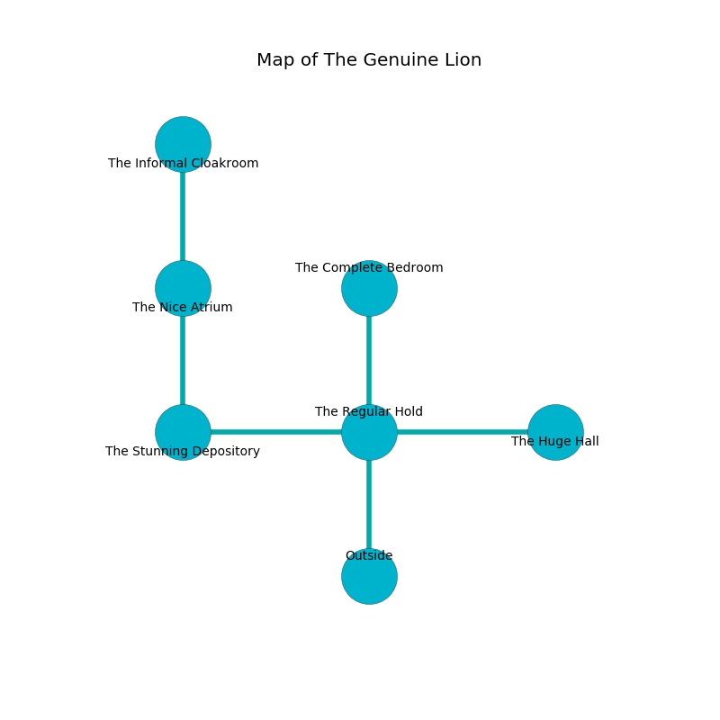

%Ruin Dogs

##The Genuine Lion
###Overview
The Genuine Lion is located under a spikey rift. Regions of it are foggy. The ruin is burning. It is occupied by Demons. Lonny Fonseca The Stingy, a Lizardfolk Shaman is here. The Demons are ruled by Lonny Fonseca The Stingy. He  is founding a new religion. 

###Artifact
####Ehobaemaeob Lfeiaaf

Ehobaemaeob Lfeiaaf looks like an opaque crystal. Fire glows from it. When carried it ignites its surrroundings. 

###Locations

####the regular hold
Red razorgrass is swaying from the walls. The wooden walls are bloodstained. The air tastes like citrus peel here. The floor is flooded with eight inch deep scalding water. There are a Spined Devil and a Bearded Devil here. The Demons are fighting amongst themselves. 

* There is a pendant here.
* [Ehobaemaeob Lfeiaaf](#Ehobaemaeob-Lfeiaaf) is here.
* To the west a dripping cave opens to [the stunning depository](#the-stunning-depository).
* To the east a flooded path opens to [the huge hall](#the-huge-hall).
* To the north a dark gap leads to [the complete bedroom](#the-complete-bedroom).
* To the south is the entrance.

####the stunning depository
The concrete walls are ruined. The air smells like watercress here. 

* There is a roof here.
* To the east a dripping cave opens to [the regular hold](#the-regular-hold).
* To the north a twisted passageway leads to [the nice atrium](#the-nice-atrium).

####the nice atrium
There are an Ankheg, a Green Dragon Wyrmling, and a Dretch here. The floor is cluttered with bones. Blue lichens are swaying from the ceiling. 

There is an engraving on the floor written in Demons Script. 

> Dear me! sad you
>
> superior, systematic, new
>
> magnetic, shy, informal
>
> sadness is formal
>

* To the north a long path opens to [the informal cloakroom](#the-informal-cloakroom).
* To the south a twisted passageway connects to [the stunning depository](#the-stunning-depository).

####the informal cloakroom
There is a trap here. When activated, a magical sound detector will open a trapdoor in the floor. There are a Giant Frog, an Eagle, a Gibbering Mouther, and an Ogre Zombie here. 

There is an engraving on a tablet written in Demons Script. 

> I thought about hiding.
>

* [Lonny Fonseca The Stingy](#Lonny-Fonseca-The-Stingy) is here.
* To the south a long path opens to [the nice atrium](#the-nice-atrium).

####the huge hall
Red lichens are decaying from the walls. The air smells like clary sage here. There are a Blink Dog, a Merrow, and a Giant Eagle here. The floor is bloodstained. 

* To the west a flooded path connects to [the regular hold](#the-regular-hold).

####the complete bedroom
Yellow lichens are sprouting in a patch on the floor. The floor is bloodstained. There are an Imp and a Spined Devil here. The concrete walls are scratched. The Demons are willing to negotiate. 

There is an engraving on a monolith written in common. 

> [Ehobaemaeob Lfeiaaf](#Ehobaemaeob-Lfeiaaf)
>
> professional, serious, inevitable
>

* To the south a dark gap leads to [the regular hold](#the-regular-hold).

